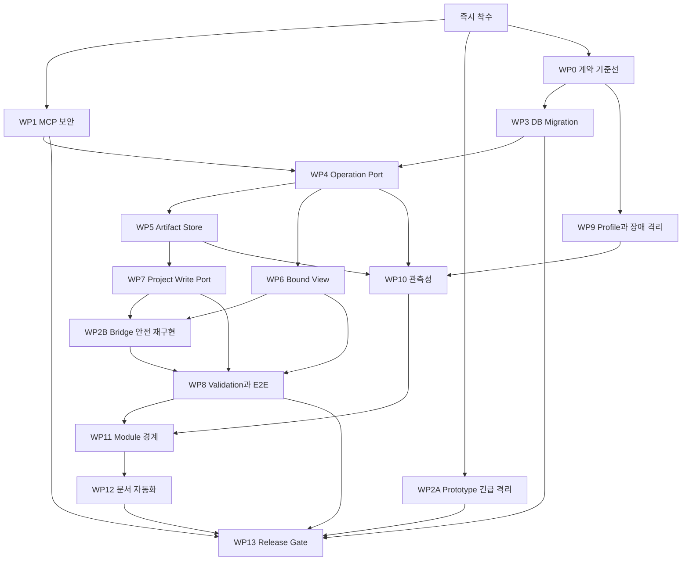

# SpringAI 권장 목표 아키텍처 구현계획서

> 작성일: 2026-08-03  
> 대상 프로젝트: `springai`  
> 기준 문서: [SpringAI 프로젝트 전체 아키텍처 재분석](./SpringAI_프로젝트_전체_아키텍처_재분석_2026-08-03.md)  
> 영향평가: [SpringAI 권장 목표 아키텍처 구현 영향평가](./SpringAI_권장_목표_아키텍처_구현_영향평가_2026-08-03.md)  
> 구현목록: [SpringAI 권장 목표 아키텍처 구현목록](./SpringAI_권장_목표_아키텍처_구현목록_2026-08-03.md)  
> 상태: **실행 계획 승인** — WP2A 구현·snapshot 검증 완료/미커밋, Wave별 Gate 적용

## 0. 권고 실행 우선순위

| 실행 단계 | 작업 | 판정 |
|---:|---|---|
| 1단계 즉시 | `ARCH-WP1` MCP 보안 + `ARCH-WP2A` Prototype 긴급 격리 | P0 공개 위험을 먼저 차단 |
| 2단계 병행 | `ARCH-WP0` 계약·DB·Artifact 기준선 | WP1·WP2A 변경과 병행하되 변경 직전 최소 MCP snapshot 확보 |
| 3단계 | `ARCH-WP3` Migration → `ARCH-WP4` Operation 영속화 | schema version 확보 후 메모리 상태를 DB로 전환 |
| 4단계 병행 | `ARCH-WP5` Artifact 기반 + `ARCH-WP6` Bound View Pipeline | ArtifactRef와 실제 Render Artifact 기반 확보 |
| 5단계 | `ARCH-WP7` Project Write → `ARCH-WP2B` Bridge 안전 재구현 | SafePathResolver·승인 Apply·실제 parity 연결 |

현재 I-4~I-6은 기능 프로토타입 수준으로 판정한다. `ARCH-WP2A`로 위험한 MCP 표면은 제거했지만
관련 클래스와 callback이 존재하더라도 재시작
복구, 공통 인증 경계, 실제 Artifact parity, Binding provenance Gate가 닫히지 않았으므로 완료가
아니며 상태 표기는 `[~]`가 맞다.

P0 수정 전에 필요한 최소 기준선은 `ARCH-0001`~`ARCH-0003`이다. 이는 몇 분 내 확보하는 변경 전
checkpoint이며 WP0 전체 완료를 WP1·WP2A의 선행조건으로 만들지 않는다. DB·Artifact·생성 fixture 등
WP0의 나머지 항목은 보안 수정과 병행한다.

`ARCH-WP2A`와 `ARCH-WP2B`는 완료 의미가 다르다.

- `WP2A`: 위험 Tool을 MCP에서 제거하는 긴급 containment
- `WP2B`: 승인 Artifact와 안전한 Project Write 기반으로 기능을 다시 제공하는 후속 구현

### 0.1 실행 준비도 승인

이 계획은 다음 통제를 전제로 **실행 준비도 승인** 상태다.

1. 작업 시작 전 아래 dirty-worktree fingerprint를 비교하고 달라졌으면 WP0 기준선을 갱신한다.
2. 동시 리팩터링의 소유권이 확인되지 않은 파일은 수정·stage·commit하지 않는다.
3. stage는 명시적 파일 경로만 사용하며 `git add -A`를 사용하지 않는다.
4. 각 Wave는 선행 Gate와 관련 test를 통과하기 전 다음 Wave의 완료 근거가 될 수 없다.
5. `[~]`는 기존 코드를 재사용할 수 있다는 뜻이며 목표 Port·영속화·실환경 Gate 완료를 뜻하지 않는다.
6. 문서 승인은 코드 커밋 승인이 아니다. WP2A와 동시 리팩터링의 커밋 경계는 계속 보류한다.

승인 시점 코드 기준선:

| 항목 | 값 |
|---|---|
| HEAD | `69c96e5028ed3aaf0e48d04bab99ee1e2b5670d0` |
| tracked code diff 파일 수 | 57 |
| tracked code diff SHA-256 | `abad3dccdd5eab6a548fd0d79586ba304cf407c5bbb70fa3f7fccab535d28e53` |
| tracked code name-status SHA-256 | `4f5e5eedb2bd6714bd8cd38d9bcfe2520442167d198b954b7ed713cd7b402911` |
| untracked code 파일 수 | 16 |
| untracked code manifest SHA-256 | `662d40ccac85cfb563126cfdbef2f0762a3cc0e95ab6d80600564f654e77f081` |
| untracked code content SHA-256 | `c11fa31d1e561114359d1dc13023bbb77130b28f50e9a5ccef4a4a494589a640` |
| MCP snapshot SHA-256 | `e25ab6d35ebf038ed1a230d7d1ee86ced52e6187c1796b6dd8045c84c406f965` |

hash 산출 범위는 `docs/**`를 제외한 코드 작업 트리다. 문서 수정으로 코드 기준선이 흔들리지 않도록
분리했다.

## 1. 구현 목표

§17의 구조적 위험 12개를 제거하면서 §18의 권장 구조로 점진적으로 수렴한다.

최종 요청 처리 원칙:

```text
인증된 MCP/REST/Web 요청
    → 기능별 Application Use Case
    → 영속 Operation과 승인 계약
    → 불변 Artifact
    → 승인 기반 Project Write 또는 외부 Apply
    → Validation Report와 감사 이벤트
```

구조적 목표:

- Adapter가 인증·프로토콜 변환을 담당한다.
- Application Core는 MCP, Servlet, JdbcTemplate, 실제 파일 API에 직접 의존하지 않는다.
- 상태, Artifact, Project Write, LLM/Vision은 Port를 통해 사용한다.
- Infrastructure Adapter가 MySQL, Redis, 파일 시스템, Figma, OpenAI, Ollama, Extractor를 구현한다.
- 모듈형 모놀리스를 유지하면서 의존 방향과 장애 격리를 먼저 확보한다.

## 2. 구현 원칙

1. P0 위험 완화는 구조 리팩터링보다 먼저 배포할 수 있어야 한다.
2. MCP Tool 이름과 입력 Schema는 별도 승인 없이는 변경하지 않는다. 단, P0 위험 Tool의 공개 제거는
   보안 containment로 기록하고 snapshot·사용자 영향을 함께 갱신한다.
3. 상태 변경과 파일 변경을 한 메서드에서 암묵적으로 수행하지 않는다.
4. Preview 전에는 대상 프로젝트나 Figma Canvas를 변경하지 않는다.
5. 승인 hash, source revision, Artifact hash를 Apply 직전에 다시 검증한다.
6. DB 변경은 versioned migration으로만 수행한다.
7. 기존 Service는 Port Adapter로 감싼 뒤 소비자를 전환하고 마지막에 제거한다.
8. 기능 완료는 코드 존재가 아니라 자동 테스트와 운영 증적으로 판정한다.
9. 사용자 작업 트리의 기존 변경을 덮어쓰거나 되돌리지 않는다.
10. Worker 분리는 장애 격리 metric이 필요성을 증명할 때만 수행한다.

## 3. 목표 컴포넌트와 책임

### 3.1 Adapter Layer

| 컴포넌트 | 책임 |
|---|---|
| MCP Adapter | Tool schema 보존, 인증된 actor 변환, Use Case 호출, 결과 redaction |
| REST Adapter | X-API-Key/단기 토큰, HTTP status·오류 계약, DTO 변환 |
| Web Adapter | Thymeleaf UI, SSE 연결·idle timeout, 세션 context |

### 3.2 Application Core

| 모듈 | 책임 |
|---|---|
| Generation | CRUD·Board·Master-detail 계획과 검증 가능한 ChangeSet 생성 |
| Design Specification | 분석 결과를 ScreenSpecification으로 정규화하고 승인 관리 |
| Figma | 승인 명세→Bundle→Plugin Apply와 보고서 검증 |
| Thymeleaf Conversion | Legacy 분석→Binding Contract→Bound View→검증 |
| RAG/Chat | 문서 인덱싱, context 조립, 모델 routing |
| Operation | 공통 상태·revision·승인·충돌·감사 정책 |

### 3.3 공통 Port

| Port | 최소 계약 |
|---|---|
| `OperationRepositoryPort` | create, appendRevision, find, compareAndTransition |
| `OperationEventPort` | appendEvent, listEvents |
| `OperationLockPort` | acquire/release with owner and TTL |
| `ArtifactStorePort` | stage, commit, open, verifyHash, deleteAfterRetention |
| `ArtifactCatalogPort` | register, linkOperation, find, markOrphaned |
| `ApprovedProjectWritePort` | preview, approve, apply, rollback, validate |
| `LlmPort` | chat, stream, classify |
| `VisionPort` | analyzeImage with capability and limits |
| `FigmaPort` | readRevision, readNodes, verifyEditableScope |
| `WebCapturePort` | health, capture, fetchArtifact |

### 3.4 Infrastructure Adapter

| Adapter | 책임 |
|---|---|
| MySQL | Operation·Artifact catalog·승인·보고서, ADR로 선택한 versioned migration |
| Redis | Vector Store, chat memory, 선택적 lock/cache |
| File | immutable Artifact, staging, backup, atomic replacement |
| External AI | OpenAI·Ollama timeout, retry, redaction |
| Figma | API revision/node/style 조회와 Plugin 보고 검증 |
| Extractor | `.figpack` capture, response 제한, health |

## 4. 전체 작업 패키지

| 실행 Wave | 작업 패키지 | 우선순위 | 주요 위험 | 선행 단계 |
|---:|---|---|---|---|
| 1 | `ARCH-WP1` MCP 보안 경계 통합 | P0 | RISK-01 | 없음, WP0 최소 checkpoint만 즉시 확보 |
| 1 | `ARCH-WP2A` Prototype Bridge 긴급 격리 | P0 | RISK-02 | 없음, WP0 최소 checkpoint만 즉시 확보 |
| 2 | `ARCH-WP0` 계약·테스트 기준선 고정 | P0 기반 | 전체 | WP1·WP2A와 병행 |
| 3 | `ARCH-WP3` DB Migration 기준선 | P1 기반 | RISK-06 | WP0 |
| 3 | `ARCH-WP4` 공통 Operation Port와 영속화 | P0 | RISK-03 | WP1, WP3 |
| 4 | `ARCH-WP5` 공통 Artifact Store와 Catalog | P1 | RISK-09 | WP3, WP4 |
| 4 | `ARCH-WP6` Bound View Pipeline 복구 | P0 | RISK-04 | WP0, WP4 |
| 5 | `ARCH-WP7` 승인 기반 Project Write Port | P1 | RISK-05 | WP4, WP5 |
| 5 | `ARCH-WP2B` Prototype Bridge 안전 재구현 | P1 | RISK-02 | WP5, WP6, WP7 |
| 6 | `ARCH-WP8` Validation Gate와 교차 E2E | P0/P1 | RISK-02~05 | WP2B, WP6, WP7 |
| 6 | `ARCH-WP9` 운영 Profile과 장애 격리 | P1 | RISK-07, 08 | WP0 |
| 7 | `ARCH-WP10` 관측성과 상태 조정 | P1/P2 | RISK-09, 11 | WP4, WP5, WP9 |
| 8 | `ARCH-WP11` 모듈 경계 강제 | P2 | RISK-10 | WP4~10의 Port 안정화 |
| 9 | `ARCH-WP12` 문서·계약 자동 동기화 | P2 | RISK-12 | WP0, WP11 |
| 10 | `ARCH-WP13` Release Gate와 운영 전환 | 전체 | 전체 | WP1, WP2A/B, WP0, WP3~12 |

## 5. 의존 순서



WP1과 WP2A는 WP0 전체 완료를 기다리지 않는 보안 hotfix다. `ARCH-0001`~`ARCH-0003`의 최소
checkpoint만 변경 직전에 확보하고 나머지 WP0는 병행한다. WP3 완료 후 WP4를 진행하고, WP5와 WP6는
병렬 진행한다. WP2B는 WP5·WP6·WP7 기반이 준비된 뒤에만 착수한다. WP2B를 영구 폐기하기로 ADR에서
결정하면 해당 ADR 승인을 WP8의 WP2B 선행조건 충족으로 간주한다.

## 6. `ARCH-WP0` 계약과 테스트 기준선

### 목표

구조 변경 전 외부 계약, 데이터, 파일 결과를 비교할 기준을 고정한다.

### 구현

- Git HEAD, WP2A 이전 dirty worktree, WP2A 이후 dirty worktree의 MCP snapshot을 각각 기록
- REST endpoint와 오류 응답 inventory 생성
- Figma/Thymeleaf 상태 전이 snapshot 생성
- 대표 CRUD·Board·Master-detail 생성 파일 tree와 golden fixture 확보
- 기존 MySQL schema dump와 table/index inventory 생성
- Artifact directory 구조와 metadata fixture 확보
- `-Pci` 제외 테스트와 full test 차이 문서화

### 완료 Gate

- `G0` MCP snapshot 통과
- 현재 full test와 bootJar 결과 기록
- 기준 fixture에 commit SHA와 생성 환경 기록
- 작업 트리의 사용자 변경과 대상 변경 범위 분리

현재 확인된 MCP 기준선:

| 기준 | Tool 객체 | Tool 메서드 | 재현 상태 |
|---|---:|---:|---|
| Git HEAD snapshot 상수 | 32 | 86 | clean checkout runtime 재검증 필요 |
| WP2A 이전 dirty worktree | 35 | 97 | 변경 전 기록 |
| WP2A 이후 dirty worktree | 34 | 92 | snapshot test 통과, 미커밋 |

dirty worktree 기준선에는 commit SHA만 기록하지 않는다. `git status --short`, `git diff --name-status`,
tracked diff hash, untracked file manifest, MCP snapshot SHA-256와 검증 명령을 함께 보존한다.

## 7. `ARCH-WP1` MCP 보안 경계 통합

### 목표

MCP Adapter에서 deny-by-default 인증·인가를 적용한다.

### 설계

```text
MCP Transport
  → McpAuthenticationFilter
  → Spring Security Authentication(McpPrincipal)
  → RiskAwareToolCallbackProvider
  → ToolAuthorizationPolicy(toolName, riskLevel)
  → ActorContext snapshot
  → Tool Adapter
  → Use Case
```

### 승인된 인증 경계 결정

- Transport 인증은 `/mcp/**` 전용 `OncePerRequestFilter`에서 수행한다.
- Filter는 token을 검증하고 `McpPrincipal` 기반 `Authentication`을 `SecurityContext`에 저장한다.
- Tool별 인가는 `MethodToolCallbackProvider`가 만든 callback을 감싸는
  `RiskAwareToolCallbackProvider`에서 수행한다.
- 등록되지 않은 Tool risk는 deny-by-default로 기동 또는 최초 호출 전에 실패한다.
- `ActorContext`는 인증 주체·권한·correlationId만 복사하며 credential 원문을 포함하지 않는다.
- 비동기/streaming 경계에서는 mutable ThreadLocal을 장기 보관하지 않고 실행 시점의 immutable
  `ActorContext` snapshot을 전달한다.
- Spring Security Filter는 transport 인증, callback wrapper는 Tool 인가를 담당하며 같은 검사를
  중복 구현하지 않는다.
- `/mcp/**` loopback bind는 보조 통제이며 인증을 대체하지 않는다.

### 구현

- Tool 위험 등급 enum과 inventory 작성
- 공통 token resolver와 상수시간 검증 구현
- 실패 응답 및 감사 이벤트 표준화
- 위험 Tool은 공통 인증 없이는 실행되지 않도록 차단
- Tool 메서드 내부 shared secret을 호환 기간 후 제거
- secret, token, fileKey, LLM key redaction 정책 통합
- MCP loopback 기본값과 비-loopback 기동 guard 추가

### 호환 전략

1. audit-only 모드
2. 공통 인증 또는 기존 shared secret 허용
3. 공통 인증 필수
4. Tool 파라미터의 shared secret 제거는 별도 MCP 계약 버전에서 수행

### 완료 Gate

- 인증 전에 Repository·파일·외부 API 호출 0건
- 모든 등록 Tool이 위험 등급을 갖고 누락 시 context test 실패
- 정상·누락·오류·회전 token 테스트 통과
- 로그와 응답에서 secret 노출 0건

## 8. `ARCH-WP2A` Prototype Bridge 긴급 격리

### 목표

실제 검증 없이 성공을 반환하거나 공통 경계를 우회하는 Tool을 MCP 공개 표면에서 제거한다.

### 구현

- `FigmaThymeleafBridgeTool`을 MCP 등록에서 즉시 제거
- `validateThymeleafDesignParity`의 `VERIFIED` 고정 응답 제거
- `syncDesignTokensToCss`의 임의 서버 경로 읽기 제거
- 사용되지 않는 `FigmaThymeleafMapping` 제거
- MCP snapshot과 공개 capability 문서 갱신

### 완료 Gate

- 위험한 5개 callback이 MCP snapshot에 존재하지 않음
- 고정 `VERIFIED`와 임의 경로 읽기의 다른 소비자 0건
- snapshot test 통과
- 독립 커밋 또는 재현 가능한 dirty-worktree 증적 확보

현재 판정: 구현과 snapshot test는 완료했으나 다른 세션의 리팩터링과 파일 경계가 섞여 커밋을
보류했다. 따라서 `WP2A`는 `[~]`이며 독립 변경 단위와 전체 회귀 Gate가 확보된 뒤 `[x]`로 전환한다.

## 8.1 `ARCH-WP2B` Prototype Bridge 안전 재구현

### 목표

제거한 기능이 실제 제품 요구사항으로 확인된 경우에만 승인 Artifact 기반 기능으로 다시 제공한다.
영구 폐기하기로 결정하면 ADR과 capability 문서로 대체하고 이 작업을 `NOT_APPLICABLE`로 종료한다.

착수 전 `ARCH-0214` ADR에서 `REIMPLEMENT` 또는 `RETIRE`를 결정한다. 결정 전에는 Tool을 재등록하지
않는다.

### 구현

- 실제 `DesignParityValidationUseCase` 입력·출력 계약 정의
- raw HTML/path 대신 승인 `ArtifactRef` 사용
- Figma Bundle과 Thymeleaf Render Artifact hash·revision 비교
- parity evidence가 없으면 `VERIFIED` 금지
- Token CSS 변경은 `SafePathResolver`와 `ApprovedProjectWritePort`로 Preview만 생성
- 미지원 capability는 성공이 아닌 구조화 `UNSUPPORTED` Issue 반환

### 완료 Gate

- 실제 Figma/Thymeleaf Artifact가 없으면 `VERIFIED` 불가
- 허용 root 밖 파일 read/write 테스트 전부 거부
- 신규 Tool 재등록 시 별도 MCP 계약 승인과 snapshot 검증

## 9. `ARCH-WP3` DB Migration 기준선

### 목표

Repository별 DDL을 versioned migration으로 전환한다.

### 구현 순서

1. Flyway와 Liquibase를 비교한 ADR로 migration 도구와 기존 DB baseline 정책 확정
2. 현재 10개 애플리케이션 관리 테이블을 baseline migration으로 표현
3. empty DB migration test
4. 기존 schema의 baseline/upgrade test
5. Operation·Artifact 신규 테이블 expand migration
6. Repository `@PostConstruct` DDL을 feature flag 뒤에서 비활성
7. 모든 환경 검증 후 DDL 제거

### 권장 신규 테이블

```text
AI_OPERATION
AI_OPERATION_REVISION
AI_OPERATION_EVENT
AI_OPERATION_IDEMPOTENCY
AI_ARTIFACT
AI_ARTIFACT_LINK
AI_OPERATION_OUTBOX
AI_PROJECT_APPLY_REPORT
AI_VALIDATION_REPORT
```

기존 Figma 테이블은 즉시 삭제하지 않는다. 공통 Port의 legacy Adapter로 유지하면서 신규 공통 schema로
전환할지 기능별 schema를 유지할지 ADR로 확정한다.

### 완료 Gate

- 빈 DB와 기존 DB가 동일 schema version에 도달
- 같은 migration 재실행이 안전
- migration 실패 시 애플리케이션 기동 실패
- Repository startup DDL 0건

## 10. `ARCH-WP4` 공통 Operation Port와 Thymeleaf 영속화

### 목표

Figma와 Thymeleaf가 공통 상태·revision·승인·충돌 정책을 사용하도록 한다.

### 공통 모델

```text
Operation
  operationId, operationType, subject, owner, currentRevision, currentStatus

OperationRevision
  revision, previousRevision, requestHash, sourceRevision,
  policyRevision, artifactRefs, reportRefs, createdAt

OperationEvent
  eventType, fromStatus, toStatus, actor, correlationId, reason, timestamp
```

### 구현

- 상태 전이 공통 정책과 기능별 확장 정책 분리
- compare-and-set revision 저장
- request hash 멱등성 index
- projectRoot 또는 Figma file/node scope lock
- TTL은 Operation 삭제가 아니라 만료 상태 전이에 사용
- `ThymeleafProjectWorkflowService`의 `ConcurrentHashMap`을 Repository Adapter로 교체
- 재시작 후 조회·Approve·Apply·Revalidate 복구
- 기존 Figma Operation을 공통 Port 뒤에 연결

### 완료 Gate

- 재시작 후 Operation 상태와 report 복구
- 동일 expected revision의 동시 전이는 하나만 성공
- 중복 요청은 동일 Operation을 반환하거나 명확한 conflict 반환
- 상태를 건너뛰는 전이 거부

## 11. `ARCH-WP5` Artifact Store와 Catalog

### 목표

Figma Bundle, Web Capture, Thymeleaf Preview, Validation Report를 공통 Artifact 수명주기로 관리한다.

### 구현

- `ArtifactStorePort`와 filesystem Adapter
- `ArtifactCatalogPort`와 MySQL Adapter
- content-addressed 또는 UUID+SHA-256 immutable 저장
- stage→hash verify→atomic commit
- Operation과 Artifact link 저장
- outbox와 reconciler로 orphan·missing Artifact 탐지
- retention, quarantine, cleanup 정책
- 다운로드 인증과 media type/size 검증
- 기존 `DesignArtifactService`, `FigmaHybridArtifactStore`를 Adapter로 통합

### 완료 Gate

- 동일 content hash의 멱등 저장
- DB commit/파일 move 각 실패 지점의 복구 테스트
- symlink, traversal, ZIP bomb, oversized artifact 거부
- orphan/missing reconciliation report 생성

## 12. `ARCH-WP6` Bound View Pipeline 복구

### 목표

Legacy Source evidence와 디자인 계약을 모두 보존하는 Thymeleaf Bound View를 생성한다.

### 단계

1. JSP EL/JSTL/form evidence 수집
2. Controller route, method, model attribute 수집
3. VO field와 validation evidence 수집
4. `ThymeleafBindingContract` 조립
5. 승인 `ScreenSpecification`, Profile, Registry, `DESIGN.md` 결합
6. 업무 binding 없는 Skeleton 생성
7. Binding Composer가 `th:*`, action, CSRF, error를 적용
8. provenance Gate와 render/build Gate 실행

### 우선순위 규칙

```text
업무 Binding과 보안 계약
  > 승인 ScreenSpecification
  > Design System Profile/Token
  > DESIGN.md
  > 요청 Override
  > 안전한 기본값
```

디자인 입력은 route, method, field, validation, 권한, CSRF를 변경할 수 없다.

### 완료 Gate

- LIST·FORM·DETAIL·BOARD·MASTER_DETAIL fixture 통과
- 모든 동적 `th:*`에 source provenance 존재
- 미해결 binding이 있으면 Preview가 BLOCKED
- 실제 TemplateEngine render와 route/field parity 통과

## 13. `ARCH-WP7` 승인 기반 Project Write Port

### 목표

일반 Generation과 Thymeleaf Apply의 파일 변경 의미를 통일한다.

### 모델

```text
ProjectChangeSet
  projectRootRef
  baseRevision
  generatedFiles[path, beforeHash, afterHash, contentArtifact]
  deletions[path, beforeHash]
  policy: ATOMIC_APPROVED | BEST_EFFORT_COMPATIBILITY
```

### 구현

- 안전한 project root registry와 `SafePathResolver`
- preview diff와 canonical preview hash
- approval actor와 expected hash 저장
- Apply 직전 source/`DESIGN.md`/policy revision 검사
- staging과 backup manifest
- 대상 파일 atomic replacement
- 실패 시 역순 보상 rollback
- rollback failure를 별도 상태와 report로 기록
- CRUD·Board·Master-detail Pipeline이 `ProjectChangeSet`을 반환하도록 점진 전환

### 전환 순서

1. Thymeleaf Workflow를 신규 Port로 이전
2. 신규 Generation API의 기본값을 `ATOMIC_APPROVED`로 적용
3. 기존 Tool은 compatibility mode 유지
4. MCP 계약 버전과 운영 안내 후 기존 즉시 쓰기 축소

### 완료 Gate

- Preview·승인 전 대상 변경 0건
- drift 또는 lock 충돌 시 변경 0건
- Apply 실패 후 부분 변경 0건 또는 `ROLLBACK_FAILED` 명시
- 동일 Operation 재적용 멱등성

## 14. `ARCH-WP8` Validation Gate와 REST/MCP 교차 E2E

### Gate Pipeline

```text
Contract
 → Static Parse
 → Thymeleaf Render
 → Binding/Route/Validation Parity
 → Offline Build
 → Browser 1440/768/390
 → axe Accessibility
 → Visual/Design Parity
 → Final Report
```

### 구현

- Gate 공통 인터페이스, BLOCK/WARN 정책, timeout
- build execution allowlist와 sandboxed working directory
- Playwright responsive/a11y 검증
- 실제 Figma revision/editable scope/Plugin report 검증
- REST와 MCP가 동일 Use Case·Operation Repository 사용
- 교차 E2E:
  - REST Preview→MCP Approve→REST Apply
  - MCP Preview→REST Approve→MCP Apply
  - 재시작 후 재개
  - 동시 Apply와 source drift
  - Apply 실패와 rollback
  - Figma와 Thymeleaf 독립/결합/HYBRID

### 기존 계획 연결

- [Figma MCP와 eGovFrame JSP→Thymeleaf 미완료 실행계획서](../figma/Figma_MCP와_eGovFrame_JSP_Thymeleaf_미완료_실행계획서.md)
- [Figma MCP와 eGovFrame JSP→Thymeleaf 통합 구현계획서](../figma/Figma_MCP와_eGovFrame_JSP_Thymeleaf_통합_구현계획서.md)

기능별 Figma/Thymeleaf 상세 구현은 위 문서를 따르되 Operation, Artifact, Project Write는 이 계획의
공통 Port를 사용한다.

### 완료 Gate

- BLOCK Gate가 있으면 Apply/VALIDATED 전이 불가
- REST/MCP 혼합 경로가 같은 revision과 report 반환
- 실제 Figma Desktop과 대표 eGovFrame 프로젝트 증적 확보

## 15. `ARCH-WP9` 운영 Profile과 장애 격리

### 구현

- `application-dev.yaml`, `application-test.yaml`, `application-prod.yaml` 분리
- prod template/static 경로 `classpath:` 사용
- bootJar를 임의 working directory에서 기동하는 smoke test
- 외부 Adapter별 connect/read/total timeout
- 기능별 executor와 bounded queue
- retry는 idempotent read에만 제한
- circuit breaker와 bulkhead
- readiness와 liveness 분리
- SSE connect, first-token, idle timeout 분리

### Worker 분리 기준

다음 조건이 실제 metric으로 반복될 때만 Capture 또는 RAG Indexing Worker 분리를 검토한다.

- 장시간 작업이 HTTP/MCP executor를 지속적으로 고갈시킴
- 독립 scaling 요구가 확인됨
- 장애 격리가 in-process bulkhead로 충분하지 않음
- Operation/Artifact Port로 프로세스 간 계약이 이미 안정됨

### 완료 Gate

- OpenAI/Ollama/Figma/Extractor 장애 주입 시 무관한 endpoint 정상
- prod bootJar UI와 static resource 정상
- readiness가 필수 의존성 상태를 정확히 반영

## 16. `ARCH-WP10` 관측성과 상태 조정

### 구현

- `correlationId`, `operationId`, `artifactId`, `actorId` MDC 전파
- JSON 구조화 로그와 공통 event name
- Micrometer metric:
  - Tool 호출·거부·실패
  - Operation 상태·충돌·반려·rollback
  - Artifact 저장·orphan·cleanup
  - external latency·timeout·circuit state
  - build/render/a11y Gate 실패
- 민감정보 redaction test
- outbox consumer와 reconciler 운영 dashboard
- retention cleanup dry-run과 실제 실행 분리

### 완료 Gate

- 한 요청을 Adapter→Operation→Artifact→Apply까지 correlation 가능
- 고 cardinality label 없음
- secret scan과 로그 fixture 통과

## 17. `ARCH-WP11` 모듈 경계 강제

### 1단계: 논리 경계

- ArchUnit으로 Adapter→Application→Port 방향 검증
- Application Core의 `controller`, `tools`, `JdbcTemplate`, `Files` 직접 참조 금지
- 기능 Core 간 직접 호출 대신 Use Case 또는 계약 사용
- 순환 의존 graph를 0으로 축소

### 2단계: 선택적 Gradle multi-project

```text
springai-boot
springai-adapter-mcp
springai-adapter-web
springai-application
springai-generation
springai-design-spec
springai-figma
springai-thymeleaf
springai-rag
springai-operation
springai-artifact
springai-infrastructure
```

모든 패키지를 한 번에 이동하지 않는다. Operation과 Artifact처럼 의존이 안정된 모듈부터 추출하고,
각 이동 후 context test와 bootJar를 통과한다.

### 완료 Gate

- ArchUnit 규칙 통과
- 신규 순환 의존 0건
- multi-module을 적용했다면 기존 bootJar와 MCP snapshot 동일

## 18. `ARCH-WP12` 문서·계약 자동 동기화

### 구현

- MCP Tool inventory를 snapshot에서 생성
- Java/package/test/schema 수치 생성 script
- Mermaid/Markdown link와 핵심 파일 존재 검증
- AGENTS의 Tool 수 등 변동 수치 제거 또는 자동 생성 영역으로 전환
- CI에서 문서 기준 commit과 생성 결과 drift 검사
- 구현목록 완료 항목에 test/report/commit 증적 필수화

### 완료 Gate

- 코드 변경 후 snapshot 또는 문서가 오래되면 CI 실패
- 수동 수치의 source와 측정 시점이 문서에 표시

## 19. `ARCH-WP13` Release Gate와 운영 전환

### 검증 묶음

1. Backend fast unit
2. MySQL·Redis integration
3. MCP snapshot/context
4. `bootJar`와 prod profile smoke
5. Contract Node test
6. Extractor typecheck/lint/E2E
7. Plugin typecheck/lint/test/build
8. REST/MCP 교차 E2E
9. Figma Desktop 실제 승인
10. 대표 Gradle/Maven eGovFrame Project Apply와 rollback 훈련
11. secret·dependency·artifact scan

### 배포 전략

- 기능 flag로 신규 Adapter를 활성화한다.
- read path를 먼저 전환하고 write path는 별도 승인 후 전환한다.
- 이전 경로 제거 전 최소 한 release 동안 비교 metric을 수집한다.
- rollback은 코드뿐 아니라 DB migration compatibility와 Artifact reader compatibility를 포함한다.

### 완료 조건

- P0 미해결 항목 0개
- P1 항목은 모두 완료되거나 책임자·기한·보상 통제가 있는 승인된 예외
- 전체 Gate 녹색
- 운영 Runbook과 복구 훈련 증적 존재

## 20. 변경 예상 파일 영역

| 영역 | 예상 변경 |
|---|---|
| `config/` | MCP auth, profile, resilience, metric, migration 설정 |
| `tools/` | Adapter 인증 제거/통합, prototype 격리, Use Case 위임 |
| `controller/` | 공통 DTO·오류·actor/correlation 전달 |
| `service/contract` | Operation/Artifact hash와 공통 계약 |
| `service/thymeleaf` | 영속 Workflow, Binding Composer, Project Write 연결 |
| `service/figma` | 공통 Operation/Artifact Port, parity와 Plugin report |
| `service/generation` | ChangeSet 반환과 승인 Apply 선택 경로 |
| `mapper/` | Port Adapter 전환, startup DDL 제거 |
| `model/` | Operation, Artifact, ChangeSet, Report 계약 |
| `resources/db/migration` | baseline과 versioned schema |
| `src/test` | ArchUnit, migration, integration, cross-E2E, smoke |
| `.github/workflows` | fast/integration/Node/real-environment Gate 분리 |

## 21. 단계별 롤백 원칙

| 단계 | 롤백 방식 |
|---|---|
| 보안 | 공통 인증 feature flag를 호환 모드로 전환하되 감사는 유지 |
| Migration | destructive down migration 대신 이전 코드가 신규 schema를 무시하도록 호환 |
| Operation | legacy Adapter read fallback, 신규 write 중단 |
| Artifact | 신규 catalog write 중단, immutable 파일 보존 후 reconciler 정지 |
| Project Write | 신규 Apply 비활성, 이미 적용된 작업은 operation backup으로 복구 |
| Module | package/API compatibility Facade로 이전 wiring 복구 |

## 22. 최종 완료 정의

다음을 모두 만족해야 §18 권장 목표 아키텍처 전환 완료로 판정한다.

- 모든 MCP 위험 Tool이 공통 인증·인가 경계를 통과한다.
- Prototype이 실제 검증 없이 성공 상태를 반환하지 않는다.
- Figma와 Thymeleaf Operation이 재시작·동시성에 안전하게 영속화된다.
- Bound View의 모든 동적 binding에 provenance가 있다.
- 프로젝트 파일 변경이 `ApprovedProjectWritePort`를 거친다.
- 모든 DB 변경이 versioned migration으로 관리된다.
- Artifact가 catalog, hash, retention, reconciliation을 갖는다.
- 운영 bootJar가 source directory 없이 실행된다.
- 외부 장애가 무관한 기능으로 전파되지 않는다.
- 의존 방향이 ArchUnit 또는 module build로 강제된다.
- Operation 전체 경로를 로그·metric·report로 추적할 수 있다.
- 문서와 MCP/schema snapshot drift가 CI에서 검출된다.
