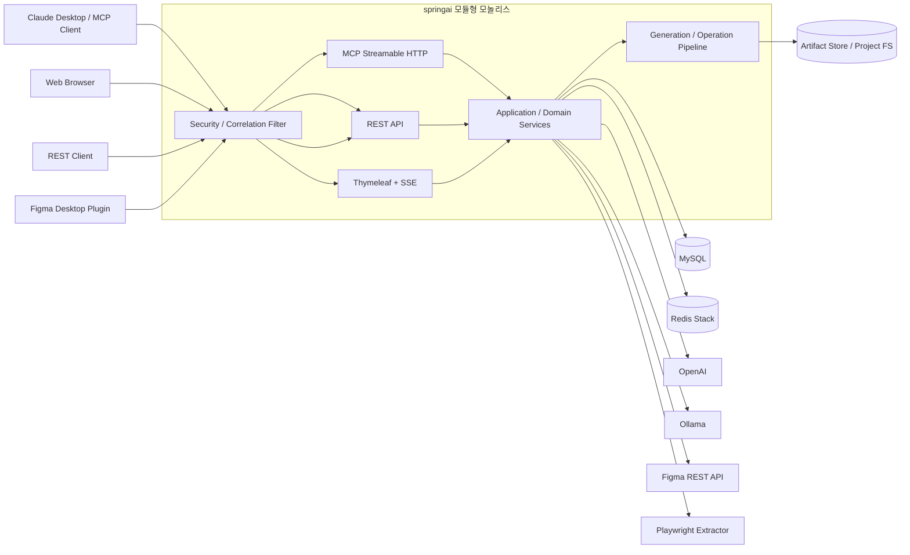
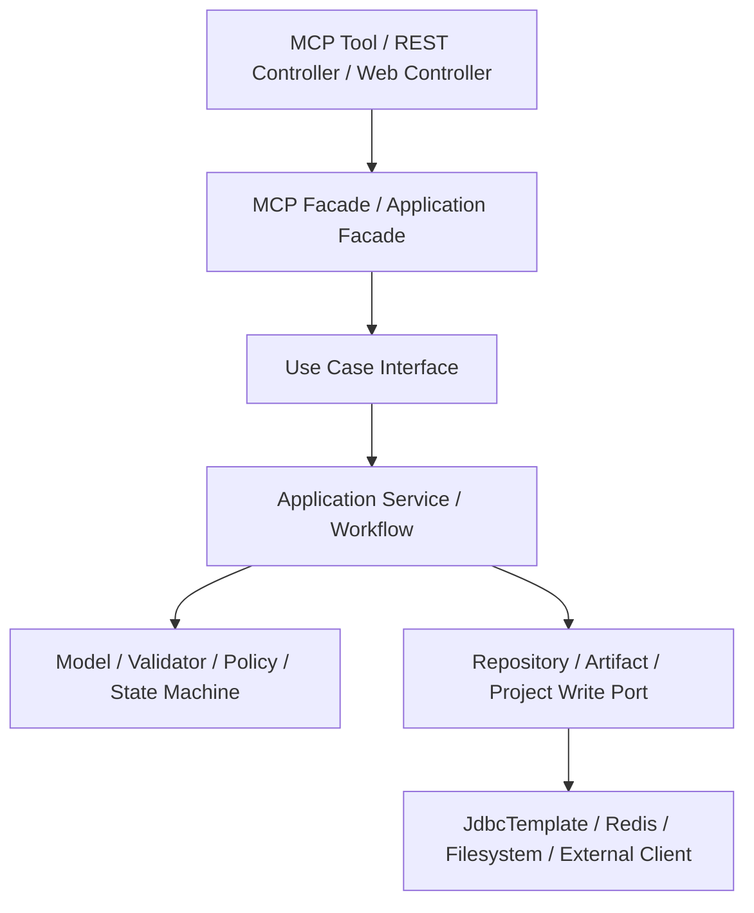
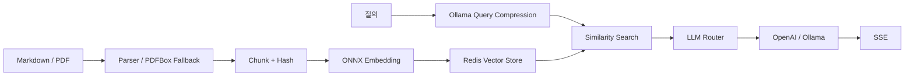

# SpringAI 프로젝트 전체 아키텍처 분석

> 분석 기준일: 2026-08-17
> 분석 대상: 현재 로컬 워크트리의 Java 소스, 설정, DB Migration, 계약 Schema, Figma/JSP 플러그인, 테스트와 운영 문서
> 대상 프로젝트: `springai`
> 주의: 사용자 소유 미커밋 변경(`.codex/config.toml`, `docs/figma/R6-040-048_AdvancedFeatures_Roadmap.md`, `figma-capture/`)은 분석 대상에는 포함하되 수정하지 않았다.

## 1. 분석 결론

`springai`는 Spring Boot 4.1과 Spring AI 2.0을 기반으로 다음 일곱 영역을 한 프로세스에서 제공하는 **운영 지향 모듈형 모놀리스 MCP 애플리케이션**이다.

1. Claude Desktop/Web 및 MCP Client용 Streamable HTTP Tool Server
2. eGovFrame CRUD·Board·Master/Detail·보안·메뉴 소스 생성
3. OpenAI·Ollama 라우팅과 Redis 기반 RAG·채팅
4. JSP/웹 화면 분석과 승인 기반 Thymeleaf Project 변환
5. Semantic Figma Role·Variant Resolver, Bundle, Desktop Plugin
6. 상태 기반 Operation·Artifact·승인·Rollback 워크플로
7. 보안, 회복탄력성, 관측성, CI와 운영 상태 관리

현재 아키텍처의 핵심은 다음 다섯 가지다.

- MCP, REST, Thymeleaf/SSE Adapter가 동일한 Application Service와 Domain Contract를 재사용한다.
- `ScreenSpecification`이 DB 업무 의미, Thymeleaf Binding, Figma Screen Spec을 연결하는 중심 계약이다.
- CRUD·Board·Master/Detail 생성은 공통 `service/generation/**` Pipeline으로 통합됐다.
- Figma와 Thymeleaf 변경은 Preview → 승인 → Apply → 검증/Rollback 경계를 공유한다.
- MySQL 상태 원장, content-addressed Artifact Store, Redis, 파일시스템을 용도별로 분리한다.

이전 문서에서 주요 위험으로 지적한 MCP 무인증 실행, Flyway 부재, 관측성 부재, Board/MasterDetail 거대 Orchestrator, 개발·운영 리소스 혼재, CI 부재는 대부분 해소됐다. 남은 핵심 위험은 단일 프로세스 장애 반경, package 수준의 약한 모듈 경계, Flyway와 Repository 자체 DDL의 과도기적 공존, 외부 분산 트랜잭션 Outbox 부재, 일부 공개 REST 경로, 실 Figma Desktop E2E의 CI 자동화 한계다.

## 2. 분석 방법과 현재 규모

다음 항목을 실제 코드에서 다시 조사했다.

- `build.gradle`, `application.yaml`, `logback-spring.xml`, `.github/workflows/ci.yml`
- `config/**`, `controller/**`, `tools/**`, `service/**`, `chat/**`, `mapper/**`, `model/**`
- `service/generation/**`, `service/thymeleaf/**`, `service/figma/**`, `service/artifact/**`
- `website-figma-contract`, `jsp-design-extractor`, Figma Plugin 3종
- Flyway V1~V11, MCP/REST 계약 Snapshot, 운영 검증 보고서
- 현재 생성된 JUnit XML과 Plugin 테스트 결과

### 2.1 코드 규모

| 항목 | 실측값 |
|---|---:|
| 메인 Java 파일 | 721 |
| 메인 Java 코드 | 53,793줄 |
| 테스트 Java 파일 | 243 |
| `@Service` 보유 파일 | 144 |
| Controller 보유 파일 | 24 |
| `tools/**`의 `@Tool` 보유 클래스 | 38 |
| `tools/**`의 `@Tool` 선언 | 113 |
| MCP 계약 Snapshot 공개 메서드 | 95 |
| REST 계약 Snapshot 엔드포인트 | 68 |
| JdbcTemplate Repository | 19 |
| Flyway Migration | 11 |
| 최근 JUnit 결과 | 1,398개, 실패 0, 오류 0, Skip 3 |
| Semantic Figma Schema | 27개 검증 |
| Figma Screen Plugin Core/Refinement | 44개 / 29개 테스트 |

`@Tool` 선언 수와 MCP 공개 수가 다른 이유는 annotation scanner를 비활성화하고 `McpConfig`에서 공개 Tool 객체를 수동 등록하기 때문이다. 이 차이는 의도된 공개면 제어이며 `McpToolDefinitionSnapshotTest`가 계약 Drift를 감지한다.

## 3. 시스템 컨텍스트



### 3.1 외부 의존성과 장애 영향

| 의존성 | 기본 위치 | 용도 | 장애 격리 |
|---|---|---|---|
| MySQL | 환경변수 기반 Datasource | 업무 조회, 계약, Operation, 승인, Report, Artifact Catalog | Hikari timeout, readiness, Flyway fail-fast |
| Redis Stack | `redis://localhost:6379` | Vector Store, Chat Memory, Session/문서 Hash | 연결/읽기 timeout, 외부 상태 표시 |
| Ollama | `localhost:11434` | 로컬 채팅, 민감 질의, 쿼리 압축 | timeout, Circuit Breaker, Bulkhead |
| OpenAI | 외부 API | 클라우드 채팅·Vision | timeout, Circuit Breaker, Bulkhead |
| Figma API | `api.figma.com` | 디자인 참조·Library 조회 | 읽기 중심, allowlist, timeout/retry |
| Playwright Extractor | `127.0.0.1:4319` | 웹 캡처·`.figpack` 생성 | 기능 flag, SSRF 검증, loopback guard |
| 파일시스템 | 허용된 프로젝트/Artifact 경로 | 생성 소스·Baseline·Bundle·이미지 | SafePath, symlink 차단, staging/atomic replace |

## 4. 런타임과 배포 구조

### 4.1 기술 스택

| 영역 | 기술 |
|---|---|
| 언어/Toolchain | Java 17, CI Temurin 21 |
| 애플리케이션 | Spring Boot 4.1.0-RC1, Servlet/Tomcat |
| AI/MCP | Spring AI 2.0.0-RC1, MCP Server WebMVC, Streamable HTTP |
| 웹 | Thymeleaf, SSE |
| 생성 Template | FreeMarker 2.3.33 |
| DB | MySQL, Spring JDBC, Flyway |
| RAG/Memory | Redis Vector Store, Redis Chat Memory |
| LLM | OpenAI, Ollama |
| Embedding | ONNX Transformers, `ko-sroberta-multitask` |
| Browser 분석 | Node.js, TypeScript, Playwright, axe |
| Figma | Figma Plugin API, REST API, JSON Bundle |
| 계약 | JSON Schema, 불변 Version Snapshot |
| 운영 | Actuator, Micrometer, JSON Lines Log, GitHub Actions |

### 4.2 프로세스와 패키징

- 단일 Embedded Tomcat 프로세스가 MCP, REST, Web/SSE를 함께 제공한다.
- 기본 바인딩은 `127.0.0.1:8080`, graceful shutdown 30초다.
- 결과물은 실행 가능한 `bootJar` 하나이며 일반 `jar`는 비활성화돼 있다.
- 운영 Template은 classpath를 기본으로 사용하고 필요한 경우에만 `EXTERNAL_TEMPLATE_DIRECTORY`를 우선 탐색한다.
- `prodBootJarSmoke`가 소스 디렉터리 밖에서 Thymeleaf/정적 리소스 패키징을 검증한다.
- MCP annotation scanner는 꺼져 있으며 `McpConfig.allToolCallbacks`가 공개 Tool을 중앙 등록한다.

## 5. 입력 Adapter와 공개 계약

### 5.1 MCP

MCP Transport는 `/mcp/**` Streamable HTTP다. HTTP 연결 자체는 Spring Security에서 허용하지만, 실제 Tool 실행은 다음 계층을 모두 통과한다.

```text
MCP HTTP 요청
  → McpAuthenticationInterceptor
  → McpActorContext(correlation/credential/authority)
  → McpAuthorizingToolCallback
  → ToolAuthorizationPolicy
  → @McpToolRisk(READ/EXTERNAL/DB_WRITE/FILE_WRITE/APPLY)
  → Tool → MCP Facade → Use Case
```

- 기본 `MCP_AUTH_MODE=REQUIRED`: 공통 Token이 없거나 잘못되면 모든 Tool이 fail-closed 된다.
- `AUDIT_ONLY`, 만료 시각이 있는 `COMPATIBILITY`는 전환 용도다.
- 현재/이전 shared token 회전을 지원한다.
- 모든 등록 Tool 메서드는 `@McpToolRisk`가 없으면 애플리케이션 기동이 실패한다.
- 입력·출력과 감사 로그는 민감정보 Redactor를 통과한다.
- non-loopback 배포에서 보안 조건이 맞지 않으면 Startup Guard가 차단한다.

### 5.2 REST

REST 계약 Snapshot 기준 68개 엔드포인트가 있으며 주요 영역은 다음과 같다.

| Prefix | 역할 |
|---|---|
| `/api/figma/**` | Screen Spec, Operation Report, Refinement, Hybrid |
| `/api/design-systems/**` | Profile, Registry, Inventory, Pattern/Rule 승인, Rollback |
| `/api/thymeleaf/**` | Binding 생성, Project Preview/승인/Apply/Baseline |
| `/api/screen-specifications/**` | 업무 화면 계약 저장·조회 |
| `/api/operations/**` | 운영 상태와 Artifact Reconciliation |
| `/api/tools/**` | Tool 보조 API |
| `/api/rag/**` | RAG 검색 |

일반 `/api/**`는 `X-API-Key`가 필요하다. Figma Plugin은 장기 Key 대신 HMAC 단기 Bearer Token을 사용하며 `figma:screens:read`, `figma:refinements:write`, `figma:reports:write` Scope로 제한된다. 승인·반려처럼 운영자 전용 경로는 단기 Token으로 접근할 수 없다.

### 5.3 Web/SSE

- `/`는 Thymeleaf 채팅 UI다.
- `/ai/**`는 일반/RAG 스트리밍 응답을 제공한다.
- `/api/chat/**`, `/api/ollama/**`, `/api/documents/**`는 현재 permitAll이다.
- 비동기 Executor는 correlation context를 전파하며 capture/indexing/chat/vision 별로 동시성을 제한한다.

## 6. 코드 계층과 모듈 경계



신규 핵심 흐름은 Hexagonal Architecture에 가까운 `Adapter → Facade → Use Case → Application Service → Port` 구조다. 오래된 조회·유틸리티 기능은 여전히 `Tool/Controller → Service → mapper` 구조를 사용한다.

주요 패키지는 다음과 같다.

```text
com.krdevops.springai
├── chat/                 RAG, SSE, 세션, 문서 인덱싱
├── config/               MCP, Security, Observability, Resilience, VectorStore
├── controller/           Figma, Thymeleaf, Operation, RAG REST Adapter
├── mapper/               JdbcTemplate Repository
├── model/                Artifact, Operation, Design, Figma, Thymeleaf 계약
├── policy/               생성/민감 데이터 정책
├── service/
│   ├── generation/       공통 생성 Pipeline과 기능별 구현
│   ├── thymeleaf/        Binding, Preview, Gate, Apply, Baseline
│   ├── figma/            Resolver, Bundle, Operation, Refinement
│   ├── designsystem/     Profile, Registry, Rule/Pattern, Drift
│   ├── artifact/         Content-addressed Store/Catalog/Reconciliation
│   ├── operation/        상태 전이와 Lock
│   ├── resilience/       외부 호출 Guard
│   └── observability/    Metric과 운영 상태
└── tools/                MCP Adapter
```

Gradle multi-module이나 JPMS 경계는 아니므로 패키지 간 잘못된 의존을 컴파일 단계에서 강제 차단하지는 못한다.

## 7. eGovFrame 생성 아키텍처

### 7.1 공통 Generation Pipeline

CRUD·Board·Master/Detail은 모두 구형 단일 Orchestrator에서 공통 Pipeline으로 전환됐다.

```mermaid
flowchart LR
    Tool[MCP Generation Tool]
    Facade[Feature MCP Facade]
    Dispatch[Provider Dispatch]
    Planner[Feature Planner]
    Renderer[Feature Renderer]
    Pre[PRE_WRITE Processor]
    Write[ApprovedProjectWritePort]
    Post[POST_WRITE Processor]
    Verify[Verifier Runner]
    History[History Recorder]
    Result[Result Assembler]

    Tool --> Facade --> Dispatch --> Planner --> Renderer --> Pre --> Write --> Post --> Verify --> History --> Result
```



공통 계약은 `service/generation/model`, `pipeline`, `pipeline/processor`에 있다.

- `GenerationBlueprint`, `RenderedGenerationPlan`, `GenerationExecution`
- `GenerationStageProcessor`, `GenerationVerifier`, `GenerationHistoryRecorder`
- `CodeServiceGenerationExecutor`, `ApprovedProjectWritePort`
- 공통 Thymeleaf/ControllerScan/MyBatis Processor

기능별 `crud`, `board`, `masterdetail` 패키지가 Planner, Renderer, Processor, Verifier, Result Assembler를 소유한다. MCP Tool은 생성 정책을 직접 조합하지 않고 기능별 Facade/Use Case를 호출한다. 구형 Board/MasterDetail Orchestrator는 제거됐고 `CrudOrchestrationService`만 80줄짜리 `@Deprecated` 호환 Facade로 남아 있다.

### 7.2 파일 적용 정책

생성 파일은 공용 `ApprovedProjectWritePort`를 통해 적용한다.

- `ATOMIC_APPROVED`: staging → backup → 전체 교체 → 실패 시 rollback
- `BEST_EFFORT_COMPATIBILITY`: 파일별 독립 처리로 기존 호환 정책 유지
- `SafePathResolver`: 허용 root, 경로 이탈, symlink 차단
- `ProjectChangeSet`: 생성 계획과 실제 파일 쓰기를 분리
- Marker 기반 설정 변경과 binary asset도 동일 Port를 사용한다.

### 7.3 ScreenSpecification

`ScreenSpecification`은 생성 아키텍처의 중심 업무 계약이다.

- ID, Version, 승인 상태
- Archetype과 Page/Action/Field/DataSource
- Layout Density와 Binding 정책
- Semantic Role, Pattern, Field Mode
- 검증 Issue와 승인 이력

승인된 Specification만 최종 Thymeleaf/Figma 생성에 사용한다. Q&A Runtime 계약은 현재 `qna-update`를 포함한 7화면 v3다.

## 8. Thymeleaf 변환과 Project Workflow

```mermaid
flowchart LR
    Legacy[JSP / Controller / VO]
    Reader[Safe Source Readers]
    Contract[Binding Contract Assembler]
    Compose[Binding Composer]
    Preview[PREVIEW_READY Operation]
    Approve[APPROVED]
    Apply[ApprovedProjectWritePort]
    Gate[Static / Browser / Build Gates]
    Artifact[Report / Baseline Artifact]

    Legacy --> Reader --> Contract --> Compose --> Preview --> Approve --> Apply --> Gate --> Artifact
```



주요 특성은 다음과 같다.

- LIST/FORM/DETAIL과 Board/MasterDetail 다중 root를 지원한다.
- Legacy 원본 fingerprint와 Binding Contract를 Operation Snapshot에 저장한다.
- Apply 직전 원본 변경·삭제를 재검사해 `CONFLICT`로 차단한다.
- 정적 Gate는 parse, binding, route parity, overflow 등 BLOCK/WARN 정책을 사용한다.
- Browser Gate는 Playwright 1440/768/390, axe, screenshot diff를 수행한다.
- Visual Baseline은 별도 승인 Artifact이며 재검증 결과도 Artifact Catalog에 보존한다.
- Project Apply는 Lock, 상태 전이, backup/rollback을 사용한다.

## 9. Semantic Figma와 Design System

### 9.1 서버 Pipeline

```mermaid
flowchart LR
    ApprovedSpec[APPROVED ScreenSpecification]
    Pattern[Published Screen Pattern]
    Role[Semantic Role Resolver]
    Variant[Variant Rule Resolver]
    Registry[Published Component Registry]
    Screen[FigmaScreenSpec v2]
    Bundle[Immutable Export Bundle]
    Plugin[Figma Desktop Plugin]
    Report[Generation Report]

    ApprovedSpec --> Pattern --> Role --> Variant --> Registry --> Screen --> Bundle --> Plugin --> Report
```



- Registry와 Rule Set은 Published Component/Variant Key를 결정적으로 해석한다.
- 첫 Variant, 첫 Component, local name, 정상 Apply placeholder fallback을 금지한다.
- Pattern, Rule Set, Registry Snapshot과 Contract Version을 Bundle에 동봉한다.
- Profile/Registry/Rule/Pattern 승인과 Publish 이력을 DB에 저장한다.
- Registry Drift, Breaking Change 영향 화면, Shadow 비교, Rollback Preview를 제공한다.

### 9.2 Desktop Plugin

`figma-screen-spec-plugin`은 CREATE/MERGE/REPLACE/SKIP과 원자적 staging/rollback을 지원한다.

- Published Variant Key 직접 import
- logicalNodeId 기반 재사용·이동·추가·archive
- Layout, Accessibility, Visual Regression Gate
- Generation Report 서버 저장
- Manual Refinement Capture → Preview → 승인 → 재적용
- 실제 TextNode 속성 쓰기 성공 건수와 PatchSet `APPLIED` 전이 연결
- 장기 X-API-Key 대신 Scope가 제한된 15분 단기 Token 사용

2026-08-16 실제 Figma Desktop에서 Q&A 7화면 MERGE, Fallback 0, 세 Gate PASSED가 확인됐다. Registry `2.2.1` Snapshot으로 7개 Bundle Rollback Preview를 재생성한 뒤 운영 `2.2.2/PUBLISHED`로 복구했다. 상세 증적은 [KRDS Q&A 7화면 운영검증 보고서](../figma/KRDS_QNA_7화면_운영검증보고서_2026-08-16.md)에 있다.

### 9.3 플러그인/계약 모듈

| 모듈 | 역할 |
|---|---|
| `jsp-design-extractor` | Playwright 캡처, `.figpack`, Browser Gate |
| `jsp-to-figma-plugin` | 렌더 기반 디자인 import |
| `krds-design-system-author-plugin` | Token·Variable·Component·Variant authoring |
| `figma-screen-spec-plugin` | Semantic Bundle materialization과 Refinement |
| `website-figma-contract` | 서버/Plugin 공용 JSON Schema와 Fixture |

## 10. RAG와 멀티 LLM



- 문서 Hash로 변경분만 재색인하고 이전 Chunk ID를 제거한다.
- 기본 임베딩은 로컬 ONNX 모델이다.
- 질의 압축은 경량 Ollama 모델을 사용한다.
- Chat Memory와 Session Metadata는 Redis에 저장한다.
- `LlmRouterService`가 작업 유형·민감도·모델 요청에 따라 OpenAI/Ollama를 선택한다.
- 일반 Chat을 통한 코드 생성은 MCP 생성 Tool 사용으로 유도한다.

## 11. 데이터와 상태 원장

### 11.1 MySQL과 Flyway

MySQL은 업무 데이터뿐 아니라 다음 상태 원장을 보관한다.

- ScreenSpecification과 FigmaScreenSpec
- DesignSystem Profile, Registry, Pattern, Rule Set, Inventory
- Thymeleaf/Figma Operation, Event, Lock
- Review/Approval, Generation Report, Refinement PatchSet
- Artifact Catalog와 Operation Link
- Generation History와 Design Analysis

Flyway V1~V11이 baseline, Operation, Artifact, Lock, Project Root, KRDS Contract, Inventory, 승인 Workflow, Manual Refinement를 관리한다. 기존 환경 호환을 위해 Repository의 `CREATE TABLE IF NOT EXISTS`도 `LEGACY_REPOSITORY_DDL_ENABLED=true` 기본값으로 남아 있어 현재는 이중 안전망 단계다.

### 11.2 Artifact Store

Artifact는 `stage → content hash → filesystem commit → catalog save → operation link`로 처리한다.

- content hash 기반 멱등 저장
- 허용 media type/크기 제한
- DB Catalog와 파일 Store 분리
- orphan/missing 탐지와 명시적 quarantine reconciliation
- dry-run과 `confirm=true` 실행 분리

DB와 파일시스템을 하나의 ACID 트랜잭션으로 묶는 Outbox는 아직 없으며 운영 상태 API가 `NOT_CONFIGURED`로 노출한다.

### 11.3 Redis

Redis는 Vector Store, Chat Memory, Session Metadata, 문서 Hash/Chunk Index를 함께 담당한다. 연결 timeout과 상태 점검은 구현됐지만 도메인별 TTL·보존 기간은 추가 명문화가 필요하다.

## 12. 보안 아키텍처

### 12.1 인증·인가 경계

| 경로/기능 | 현재 정책 |
|---|---|
| MCP Transport | HTTP permitAll, Tool 실행은 shared token + risk authorization |
| 일반 `/api/**` | `X-API-Key` |
| Figma 조회/Preview/Report | Scope 제한 단기 Bearer Token 또는 `X-API-Key` |
| Figma 승인/반려 | 운영자 `X-API-Key`만 허용 |
| `/`, `/ai/**`, chat/ollama/documents API | permitAll |
| Actuator | health/metrics만 permitAll |
| 그 외 | denyAll |

### 12.2 추가 통제

- MCP Credential rotation과 만료된 legacy compatibility
- Tool별 위험 등급과 deny-by-default
- SSRF/redirect 재검증, loopback deployment guard
- Figma file/node allowlist와 응답 크기/깊이 제한
- 생성 경로 allowlist, symlink·path traversal 차단
- 외부 빌드 기본 비활성 및 명령/timeout 검증
- CORS 기본 deny, 필요한 Figma REST 경로만 명시 허용
- JSON Log, Tool 입출력, 오류 응답의 민감정보 Redaction

### 12.3 남은 보안 과제

1. permitAll인 documents/chat 경로에 배포 프로파일별 인증·rate limit이 필요하다.
2. 단일 `X-API-Key`는 사용자별 역할과 세밀한 감사 주체를 표현하지 못한다.
3. MCP 위험 등급은 현재 인증/감사 근거이며 `APPLY` 별도 다중 승인 같은 정책은 후속 과제다.
4. 외부 공개 배포 시 reverse proxy, TLS, secret manager, network policy가 필요하다.

## 13. 회복탄력성과 관측성

### 13.1 회복탄력성

- 외부 의존성별 connect/first-token/idle/total timeout
- 실패 임계값과 open duration을 갖는 Circuit Breaker
- capture/indexing/chat/vision 동시성 Bulkhead
- bounded async queue와 context propagation
- graceful shutdown과 readiness
- 외부 의존성 Health Indicator

### 13.2 관측성

- Actuator health/metrics
- HTTP/MCP/SSE correlation ID
- Operation/Artifact/Actor context 전파
- JSON Lines 구조화 로그와 rolling
- Tool 호출 수/시간/위험등급/결과 Metric
- Operation 상태 전이와 rollback/conflict Metric
- Artifact ingest/link/read/reconciliation Metric
- 외부 호출 timeout/circuit Metric
- Thymeleaf Gate와 Figma Role/Variant/Drift/Visual/Refinement Metric
- `/api/operations/status` 운영 Snapshot

Metric tag는 유한 집합으로 정규화해 cardinality 폭증을 방지한다.

## 14. CI와 품질 Gate

GitHub Actions `CI`는 push/PR의 `main`에서 다음을 수행한다.

1. Temurin 21, Node 24, Gradle 설정
2. Playwright Chromium 설치
3. 1440/768/390 Browser Gate와 axe/visual 테스트
4. `./gradlew clean test bootJar -Pci`
5. 소스 경로 밖 `prodBootJarSmoke`
6. 실패 시 Test/Problem Report Artifact 업로드

Gradle `check`에는 Semantic Figma Contract, Q&A 7화면 Runtime Resolver, Runtime Bundle Plugin, Manual Refinement 테스트가 연결돼 있다. CI는 대형 로컬 ONNX 모델과 외부 DB/Redis가 필요한 통합 테스트를 제외하고, 로컬 전체 검증은 `./gradlew test`로 수행한다.

## 15. 강점과 구조적 한계

### 15.1 강점

- Adapter가 달라도 동일한 계약과 Service를 재사용한다.
- 생성 로직이 Feature별 Planner/Renderer와 공통 Pipeline으로 분리됐다.
- Preview·승인·Apply·Rollback이 상태 원장과 Artifact 증적에 연결된다.
- Figma Role/Variant 선택이 결정적이고 Bundle Snapshot으로 재현 가능하다.
- 파일 변경은 공용 Write Port와 SafePath를 통과한다.
- Flyway, Actuator, 구조화 로그, 회복탄력성, CI가 운영 기반을 형성한다.
- 계약 Snapshot, Golden Fixture, Browser Gate, 실제 Figma Desktop 증적이 함께 존재한다.

### 15.2 구조적 한계

- 단일 JVM·단일 배포 단위여서 DB, Redis, LLM, Figma 기능의 장애 반경이 겹친다.
- 기능 패키지는 분리됐지만 컴파일 수준 모듈 경계가 없다.
- 721개 Java 파일과 144개 Service로 탐색·변경 비용이 높다.
- Flyway와 Repository 자체 DDL이 공존한다.
- DB Catalog와 파일 Artifact commit 사이에 Outbox/보상 트랜잭션이 없다.
- Redis가 여러 책임을 공유하며 TTL 정책이 일관되게 드러나지 않는다.
- 공개 chat/documents 경로와 단일 API Key는 외부 SaaS 배포에 부족하다.
- Figma Desktop E2E는 실제 앱 의존성이 커 GitHub Actions에서 완전 자동화되지 않는다.

## 16. 개선 우선순위

| 우선순위 | 개선 항목 | 목적 |
|---|---|---|
| P0 | Repository legacy DDL 비활성화·제거 | Flyway를 유일한 Schema 원장으로 확정 |
| P0 | 공개 chat/documents 경로 인증·rate limit | 외부 배포 자원 고갈과 데이터 노출 방지 |
| P1 | Artifact Outbox 또는 보상 상태 머신 | DB/파일 이중 쓰기 장애 복구 자동화 |
| P1 | API Key를 사용자/역할 기반 인증으로 확장 | 승인·Apply 감사 주체와 최소권한 강화 |
| P1 | Redis 도메인별 TTL·용량·삭제 정책 | 장기 운영 시 무한 누적 방지 |
| P1 | Architecture Test/Gradle module 경계 | 패키지 역방향 의존과 재결합 방지 |
| P1 | Figma Desktop E2E 전용 Runner | 수동 실환경 검증을 반복 가능한 Release Gate로 전환 |
| P2 | 외부 의존성별 독립 Worker 검토 | Capture/Index/Vision 장애 반경과 scaling 분리 |
| P2 | 운영 배포 표준화 | Container, TLS, Secret Manager, Backup/Restore 정착 |

## 17. 권장 목표 구조

마이크로서비스 분해보다 먼저 현재 모듈형 모놀리스의 경계를 빌드 수준으로 강화하는 것이 적절하다.

```text
springai
├── platform-mcp
│   ├── transport
│   ├── authentication
│   ├── authorization
│   └── tool-registry
├── platform-operation
│   ├── state-machine
│   ├── artifact
│   ├── project-write
│   └── observability
├── feature-generation
│   ├── crud
│   ├── board
│   ├── masterdetail
│   └── shared-pipeline
├── feature-thymeleaf
│   ├── binding
│   ├── preview
│   └── browser-gate
├── feature-semantic-figma
│   ├── design-system
│   ├── resolver
│   ├── export
│   └── refinement
├── feature-rag-chat
└── feature-security-menu
```

MCP Tool, REST Controller, Web Controller는 얇은 inbound Adapter로 유지하고, 상태 전이·승인·파일 적용·외부 호출 정책은 Application/Domain 계층과 Port에만 둔다. 외부 Worker 분리는 Capture/Index/Vision처럼 CPU·I/O 특성과 장애 반경이 명확히 다른 기능부터 검토한다.

## 18. 최종 판정

현재 `springai`는 기능 프로토타입 단계를 넘어 계약·승인·Rollback·관측성·CI를 갖춘 성숙한 모듈형 모놀리스다. 특히 공통 Generation Pipeline, 승인 기반 Project Write Port, Operation/Artifact 상태 원장, Semantic Figma 7화면 실증이 핵심 아키텍처 자산이다.

다음 단계의 중심은 신규 기능 추가보다 **과도기 제거와 경계 강화**다.

1. Flyway 단일화와 legacy DDL 제거
2. 공개 API 인증·rate limit 강화
3. Artifact 이중 쓰기 복구 모델 도입
4. 모듈 의존 규칙 자동 검증
5. Redis 보존 정책과 Figma Desktop Release Runner 정착

이 순서로 진행하면 단일 배포의 조합 편의성을 유지하면서 외부 배포 안정성, 감사 가능성, 장애 격리 수준을 높일 수 있다.
