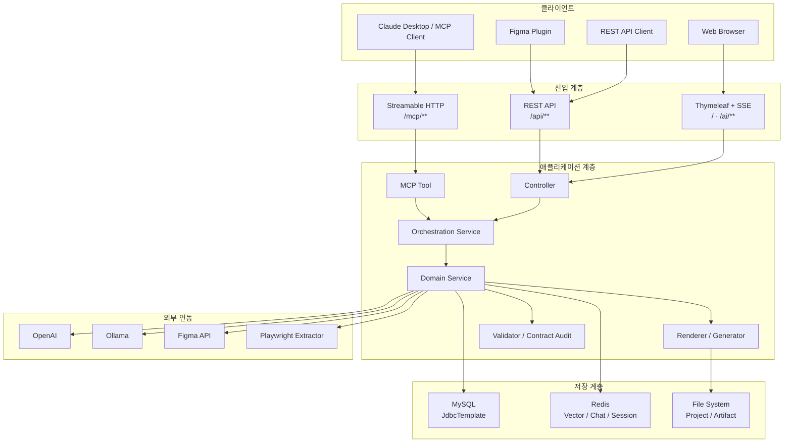
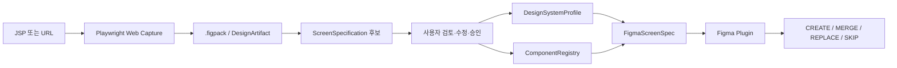
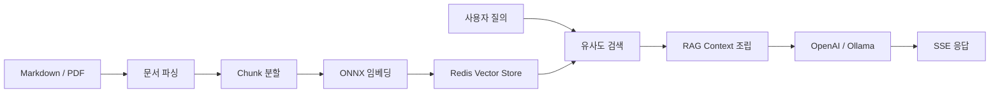

# SpringAI 프로젝트 전체 아키텍처 분석

> 분석 기준일: 2026-07-31  
> 분석 대상: 현재 로컬 워크트리의 애플리케이션 소스, 설정, 플러그인, 계약 스키마 및 테스트  
> 대상 프로젝트: `springai`

## 1. 분석 요약

`springai`는 Spring Boot 기반의 **모듈형 모놀리스 MCP 서버**다. 단순한 AI 채팅 애플리케이션이 아니라 다음 네 가지 업무 영역을 하나의 애플리케이션에서 통합 제공한다.

1. eGovFrame 표준 CRUD 및 프로젝트 소스 자동 생성
2. RAG 문서 검색과 OpenAI·Ollama 기반 채팅
3. JSP·웹 화면 분석과 Semantic Figma 변환
4. 데이터베이스·프로젝트·보안·메뉴 관련 MCP 도구 제공

현재 구조는 기능 간 도메인 모델과 트랜잭션을 공유하기 쉽다는 장점이 있다. 반면 기능이 증가하면서 거대 Orchestrator, MCP 인증 범위, DB 스키마 관리, 운영 관측성 문제가 주요 구조적 위험으로 나타난다.

## 2. 전체 시스템 구성



## 3. 기술 스택

| 영역 | 기술 |
|---|---|
| 언어 | Java 17 |
| 애플리케이션 프레임워크 | Spring Boot 4.1.0-RC1 |
| AI 프레임워크 | Spring AI 2.0.0-RC1 |
| MCP Transport | Spring AI MCP Server WebMVC, Streamable HTTP |
| 웹 UI | Thymeleaf, SSE |
| 소스 생성 템플릿 | FreeMarker 2.3.33 |
| 관계형 데이터베이스 | MySQL, Spring JDBC |
| 벡터 검색 | Redis Stack, RedisVectorStore |
| 채팅 메모리 | Redis |
| 로컬 LLM | Ollama |
| 클라우드 LLM | OpenAI |
| 임베딩 | ONNX Transformers, `ko-sroberta-multitask` |
| 웹 화면 분석 | Node.js, TypeScript, Playwright |
| Figma 연동 | Figma Plugin API, Figma REST API, `.figpack` |
| 계약 검증 | JSON Schema |
| 빌드 | Gradle, npm |

주요 설정 파일은 다음과 같다.

- `build.gradle`: Java, Spring Boot, Spring AI 및 외부 라이브러리 의존성
- `src/main/resources/application.yaml`: MCP, LLM, Redis, MySQL, Figma, 웹 캡처 설정
- `src/main/java/com/krdevops/springai/SpringaiApplication.java`: 애플리케이션 시작점

현재 코드 규모는 다음과 같다.

| 구분 | 규모 |
|---|---:|
| 메인 Java 파일 | 351개 |
| 메인 Java 코드 | 약 28,700줄 |
| 테스트 Java 파일 | 116개 |
| `@Service` 클래스 | 약 90개 |
| MCP Tool 클래스 | 25개 |
| `@Tool` 메서드 | 79개 |
| REST 매핑 메서드 | 49개 |

## 4. 애플리케이션 진입점

### 4.1 MCP 서버

주요 MCP 진입점은 `/mcp/**`이며 Streamable HTTP 방식으로 동작한다.

`src/main/java/com/krdevops/springai/config/McpConfig.java`는 Tool 객체를 수동으로 등록한다. Annotation Scanner가 비활성화되어 있으므로 외부에 공개되는 도구가 중앙 설정에 명시적으로 나타난다.

대표 MCP 도구의 기능은 다음과 같다.

- CRUD·게시판·마스터 상세 소스 생성
- 데이터베이스 스키마 조회와 읽기 전용 SQL 실행
- eGovFrame 프로젝트 생성·검사·빌드 검증
- 파일 저장과 생성 코드 검증
- RAG 문서 수집 및 검색
- 웹 화면 캡처와 디자인 분석
- Figma 업무 화면과 디자인 시스템 생성
- 메뉴·권한·인증 관련 소스 생성

`McpKnowledgeConfig`는 `docs`, `prompts`의 Markdown 문서를 MCP Resource로 제공하고 코드·CRUD·보안·메뉴 생성용 Prompt Template을 노출한다.

### 4.2 REST API

REST API는 MCP 기능을 웹 클라이언트나 Figma 플러그인에서도 사용할 수 있도록 제공한다.

| 경로 | 역할 |
|---|---|
| `/api/tools/**` | Tool 호출 및 보조 기능 |
| `/api/rag/**` | RAG 검색 |
| `/api/figma/**` | Figma Screen Spec 생성 및 조회 |
| `/api/design-systems/**` | Design System Profile 관리 |
| `/api/figma/hybrid/**` | `.figpack` 기반 하이브리드 변환 |
| `/api/figma/operations/**` | Figma 생성·검토 작업 |
| `/api/chat/sessions/**` | 채팅 세션 관리 |
| `/api/documents/**` | 문서 수집·재색인 |
| `/api/ollama/**` | Ollama 관련 기능 |

### 4.3 웹 UI

루트 경로 `/`는 Thymeleaf 기반 채팅 화면을 제공한다. `/ai/rag/stream`, `/ai/simple/stream`은 SSE로 LLM 응답을 스트리밍한다.

현재 Thymeleaf와 정적 리소스 경로가 `file:src/main/resources/...` 형태로 설정되어 있다. 이 구성은 소스 디렉터리에서 실행하는 개발 환경에는 편리하지만 패키징된 `bootJar` 운영 환경에는 적합하지 않으므로 개발·운영 프로파일 분리가 필요하다.

## 5. eGovFrame 소스 생성 아키텍처

### 5.1 처리 흐름

```mermaid
flowchart LR
    REQUEST["MCP Tool / REST"] --> SCHEMA["DB Schema 분석"]
    SCHEMA --> SPEC["ScreenSpecification 생성"]
    SPEC --> REVIEW["검증·수정·승인"]
    REVIEW --> MODEL["생성 모델 조립"]
    MODEL --> TEMPLATE["FreeMarker 렌더링"]
    TEMPLATE --> OUTPUT["Java / XML / JSP / Thymeleaf"]
    OUTPUT --> SAVE["파일 저장"]
    SAVE --> VERIFY["정적 검증 / 계약 감사 / 선택적 빌드"]
    VERIFY --> HISTORY["생성 이력"]
```



`CrudOrchestrationService`가 CRUD 소스 생성 전체 과정을 조정한다.

1. 대상 테이블 스키마 조회
2. eGovFrame 패키지 규칙 검증
3. 프로그램 메타데이터 생성
4. `ScreenSpecification` 해석
5. 생성 모델 조립
6. 라우트·레이아웃·CSS 정책 검증
7. FreeMarker 템플릿 렌더링
8. Controller·Service·DAO·Mapper·화면 저장
9. 생성 코드 검증과 계약 감사
10. 생성 이력 기록

게시판과 마스터 상세 생성도 별도의 Orchestration Service를 사용하지만 전체 패턴은 동일하다.

### 5.2 ScreenSpecification

`ScreenSpecification`은 데이터베이스 스키마, 업무 화면, Thymeleaf 생성, Figma 화면 생성 사이의 핵심 중간 모델이다.

주요 속성은 다음과 같다.

- 화면 ID와 버전
- 승인 상태
- 기능과 화면 Archetype
- 기본 테이블과 데이터 소스
- 페이지 구성
- 데이터 바인딩
- 레이아웃 정책
- 검증 이슈

`ScreenSpecificationService`는 생성, 검증, 수정, 승인 과정을 담당한다. 승인된 Specification만 최종 Thymeleaf 또는 Figma 생성 단계로 진행할 수 있다.

### 5.3 생성과 검증

FreeMarker는 Java·XML·JSP·Thymeleaf 소스를 생성하는 Generator로 사용된다. Thymeleaf는 현재 애플리케이션 UI와 생성 대상 업무 화면의 View Template으로 사용된다.

생성 프로젝트의 실제 빌드 실행은 기본적으로 비활성화되어 있다. 빌드를 허용하려면 기능 플래그, 허용 경로, 명령어와 타임아웃 검증을 통과해야 한다.

## 6. Semantic Figma 아키텍처

### 6.1 전체 처리 흐름



### 6.2 Figma 화면 내보내기

`FigmaScreenExportService`는 다음 순서로 Figma 화면 규격을 생성한다.

1. 승인된 `ScreenSpecification` 조회
2. 대상 페이지 선택
3. 화면 유형과 레이아웃 패턴 결정
4. 화면 유형별 Builder 선택
5. `FigmaNodeSpec` 생성
6. `DesignSystemProfile` 조회
7. `ComponentRegistry`를 이용한 컴포넌트 매핑
8. 생성 결과 검증
9. 화면 버전 증가
10. DB와 불변 파일 아티팩트 저장

### 6.3 DesignSystemProfile과 ComponentRegistry

`DesignSystemProfile`은 특정 화면 생성에 사용할 회사 디자인 시스템과 활성 버전을 결정하는 운영 프로필이다.

`ComponentRegistry`는 논리 컴포넌트 ID를 Figma의 실제 게시 컴포넌트 Key와 연결한다.

```text
논리 컴포넌트 ID
        ↓
ComponentRegistry
        ↓
Figma Published Component Key
        ↓
Figma Component Instance
```

Registry 변경은 Preview, Diff, 사용자 확인, 적용, 버전 보존, Rollback 흐름으로 처리한다. 이를 통해 Figma 파일 내부 ID 변경이 업무 화면 규격에 직접 전파되는 것을 방지한다.

### 6.4 하이브리드 변환

`FigmaHybridExportService`는 `.figpack` 분석 결과를 바로 Figma에 반영하지 않는다.

```text
.figpack 분석
    ↓
ScreenSpecification 후보
    ↓
사용자 검토 및 수정
    ↓
승인
    ↓
Semantic Figma Export
```

이 승인 경계는 자동 분석 오류가 회사의 공식 Figma 디자인에 바로 반영되는 것을 방지한다.

### 6.5 관련 플러그인과 계약

| 모듈 | 역할 |
|---|---|
| `jsp-design-extractor` | URL을 Playwright로 렌더링하고 `.figpack` 생성 |
| `jsp-to-figma-plugin` | 렌더링 기반 디자인을 Figma로 가져오기 |
| `krds-design-system-author-plugin` | 토큰·변수·컴포넌트·반응형 Variant 생성 |
| `figma-screen-spec-plugin` | Semantic Screen Spec을 Figma Instance로 변환 |
| `website-figma-contract` | 플러그인 간 JSON Schema와 버전 계약 관리 |

`website-figma-contract/CONTRACT_RULES.md`는 ID, 버전, `logicalNodeId`, 생성 모드, 소유권, Bundle 교차 검증 규칙을 정의한다.

## 7. RAG 및 멀티 LLM 아키텍처

### 7.1 문서 수집과 검색



문서는 Markdown 또는 PDF로 수집한다. PDF 레이아웃 분석 실패 시 PDFBox 기반 파서로 대체한다. 문서 해시를 사용해 변경된 문서만 재색인하고, 기존 Chunk ID는 Redis에서 제거한 뒤 새 Chunk를 저장한다.

### 7.2 채팅 처리

`EgovSessionAwareChatServiceImpl`의 주요 역할은 다음과 같다.

- 사용자 질의 압축
- RAG 검색 컨텍스트 구성
- Redis 기반 세션별 대화 메모리
- OpenAI 또는 Ollama ChatClient 선택
- 스트리밍 응답 생성

`LlmRouterService`는 모델명, 민감도, 작업 유형에 따라 OpenAI와 Ollama를 선택한다. 일반 채팅으로 들어온 코드 생성 요청은 거부하고 MCP 생성 도구를 사용하도록 유도한다.

## 8. 데이터와 저장소

### 8.1 MySQL

Spring JDBC의 `JdbcTemplate`을 사용하며 AI 기능에는 다음 테이블이 사용된다.

- `AI_SCREEN_SPECIFICATION`
- `AI_FIGMA_SCREEN_SPEC`
- `AI_DESIGN_SYSTEM_PROFILE`
- `AI_COMPONENT_REGISTRY`
- `AI_FIGMA_REVIEW_HISTORY`
- `AI_FIGMA_GENERATION_REPORT`
- `AI_DESIGN_ANALYSIS`
- `AI_GENERATION_HISTORY`

큰 의미 모델은 JSON 문자열로 저장하고 ID, 버전, 상태와 같은 조회 조건은 관계형 컬럼으로 분리한다.

현재 각 Repository가 `@PostConstruct`에서 `CREATE TABLE IF NOT EXISTS`를 실행한다. Flyway나 Liquibase가 없으므로 운영 환경의 스키마 변경 이력, 재현성, 롤백을 통제하기 어렵다.

### 8.2 Redis

Redis는 다음 네 가지 역할을 동시에 수행한다.

- RAG Vector Store
- 채팅 메시지 메모리
- 채팅 세션 메타데이터
- 문서 해시와 Chunk ID 관리

현재 일부 데이터에는 명시적인 TTL이 없어 장기 실행 시 세션과 문서 메타데이터가 누적될 수 있다.

### 8.3 파일시스템

파일시스템에는 다음 자료가 저장된다.

- 생성된 eGovFrame 프로젝트
- `.figpack`
- `document.json`
- 미리보기와 이미지 자산
- Figma Screen Spec 버전별 결과
- 디자인 분석 결과

아티팩트 저장 시 임시 파일 작성 후 원자적 이동을 사용하며 경로 이탈과 Symbolic Link를 검사한다.

## 9. 외부 시스템 연동

| 외부 시스템 | 연동 목적 | 주요 통제 |
|---|---|---|
| OpenAI | 클라우드 채팅·비전 분석 | API Key, 모델 분리 |
| Ollama | 로컬 채팅·질의 압축 | 로컬 엔드포인트 |
| Redis Stack | Vector Search·메모리 | 로컬 URI와 인덱스 설정 |
| MySQL | 업무 및 AI 메타데이터 | JdbcTemplate |
| Figma API | 디자인 파일 조회 | 기능 플래그, File Key Allowlist |
| Playwright Extractor | URL 렌더링·캡처 | URL 검증, Loopback 배포 제한 |

Figma API Client는 읽기 전용으로 사용하며 재시도, Backoff, 응답 크기와 타임아웃을 제한한다.

웹 캡처는 URL 검증 후 Extractor를 호출하고 최종 Redirect URL을 다시 검증한다. 서버가 Loopback 주소에 바인딩되지 않은 상태에서 웹 캡처를 활성화하면 시작 단계에서 차단한다.

## 10. 보안 아키텍처

### 10.1 현재 정책

`SecurityConfig`는 Stateless 방식으로 구성되어 있다.

| 경로 | 인증 정책 |
|---|---|
| `/mcp/**` | 인증 없이 허용 |
| `/sse/**` | 인증 없이 허용 |
| `/`, `/ai/**` | 인증 없이 허용 |
| `/api/chat/**` | 인증 없이 허용 |
| `/api/ollama/**` | 인증 없이 허용 |
| `/api/documents/**` | 인증 없이 허용 |
| 기타 `/api/**` | `X-API-Key` 필요 |

추가 보안 통제는 다음과 같다.

- Figma 화면 조회용 단기 HMAC Bearer Token
- Figma·Design System MCP 작업의 공유 비밀 검증
- 기본 CORS 거부
- 웹 캡처 SSRF 방어
- Figma File Key Allowlist
- 생성 파일 경로 검증
- 외부 빌드 실행 기본 비활성화
- 서버 기본 바인딩 `127.0.0.1`

### 10.2 주요 보안 위험

1. `/mcp/**`가 외부에 노출되면 SQL 조회, 파일 생성, 프로젝트 생성 도구를 인증 없이 호출할 수 있다.
2. `/api/documents/**`가 인증 없이 허용되어 문서 업로드와 재색인이 자원 소모 경로가 될 수 있다.
3. 채팅 Controller와 Service가 질문 및 세션 정보를 로그에 남겨 민감 정보가 저장될 수 있다.
4. 단일 API Key 방식에는 역할, Scope, 사용자별 감사 정보가 없다.
5. `application.yaml`에 로컬 DB 기본 계정 정보가 포함되어 있다.
6. SQL 조회 결과는 표시 개수만 제한하고 전체 행을 먼저 읽을 수 있어 큰 조회에서 메모리를 과도하게 사용할 수 있다.

현재 기본 바인딩이 Loopback이므로 로컬 개발에서는 위험이 제한된다. 외부 배포 전에는 MCP 인증과 세부 권한 제어가 필수다.

## 11. 운영 및 품질 특성

### 11.1 장점

- MCP, REST, 웹 UI가 동일한 서비스 계층을 재사용한다.
- `ScreenSpecification`으로 DB, Thymeleaf, Figma 의미 모델을 연결한다.
- Figma 결과를 버전 불변 아티팩트로 보존한다.
- 웹 캡처, 파일 저장, 빌드 실행에 경로·기능 플래그 보호가 적용되어 있다.
- JSON Schema로 Java 서버와 Figma 플러그인의 계약을 공유한다.
- OpenAI와 Ollama를 선택할 수 있어 비용, 보안, 장애 대응 선택지가 있다.
- Java, Plugin, Contract 단위의 자동 테스트가 존재한다.

### 11.2 구조적 한계

- `controller`, `service`, `mapper`, `tools` 중심의 Package-by-Layer 구조로 기능 경계가 약하다.
- CRUD 및 Figma Orchestrator의 의존성이 많아 변경 영향 범위가 크다.
- 일부 MCP Tool이 서비스 조합과 정책 처리까지 담당해 Tool 계층이 두껍다.
- Repository별 테이블 자동 생성으로 DB 스키마 버전을 중앙 통제하지 못한다.
- Actuator, Micrometer, 구조화 로그가 없어 운영 상태를 관측하기 어렵다.
- 장시간 SSE와 LLM 요청에 대한 명시적 Rate Limit과 Backpressure 정책이 부족하다.
- Redis 데이터 보존과 만료 정책이 불명확하다.
- 개발용 파일 리소스 경로가 패키징 실행 설정과 혼재한다.
- 운영 배포를 위한 Dockerfile, Compose, CI Workflow가 명확히 정착되지 않았다.

## 12. 개선 우선순위

| 우선순위 | 개선 항목 | 목적 |
|---|---|---|
| P0 | `/mcp/**` 인증·권한·감사 로그 적용 | 강한 권한의 Tool 외부 오용 방지 |
| P0 | Flyway 또는 Liquibase 도입 | DB 스키마 버전과 배포 재현성 확보 |
| P1 | 개발·운영 설정 프로파일 분리 | 패키징 및 운영 실행 안정성 확보 |
| P1 | 거대 Tool·Orchestrator 분리 | 결합도와 변경 영향 범위 축소 |
| P1 | Redis TTL과 보존 정책 도입 | 세션·메타데이터 무한 누적 방지 |
| P1 | Actuator·Micrometer·구조화 로그 추가 | 장애 탐지와 운영 관측성 확보 |
| P1 | 요청 제한과 동시성 제어 | SSE·업로드·LLM 자원 고갈 방지 |
| P2 | 기능 중심 패키지 구조로 점진적 전환 | 도메인 경계 명확화 |
| P2 | 실제 Figma Desktop E2E 완성 | Plugin Runtime과 게시 컴포넌트 검증 |
| P2 | Streamable HTTP JSON-RPC E2E 보강 | 실제 MCP Client 통합 검증 |

## 13. 권장 목표 아키텍처

현재 구조를 한 번에 마이크로서비스로 분리하기보다 모듈형 모놀리스 경계를 먼저 강화하는 것이 적절하다.

```text
springai
├── platform-mcp
│   ├── transport
│   ├── authentication
│   └── tool-registry
├── feature-code-generation
│   ├── application
│   ├── domain
│   ├── infrastructure
│   └── presentation
├── feature-semantic-figma
│   ├── application
│   ├── domain
│   ├── infrastructure
│   └── presentation
├── feature-rag-chat
│   ├── application
│   ├── domain
│   ├── infrastructure
│   └── presentation
├── feature-security-menu
│   ├── application
│   ├── domain
│   ├── infrastructure
│   └── presentation
└── shared
    ├── contract
    ├── persistence
    ├── filesystem
    └── observability
```

이 구조에서는 MCP Tool과 REST Controller가 Use Case를 호출하는 얇은 Adapter가 되고, 실제 정책은 각 기능 모듈의 Application·Domain 계층에 위치한다.

## 14. 테스트 및 검증 결과

분석 시점에 확인한 테스트 결과는 다음과 같다.

| 테스트 | 결과 |
|---|---|
| `./gradlew test` | 744개 성공, 실패 0 |
| `website-figma-contract` | JSON Schema 10개 검증 성공 |
| `krds-design-system-author-plugin` | 7개 성공 |
| `figma-screen-spec-plugin` | 17개 성공 |
| `jsp-design-extractor` | 빌드 및 E2E 성공 |

남아 있는 주요 통합 검증 범위는 다음과 같다.

- 실제 Figma Desktop에서 게시 컴포넌트 Instance 생성 검증
- Figma Plugin의 MERGE·REPLACE·Reconciliation 실환경 검증
- 실제 MCP Client를 사용한 Streamable HTTP JSON-RPC E2E
- URL Capture부터 ScreenSpecification 후보와 FigmaScreenSpec 생성까지의 전체 E2E
- 일곱 가지 디자인 요청의 공통 Orchestration Callback 완성

## 15. 결론

현재 `springai`는 eGovFrame 소스 자동 생성, RAG, Semantic Figma를 하나의 MCP 서버로 통합한 기능적으로 성숙한 모듈형 모놀리스다.

핵심 아키텍처 자산은 `ScreenSpecification`, `DesignSystemProfile`, `ComponentRegistry`, JSON Schema 기반 플러그인 계약이다. 이 모델들이 JSP·DB·Thymeleaf·Figma 사이의 의미적 연결을 담당한다.

다음 단계에서는 기능 확장보다 아래 기반 작업을 먼저 수행하는 것이 적절하다.

1. MCP와 문서 API 인증 강화
2. DB Migration 체계 도입
3. 개발·운영 실행 설정 분리
4. 거대 Orchestrator와 Tool 분리
5. Redis 보존 정책과 운영 관측성 추가
6. 실제 MCP·Figma Runtime 통합 테스트 완성

이 순서로 개선하면 현재 모놀리스의 장점을 유지하면서 외부 배포 안정성과 기능별 독립성을 확보할 수 있다.
