# SpringAI 프로젝트 전체 아키텍처 재분석

> 분석 기준일: 2026-08-03  
> 분석 대상: `/Users/jeongdaeseob/workspace-spring-ai/springai` 현재 로컬 작업 트리  
> Git 기준: `main`, HEAD `69c96e5`  
> 주의: 분석 시점 작업 트리는 clean 상태가 아니며, 아래 내용은 커밋뿐 아니라 현재 수정·추가·삭제된 파일을 포함한다.

## 1. 분석 결론

`springai`는 Spring Boot와 Spring AI를 기반으로 다음 여섯 영역을 한 프로세스에서 제공하는
**모듈형 모놀리스 MCP 애플리케이션**이다.

1. Claude Desktop/Web용 MCP 서버
2. eGovFrame CRUD·Board·Master-detail 프로젝트 생성기
3. OpenAI·Ollama 라우팅과 Redis 기반 RAG·채팅
4. 디자인 참조 분석과 ScreenSpecification 승인 흐름
5. Semantic Figma Bundle·Plugin·Design System 연동
6. JSP→Thymeleaf 분석·반응형 변환·승인 기반 Project Apply

가장 중요한 구조적 특징은 다음과 같다.

- MCP, REST, 웹/SSE가 같은 Service 계층을 공유한다.
- MySQL은 업무 데이터와 생성·디자인 상태 원장을 저장하고, Redis는 Vector Store·채팅 메모리·문서
  hash를 함께 담당한다.
- eGovFrame 생성기는 FreeMarker를 사용하고, 생성 결과는 허용된 파일 시스템 경로에 기록한다.
- Figma Canvas Operation과 Thymeleaf Project Operation은 상태와 적용 경계를 분리한다.
- 승인된 `ScreenSpecification`이 DB 업무 계약, Thymeleaf 생성, Figma 생성 사이의 핵심 중간 계약이다.
- 전체 기능이 한 프로세스에 있어 조합은 쉽지만, 장애 격리·스키마 마이그레이션·수평 확장·보안
  경계가 약해질 수 있다.

## 2. 분석 방법과 현재 규모

이번 문서는 기존 아키텍처 문서를 그대로 요약하지 않고 다음 소스를 다시 조사해 작성했다.

- `build.gradle`, `application.yaml`, `logback-spring.xml`
- `SpringaiApplication`, `config/**`, `controller/**`, `tools/**`
- `service/**`, `service/generation/**`, `chat/**`, `mapper/**`, `model/**`
- `website-figma-contract`, `jsp-design-extractor`, `figma-screen-spec-plugin`
- MCP Tool 계약 snapshot과 테스트 소스
- 현재 Figma·Thymeleaf 승인/Apply 구현

### 2.1 코드 규모

| 항목 | 현재 실측값 |
|---|---:|
| 메인 Java 파일 | 575 |
| 메인 Java 코드 | 41,439줄 |
| 테스트 Java 파일 | 162 |
| 테스트 Java 코드 | 18,781줄 |
| `@Service` 클래스 | 127 |
| `@Component` 클래스 | 132 |
| `@Repository` 클래스 | 12 |
| Controller 클래스 | 16 |
| REST/MVC 매핑 메서드 | 58 |
| `@Tool` 보유 클래스 | 36 |
| `@Tool` 선언 메서드 | 114 |
| 실제 MCP 등록 Tool 객체 | 35 |
| 실제 MCP 공개 메서드 | 97 |
| FreeMarker/Thymeleaf/프로젝트 템플릿 파일 | 132 |
| 계약 Schema 파일 | 18 |

`@Tool` 선언과 공개 수가 다른 이유는 annotation scanner를 끄고 `McpConfig`에서 Tool 객체를 수동
등록하기 때문이다. 현재 `CrudPromptBuilderTool`은 `@Tool`을 보유하지만 등록 목록에는 없고,
세대가 분리된 `CrudGenerationTool`·`BoardGenerationTool`·`MasterDetailGenerationTool`이 실제 MCP
계약을 제공한다.

### 2.2 서비스 패키지 분포

| 서비스 영역 | Java 파일 수 | 역할 |
|---|---:|---|
| `service/generation` | 124 | 생성 Pipeline, Use Case, MCP Facade, Planner, Renderer, Processor, Verifier |
| `service` 루트 | 83 | RAG, Schema, 디자인 분석, 기존 호환 Service |
| `service/figma` | 36 | Figma Spec·Bundle·Operation·Hybrid·상태 관리 |
| `service/thymeleaf` | 21 | JSP/Controller/VO 분석, DESIGN.md, 반응형, Project Apply |
| `service/initializr` | 19 | eGovFrame 프로젝트 골격 생성 |
| `service/designsystem` | 6 | Profile·Registry 조회/동기화 |
| `service/workflow` | 5 | MCP 사용 흐름 안내 |
| `service/sql` | 5 | SQL 방언·실행·렌더링 |
| `service/menu` | 4 | 메뉴 조회·SQL 생성 |
| `service/auth` | 4 | 권한 조회·SQL 생성 |

## 3. 시스템 컨텍스트

### 그림 1. 외부 시스템과 springai의 관계

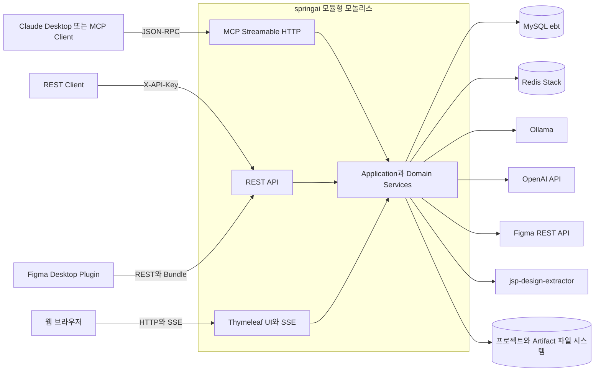

### 3.1 외부 의존성

| 시스템 | 기본 주소/위치 | 용도 | 장애 시 영향 |
|---|---|---|---|
| MySQL | `localhost:3306/ebt` | 업무 조회, 생성 이력, 디자인·Figma 상태 원장 | 다수 MCP·REST 기능 실패, 일부 Repository 초기화 실패 |
| Redis Stack | `redis://localhost:6379` | Vector Store, 채팅 메모리, session/hash/chunk index | RAG·채팅 이력·문서 증분 인덱싱 실패 |
| Ollama | `localhost:11434` | 기본 로컬 채팅, 민감 데이터, 쿼리 압축, 선택적 Vision | 로컬 채팅과 RAG 압축 실패 |
| OpenAI | 외부 API | 분류·단순 질의·클라우드 채팅·선택적 Vision | 해당 모델 요청 실패 |
| Figma API | `api.figma.com/v1` | Node·Component·Style 조회 | Figma 참조 분석과 revision 검증 제한 |
| Extractor | `127.0.0.1:4319` | Playwright 화면 캡처와 `.figpack` 생성 | Web Capture와 Hybrid 흐름 실패 |
| 파일 시스템 | `EGOV_OUTPUT_PATH`, 임시 Artifact 경로 | 생성 프로젝트·Figma Bundle·캡처 Artifact | 생성/Apply/다운로드 실패 |

## 4. 런타임과 배포 구조

### 그림 2. 단일 프로세스 내부 런타임

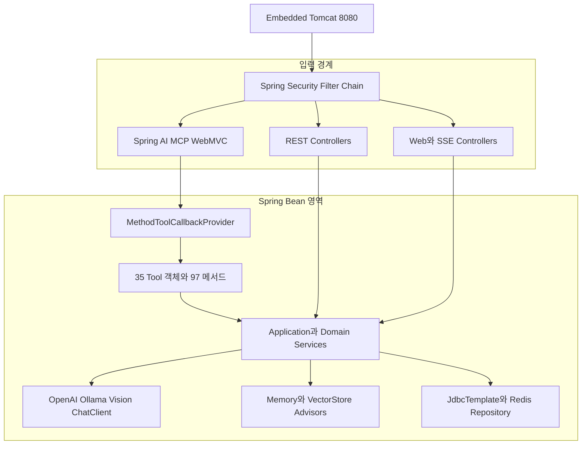

### 4.1 빌드와 실행

- Spring Boot `4.1.0-RC1`
- Spring AI `2.0.0-RC1`
- Gradle Java toolchain은 17이며 CI는 Temurin JDK 21에서 빌드한다.
- 결과물은 실행 가능한 `bootJar` 하나이며 현재 약 241MB다.
- `RedisVectorStoreAutoConfiguration`은 진입점에서 제외하고 `VectorStoreConfig`가 수동 생성한다.
- `web-application-type: servlet`, MCP protocol은 `STREAMABLE`이다.
- annotation scanner는 비활성화되어 MCP 공개 면적이 `McpConfig`에 의해 명시적으로 결정된다.

### 4.2 개발 모드와 패키지 실행 차이

`application.yaml`은 Thymeleaf와 static resource 위치를 다음처럼 소스 디렉터리로 직접 지정한다.

```yaml
spring.thymeleaf.prefix: file:src/main/resources/templates/
spring.web.resources.static-locations: file:src/main/resources/static/
```

이는 IDE 개발에는 편하지만 다른 working directory에서 `java -jar`로 실행할 때 리소스를 찾지 못할
수 있다. 운영 profile에서는 `classpath:/templates/`, `classpath:/static/`을 사용하는 분리가 필요하다.

### 4.3 로그

- Console appender 없이 `/tmp/springai-mcp.log`에 기록한다.
- 10MB 단위 rolling, 3일 보존이다.
- 현재 logback 주석은 “stdio JSON-RPC 보호”라고 쓰여 있으나 실제 Transport는 Streamable HTTP다.
  Console 미사용 정책 자체는 유효하지만 주석과 운영 문서는 현재 Transport에 맞게 고쳐야 한다.

## 5. 코드 계층과 의존 방향

### 그림 3. 논리 계층

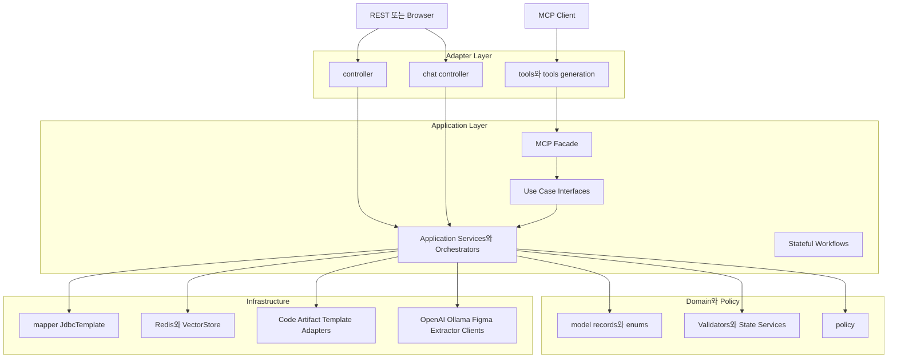

### 5.1 실제 의존 규칙

- 신규 생성 영역은 `Tool → MCP Facade → Use Case → Application Service` 경계를 사용한다.
- 기존 기능은 `Tool/Controller → Service → mapper`의 단순 3계층 구조를 유지한다.
- `model`은 대부분 Java record와 enum으로 구성된 데이터 계약이다.
- `mapper`는 MyBatis가 아니라 `JdbcTemplate`을 사용하며 JSON 전체를 `LONGTEXT`에 저장하는 Repository가
  많다.
- `service` 루트에는 오래된 호환 Facade와 신규 Application Service가 공존한다.
- 패키지 이름은 모듈화를 나타내지만 Gradle module이나 JPMS 경계는 아니므로 컴파일 수준의 의존
  차단은 없다.

### 5.2 주요 패키지

```text
com.krdevops.springai
├── chat/                    웹 채팅, SSE, Redis 대화 메모리, 문서 인덱싱
├── config/                  MCP, Security, VectorStore, Properties, FreeMarker
├── controller/              REST API와 Figma/Design System API
├── mapper/                  JdbcTemplate Repository
├── model/                   공통·CRUD·Design·Figma·Thymeleaf 계약
├── policy/                  민감 필드 등 생성 정책
├── service/
│   ├── generation/          공통 생성 Pipeline과 기능별 Planner/Renderer
│   ├── figma/               Figma Bundle·Operation·Hybrid
│   ├── thymeleaf/           Legacy Source 분석·Project Apply
│   ├── designsystem/        Profile·Registry
│   ├── initializr/          프로젝트 골격 생성
│   └── auth/menu/sql/...    운영 보조 기능
└── tools/                   MCP Adapter
```

## 6. 입력 채널 아키텍처

### 6.1 MCP

#### 그림 4. MCP 요청 처리

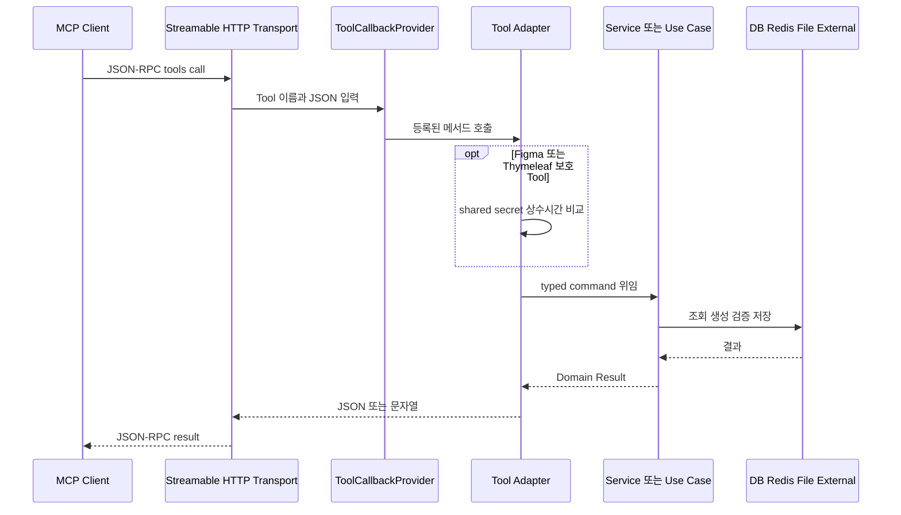

MCP 공개 구조:

- Tool 객체 35개, 공개 메서드 97개
- 문서 Resource: `docs/**/*.md`, `prompts/**/*.md`
- Prompt Template: code-generation, crud-generation, security-generation, menu-generation
- Resource와 Prompt는 시작 working directory를 프로젝트 루트로 가정한다.

중요한 경계:

- `/mcp/**`는 Spring Security에서 `permitAll`이다.
- Figma/Design System의 일부 Tool과 새 Thymeleaf Workflow Tool은 메서드 내부 shared secret을 별도로
  검증한다.
- 일반 DB·파일·RAG Tool 전체에 공통 MCP 인증이 적용되는 구조는 아니다. 네트워크 bind가 기본
  `127.0.0.1`인 것이 1차 방어선이다.

### 6.2 REST

| 경로 | 역할 | 기본 인증 |
|---|---|---|
| `/api/tools/**` | Schema, 파일 저장, 직원, LLM 라우팅 | X-API-Key |
| `/api/rag/**` | 인제스트, 검색, RAG chat | X-API-Key |
| `/api/figma/**` | Token, Export, ScreenSpec, Download | X-API-Key |
| `/api/figma/orchestration/**` | 승인 ScreenSpecification Bundle 생성 | X-API-Key |
| `/api/figma/operations/**` | 보고서, 지표, Plugin Apply 보고 | X-API-Key |
| `/api/figma/hybrid/**` | Capture와 Semantic Figma 결합 | X-API-Key |
| `/api/design-systems/**` | Profile·Registry Preview/Apply/Rollback | X-API-Key |
| `/api/thymeleaf/operations/**` | Preview, Approve, Apply, Revalidate, Report | X-API-Key |
| `/api/chat/**` | 채팅 세션 | permitAll |
| `/api/documents/**` | 문서 상태, 재색인, 업로드 | permitAll |
| `/api/ollama/**` | 로컬 모델 목록 | permitAll |

Figma Screen GET에는 장기 API Key 대신 짧은 Bearer token도 사용할 수 있다. CORS는 기본 비활성이며
허용 origin을 설정한 경우 `/api/figma/screens/**` GET에만 열린다.

### 6.3 웹 UI와 SSE

- `/`는 `chat.html`을 렌더링한다.
- `/ai/rag/stream`은 RAG Advisor와 대화 메모리를 사용한다.
- `/ai/simple/stream`은 대화 메모리만 사용한다.
- 응답 Token은 SSE 공백 손실 방지를 위해 URL encoding되어 전달된다.
- Servlet 기반 애플리케이션 안에서 Spring AI의 Reactor `Flux`를 사용해 streaming한다.

## 7. RAG와 채팅 아키텍처

### 그림 5. RAG 질의 흐름

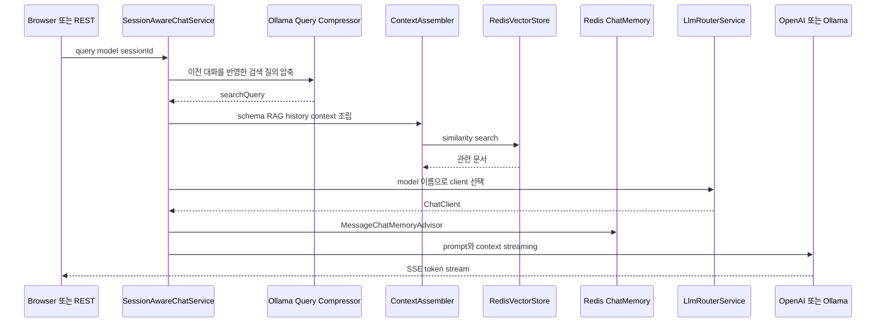

### 7.1 모델 라우팅

| 입력 | 대상 |
|---|---|
| `gpt-*`, `o1*`, `o3*` | OpenAI |
| `CLASSIFICATION`, `SIMPLE_QUERY` | OpenAI |
| `SENSITIVE_DATA` | Ollama |
| null 또는 기타 모델/작업 | Ollama |
| `CODE_GENERATION` REST chat | 거부, MCP 사용 안내 |

Vision ChatModel은 일반 ChatModel과 분리 생성한다. 이는 자동 ToolCallingManager가 MCP Tool을 다시
주입하면서 발생할 수 있는 순환 의존을 끊기 위한 설계다.

### 7.2 임베딩과 Vector Store

- 임베딩 모델: 로컬 ONNX `ko-sroberta-multitask`
- 최대 token length: 512
- Redis index: `egov-rag`
- metadata tag: `type`, `docId`
- 기본 RAG 검색: top-k 10, similarity threshold 0.30
- `QuestionAnswerAdvisor`는 `type == 'document'`만 검색한다.
- `RagService` 직접 검색은 source_code, history, design_analysis를 용도에 따라 사용할 수 있다.

### 7.3 문서 인덱싱

- Markdown과 PDF를 비동기로 읽는다.
- PDF는 Spring AI PDF reader 실패 시 PDFBox로 fallback한다.
- content hash가 같으면 재임베딩을 건너뛴다.
- 문서별 chunk id를 Redis에 저장해 재인덱싱 시 이전 chunk를 삭제한다.
- URL 인제스트는 HTTP/HTTPS만 허용하고 loopback·site-local·link-local 주소와 redirect를 차단한다.
- DNS rebinding 완전 방어는 아니므로 운영에서는 outbound proxy/allowlist가 필요하다.

## 8. eGovFrame 생성 아키텍처

### 그림 6. 공통 생성 Pipeline

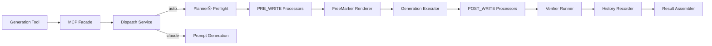

### 8.1 생성 기능

| 기능 | 주요 산출물 |
|---|---|
| CRUD | Controller, Service, ServiceImpl, Mapper, Mapper XML, VO, JSP/Thymeleaf 4화면, Layout 연동 |
| Board | 게시판 목록·상세·등록·수정과 검색 VO·Validation Handler |
| Master-detail | Master/detail Mapper와 화면·Controller·Service |
| Project Initializr | WAR/Boot, Gradle/Maven, eGovFrame 4.3/5.0 골격 |
| Thymeleaf Layout | default, GNB, LNB, breadcrumb, footer와 menu interceptor |
| Security | eGovFrame 버전별 XML/Java Security Template |

### 8.2 핵심 생성 계약

- `ScreenSpecification`: 승인 상태, DB source, page/field, layout 정책을 담는 중심 계약
- `GenerationBlueprint`: 생성 대상 파일과 Processor 선언
- `RenderedGenerationPlan`: 렌더링된 파일 계획
- `GenerationExecution`: 성공/실패 파일
- `GenerationFailure`: layer별 실패
- `ProcessorStep`: stage, order, dependency, failure policy

Processor는 Spring Bean 주입 순서가 아니라 Blueprint에 선언된 `stage → order → processorId`로 실행된다.
Verifier는 `stage ordinal → order → id`로 정렬한다. 두 정렬 방식이 다르므로 신규 stage 추가 시 실제 실행
순서를 테스트로 고정해야 한다.

### 8.3 파일 쓰기 특성

일반 Generation Pipeline의 `CodeServiceGenerationExecutor`는 파일별 best-effort 방식이다. 한 파일이
실패해도 다음 파일을 계속 저장하며 이미 쓴 파일을 자동 rollback하지 않는다. 반면 새
`ThymeleafProjectWorkflowService`는 승인 후 staging/backup과 전체 rollback을 제공한다.

즉 프로젝트 안에는 현재 두 가지 파일 적용 의미가 공존한다.

| 적용 경로 | 원자성 | 승인 hash | 실패 처리 |
|---|---|---|---|
| 기존 eGovFrame Generation Pipeline | 파일 단위 | 없음 | 부분 성공 허용·실패 목록 반환 |
| Thymeleaf Project Workflow | 작업 단위 보상형 원자성 | 있음 | 적용 파일 전체 rollback 시도 |

## 9. 디자인 참조와 ScreenSpecification

### 그림 7. 디자인 입력 정규화

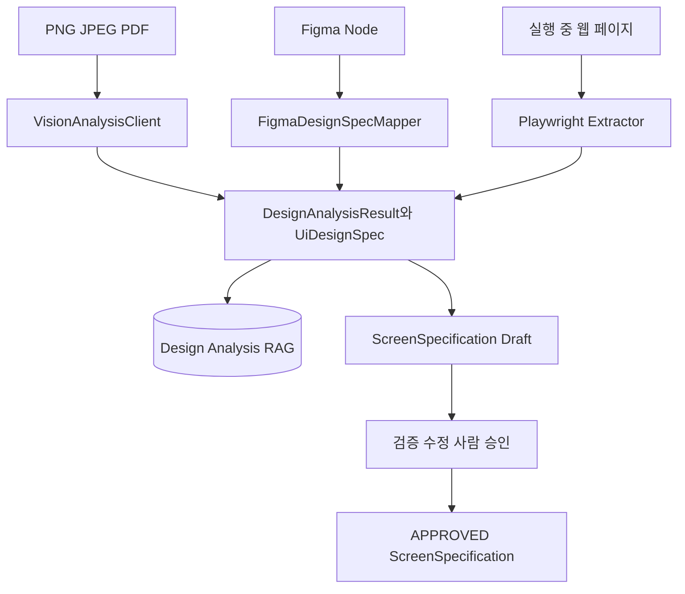

`ScreenSpecificationService`의 흐름은 생성 → binding resolve → validation → 저장 → revise/approve다.
DB primary source는 revision 과정에서 바꿀 수 없고, 승인된 명세만 최종 Figma Export 또는 생성
Context로 사용할 수 있다.

## 10. Semantic Figma 아키텍처

### 그림 8. 승인 명세에서 Plugin Bundle까지

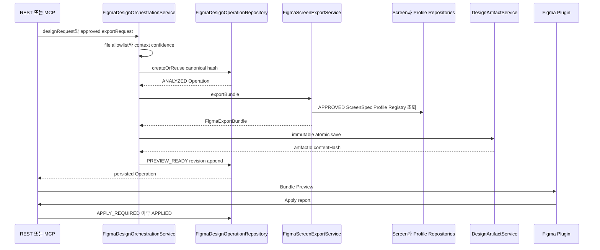

### 10.1 Operation 상태

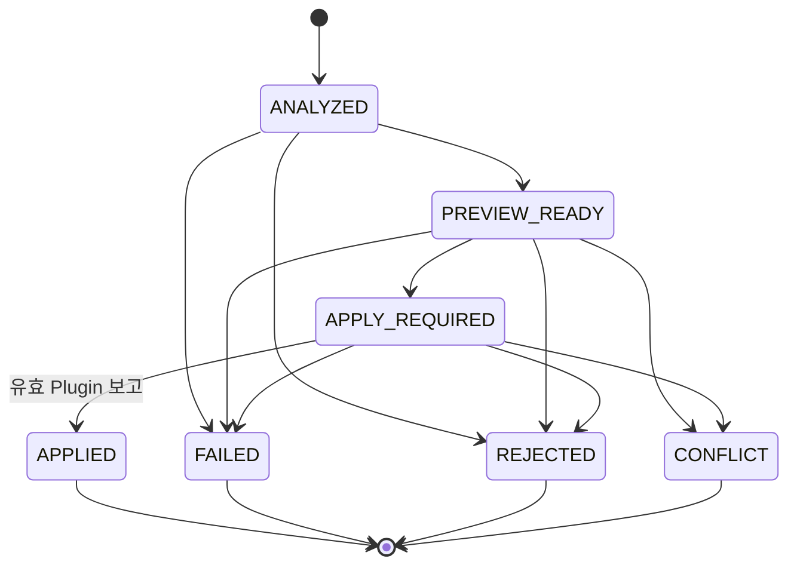

### 10.2 현재 완성도

완료된 연결:

- 승인 ScreenSpecification → FigmaScreenSpec → Bundle → 불변 Artifact → 영속 PREVIEW_READY
- request와 export context를 포함한 canonical hash 멱등 처리
- source revision conflict
- Plugin 보고 전 APPLIED 차단
- REST/MCP 승인 Bundle 진입점
- 7개 디자인 요청과 승인 Bundle Tool의 shared secret 선행 검증

남은 연결:

- 일반 Text·Reference·Modify·Component 요청은 영속 ANALYZED 후보까지만 생성한다.
- 자연어 분석에서 ScreenSpecification 후보를 자동 생성하는 공통 단계가 아직 연결되지 않았다.
- 실제 Figma revision과 editable node 소속 재검증은 일부 TODO 상태다.
- 멀티 화면 Canvas rollback과 실제 Figma Desktop 7개 요청 E2E가 남아 있다.
- `FigmaThymeleafBridgeTool`의 일부 메서드는 실제 Figma/Thymeleaf 연동보다 메타데이터·문자열을
  반환하는 prototype 성격이다.

## 11. JSP→Thymeleaf Project Workflow

### 그림 9. 승인 기반 Project Apply

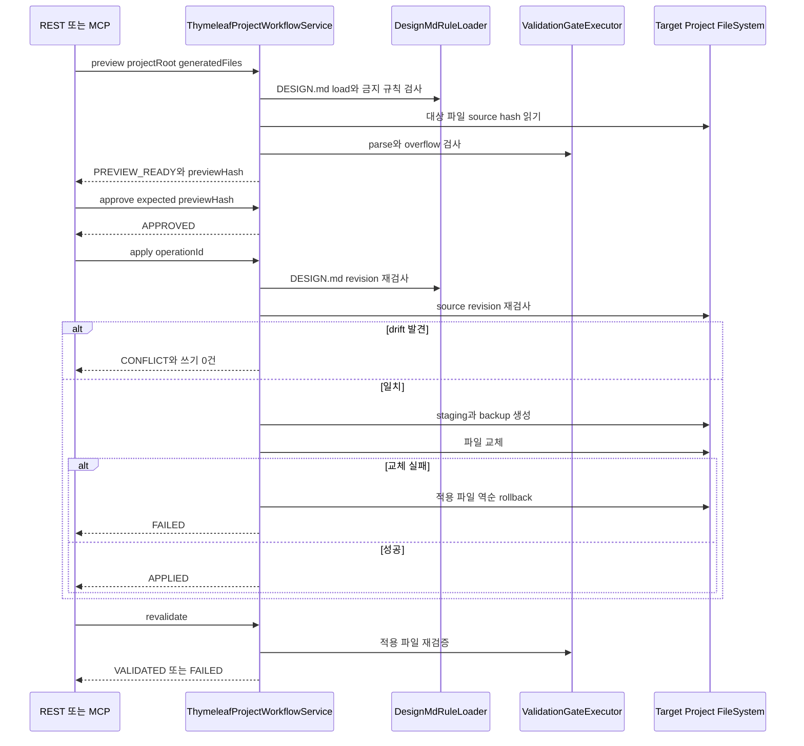

### 11.1 Project Operation 상태

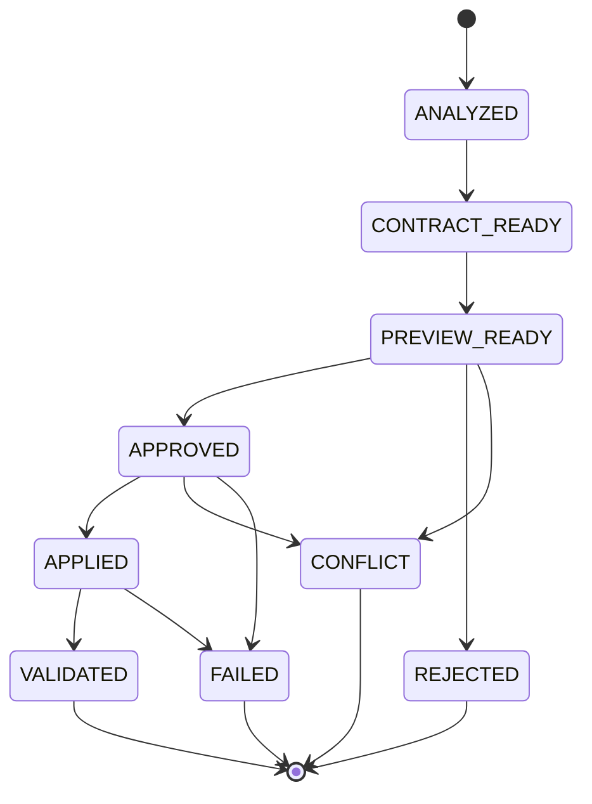

### 11.2 안전 장치와 제약

안전 장치:

- project root real path 검증
- 절대경로·`..` traversal 차단
- target과 중간 parent symbolic link 차단
- Preview 이전 파일 쓰기 없음
- generated files와 `DESIGN.md` revision을 묶은 canonical preview hash
- 승인 후 source/`DESIGN.md` drift 시 CONFLICT
- staging·backup과 적용 실패 rollback
- REST X-API-Key, MCP shared secret

제약:

- Operation snapshot은 `ConcurrentHashMap` 메모리에만 있으므로 재시작 시 사라진다.
- 여러 인스턴스 간 Operation 공유가 불가능하다.
- rollback 중 개별 복구 실패는 현재 조용히 무시된다.
- 정적 parse와 1440px inline width 검사만 연결되어 실제 TemplateEngine render, build, browser a11y,
  visual regression은 아직 전체 Gate가 아니다.
- 기존 legacy Binding assembler/Bound View composer가 현재 작업 트리에서 제거되어 JSP·Controller·VO
  provenance를 새 Skeleton에 완전히 결합하는 경로가 남아 있다.

## 12. Web Capture와 Hybrid Figma

### 그림 10. `.figpack` Hybrid 흐름

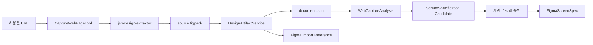

- Capture 기능은 기본 비활성이다.
- 활성화 시 서버 bind가 loopback인지 시작 단계에서 검증한다.
- Extractor는 redirect 없이 호출하고 API key·응답 크기·timeout을 검증한다.
- `.figpack`은 ZIP entry path와 압축 해제 크기를 검증한 뒤 임시 디렉터리에서 원자 이동한다.
- Hybrid 의미 추론은 Figma import node가 아니라 원본 `document.json`을 기준으로 한다.
- 사람 승인 후에만 ScreenSpecification 승인과 Semantic Figma export를 수행한다.

## 13. 데이터 아키텍처

### 그림 11. 저장소별 책임

```mermaid
flowchart TB
    Services[Application Services]

    subgraph MySQL[MySQL ebt]
        Business[COMTN 업무 테이블]
        Generation[AI_GENERATION_HISTORY]
        Design[AI_DESIGN_ANALYSIS와 SCREEN_SPECIFICATION]
        DS[AI_DESIGN_SYSTEM_PROFILE와 COMPONENT_REGISTRY]
        Figma[Figma Spec Operation Report Review]
    end

    subgraph Redis[Redis Stack]
        Vector[egov-rag Vector Index]
        Memory[chat memory와 session]
        Hash[document hash와 chunk ids]
    end

    subgraph FileSystem[File System]
        Generated[eGov generated project]
        CaptureArtifacts[Capture와 figpack artifacts]
        FigmaArtifacts[Figma export와 bundle artifacts]
        Templates[FreeMarker templates]
    end

    Services --> Business
    Services --> Generation
    Services --> Design
    Services --> DS
    Services --> Figma
    Services --> Vector
    Services --> Memory
    Services --> Hash
    Services --> Generated
    Services --> CaptureArtifacts
    Services --> FigmaArtifacts
    Services --> Templates
```

### 13.1 애플리케이션 관리 MySQL 테이블

| 테이블 | 책임 | 저장 방식 |
|---|---|---|
| `AI_GENERATION_HISTORY` | 생성 파일 이력 | 정규 컬럼 |
| `AI_DESIGN_ANALYSIS` | 이미지/Figma/Web 분석 결과 | JSON |
| `AI_SCREEN_SPECIFICATION` | 승인 가능한 화면명세 version | JSON revision |
| `AI_DESIGN_SYSTEM_PROFILE` | Design System Profile | JSON revision |
| `AI_COMPONENT_REGISTRY` | Component Registry | JSON revision |
| `AI_FIGMA_SCREEN_SPEC` | Plugin 입력 화면명세 | JSON revision |
| `AI_FIGMA_DESIGN_OPERATION` | Figma Operation 불변 revision | JSON revision |
| `AI_FIGMA_DESIGN_OPERATION_IDEMPOTENCY` | requestHash→operationId | unique index 역할 |
| `AI_FIGMA_GENERATION_REPORT` | Figma 생성 보고서 | JSON |
| `AI_FIGMA_REVIEW_HISTORY` | 승인·검토 이벤트 | 정규 컬럼과 JSON |

Repository가 `@PostConstruct`에서 `CREATE TABLE IF NOT EXISTS`를 수행한다. 개발 편의성은 높지만 정식
migration version, rollback, checksum, 순서 통제가 없으므로 운영에서는 Flyway/Liquibase 도입이 필요하다.

### 13.2 일관성 전략

| 영역 | 일관성 전략 |
|---|---|
| Figma Operation | 불변 revision append와 상태 전이 검증 |
| Figma 멱등성 | canonical SHA-256 request/context hash와 별도 index 테이블 |
| ScreenSpecification | ID+version 저장, latest/version 조회 |
| Artifact | 임시 디렉터리 작성 후 `ATOMIC_MOVE` |
| Thymeleaf Apply | source hash 재검사, staging, backup, 보상 rollback |
| RAG 재인덱싱 | 문서 hash 비교와 이전 chunk id 삭제 |
| 일반 Generation | 파일별 best-effort, 부분 성공 허용 |

## 14. 보안 아키텍처

### 그림 12. 신뢰 경계

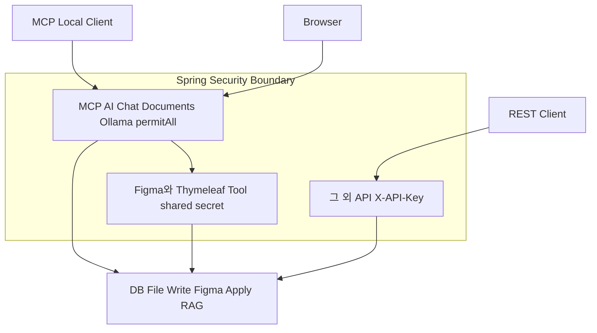

### 14.1 구현된 방어

- REST `/api/**` 기본 X-API-Key
- stateless session과 API 경로 CSRF ignore
- MCP bind 기본 loopback
- Figma/Thymeleaf 중요 MCP Tool shared secret 상수시간 비교
- Figma file key allowlist와 선택적 node allowlist
- 파일 저장 allowlist와 traversal 차단
- Design artifact UUID·path normalize·symlink·ZIP entry·size 검증
- URL 인제스트 SSRF 1차 차단과 redirect 금지
- Web Capture 활성 시 loopback bind 강제
- 실제 프로젝트 build 기본 비활성
- 민감 표시 필드 정책

### 14.2 주요 보안 Gap

| 우선순위 | Gap | 영향 |
|---|---|---|
| P0 | `/mcp/**` 전역 인증이 없고 일부 일반 Tool은 별도 secret이 없음 | loopback 경계가 깨지면 DB·파일·RAG Tool 노출 |
| P0 | `FigmaThymeleafBridgeTool.syncDesignTokensToCss`가 임의 path를 직접 읽음 | Tool 접근자가 서버 파일을 읽을 수 있음 |
| P0 | `validateThymeleafDesignParity`가 실제 Figma 조회 없이 `VERIFIED`를 반환 | 잘못된 승인 신호 생성 가능 |
| P1 | `CodeService`가 base path의 부모 workspace까지 절대경로 저장을 허용 | 의도보다 넓은 파일 쓰기 범위 |
| P1 | 문서 upload 경로가 permitAll | 로컬 이외 bind 시 무인 파일 업로드·인덱싱 위험 |
| P2 | SSRF DNS rebinding 완전 차단이 아님 | 공인→사설 IP 전환 우회 가능성 |
| P2 | application 기본 DB 계정/비밀번호가 개발값 | 운영 환경변수 누락 시 약한 credential 사용 |

## 15. 테스트와 품질 Gate

### 15.1 현재 테스트 구조

- JUnit 5 + Spring Boot Test
- Java 테스트 162개 파일
- MCP 이름·설명·JSON Schema snapshot
- Figma Operation Repository 통합 테스트
- FreeMarker Golden File과 생성 계약 테스트
- Contract Node test
- Extractor TypeScript typecheck/lint/E2E
- Figma Plugin typecheck/lint/node:test/build

최근 전체 검증 기준:

- Backend 926 tests, failure/error 0
- `bootJar` 성공
- Contract test 성공
- Extractor typecheck·lint·4 fixture E2E 성공
- Plugin typecheck·lint·17 tests·build 성공
- MCP snapshot 97 methods/35 objects

### 15.2 CI와 로컬 테스트 차이

CI는 `./gradlew clean test bootJar -Pci`를 실행하지만 `build.gradle`의 `ci` 조건이 다음 테스트를
제외한다.

- Application context 및 MCP registration/snapshot
- mapper/service integration test
- 일부 FreeMarker renderer test

따라서 GitHub Actions green은 외부 인프라와 전체 계약을 포함한 로컬 full test 성공과 같은 의미가
아니다. CI를 fast unit job과 MySQL·Redis·ONNX를 포함한 integration job으로 분리하는 편이 정확하다.

## 16. 아키텍처 강점

1. **명시적 MCP 공개 면적**  
   annotation scan을 끄고 한 설정에서 Tool을 등록해 의도치 않은 Tool 노출을 줄였다.

2. **중간 계약 중심 설계**  
   `ScreenSpecification`, `GenerationBlueprint`, Figma Bundle, Operation과 Report가 AI 자유 텍스트를
   검증 가능한 typed contract로 바꾼다.

3. **승인과 적용 분리**  
   Figma와 Thymeleaf 모두 Preview/Approval/Apply를 상태로 분리한다.

4. **결정성과 멱등성 강화**  
   canonical hash, versioned JSON, logical node ID, Golden File을 사용한다.

5. **로컬 우선 AI 구성**  
   Ollama와 ONNX embedding으로 민감 데이터의 외부 전송을 줄일 수 있다.

6. **생성 Pipeline 분해**  
   Planner·Renderer·Processor·Verifier·History를 분리해 CRUD/Board/Master-detail 재사용 기반이 있다.

7. **파일 적용 안전성 진전**  
   신규 Thymeleaf Workflow와 Artifact 저장은 staging/backup/atomic move를 활용한다.

## 17. 구조적 위험과 개선 우선순위

| 우선순위 | 위험 | 현재 근거 | 권장 개선 |
|---|---|---|---|
| P0 | MCP 인증 경계 불균일 | transport permitAll, Tool별 secret 혼재 | transport 인증 또는 모든 위험 Tool 공통 interceptor |
| P0 | Prototype Bridge가 성공처럼 응답 | parity가 실제 검증 없이 VERIFIED | Tool 비공개/삭제 또는 실제 Service·검증 계약 연결 |
| P0 | Thymeleaf Operation이 메모리 전용 | `ConcurrentHashMap` snapshot | DB/Redis 불변 revision Repository와 TTL/복구 |
| P0 | 새 Bound View 경로 공백 | legacy assembler/renderer 제거 | Binding Contract→Skeleton composer와 provenance Gate 재구축 |
| P1 | 두 파일 적용 의미 공존 | 일반 생성은 부분 성공, Workflow는 rollback | Operation 기반 Project Apply를 공통 write port로 승격 |
| P1 | DB migration 부재 | Repository `@PostConstruct` DDL | Flyway/Liquibase와 schema version |
| P1 | 운영 리소스 경로가 source-relative | `file:src/main/resources` | dev/prod profile과 classpath resource |
| P1 | 단일 프로세스 장애 반경 | DB/RAG/Figma/생성 모두 한 JVM | 기능별 bulkhead, timeout, health, 필요 시 worker 분리 |
| P1 | 상태·Artifact 이중 저장 | MySQL JSON과 파일 metadata | 공통 Artifact catalog와 transaction/outbox |
| P2 | 패키지만 있고 module 경계 없음 | 575 Java 파일 단일 Gradle module | ArchUnit 또는 multi-module 단계적 분리 |
| P2 | 관측성 부족 | 파일 로그 중심, 구조화 metric 제한 | Micrometer, operationId correlation, health indicator |
| P2 | 문서·AGENTS의 수치 drift | 19/21 Tool 등 과거 수치 | snapshot에서 문서 수치를 생성하거나 정기 검증 |

## 18. 권장 목표 아키텍처

### 그림 13. 단계적 목표 구조

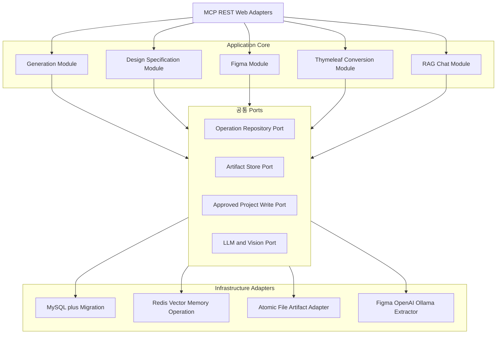

### 18.1 권장 실행 순서

1. **P0 보안 정리**
   - `FigmaThymeleafBridgeTool` prototype 공개 중단
   - MCP 공통 인증/인가와 위험도별 Tool policy
   - 임의 파일 읽기·쓰기 API를 공통 path validator로 통합

2. **Thymeleaf 상태 영속화**
   - `ThymeleafProjectOperationRepository`
   - operation revision, preview hash, source/design revision, artifact, report 저장
   - 재시작 복구와 다중 인스턴스 충돌 처리

3. **Binding→Bound View 복구**
   - JSP/Controller/VO evidence를 `ThymeleafBindingContract`로 조립
   - Skeleton과 Binding composer
   - 모든 `th:*`, route, CSRF, validation provenance Gate

4. **공통 Project Apply Port**
   - 기존 CRUD/Board/Master-detail write를 Preview/Approve/Apply 방식으로 선택적 전환
   - 일반 생성의 부분 성공 정책과 원자 적용 정책을 명시적으로 선택하도록 계약화

5. **운영 기반**
   - Flyway/Liquibase
   - Micrometer metric과 구조화 correlation log
   - dev/prod resource profile
   - integration CI job

6. **실환경 Gate**
   - 실제 Figma Desktop revision/editable scope/rollback
   - 대표 Maven·Gradle eGovFrame 프로젝트 offline build
   - 1440/768/390 browser render·a11y·visual regression

## 19. 핵심 파일 지도

| 영역 | 핵심 파일 |
|---|---|
| 시작점 | `src/main/java/com/krdevops/springai/SpringaiApplication.java` |
| MCP 등록 | `src/main/java/com/krdevops/springai/config/McpConfig.java` |
| MCP Resource/Prompt | `src/main/java/com/krdevops/springai/config/McpKnowledgeConfig.java` |
| 보안 | `src/main/java/com/krdevops/springai/config/SecurityConfig.java` |
| AI Client/Advisor | `src/main/java/com/krdevops/springai/chat/config/EgovRagConfig.java` |
| Vector Store | `src/main/java/com/krdevops/springai/config/VectorStoreConfig.java` |
| RAG | `src/main/java/com/krdevops/springai/service/RagService.java` |
| 채팅 | `src/main/java/com/krdevops/springai/chat/service/impl/EgovSessionAwareChatServiceImpl.java` |
| 생성 Pipeline | `src/main/java/com/krdevops/springai/service/generation/**` |
| 화면명세 | `src/main/java/com/krdevops/springai/service/ScreenSpecificationService.java` |
| 디자인 분석 | `src/main/java/com/krdevops/springai/service/DesignReferenceAnalysisService.java` |
| Figma 승인 Orchestration | `src/main/java/com/krdevops/springai/service/figma/FigmaDesignOrchestrationService.java` |
| Figma Export | `src/main/java/com/krdevops/springai/service/figma/FigmaScreenExportService.java` |
| Figma Operation | `src/main/java/com/krdevops/springai/mapper/FigmaDesignOperationRepository.java` |
| Artifact | `src/main/java/com/krdevops/springai/service/DesignArtifactService.java` |
| Thymeleaf Apply | `src/main/java/com/krdevops/springai/service/thymeleaf/ThymeleafProjectWorkflowService.java` |
| Web Capture | `src/main/java/com/krdevops/springai/service/WebCaptureClient.java` |
| 설정 | `src/main/resources/application.yaml` |
| 계약 | `website-figma-contract/*.schema.json` |
| Extractor | `jsp-design-extractor/src/server.ts` |
| Plugin | `figma-screen-spec-plugin/src/code.ts`, `src/core.ts` |

## 20. 최종 판정

`springai`는 단순 MCP Tool 모음 단계를 넘어 **계약·상태·승인·Artifact를 중심으로 AI 생성 작업을
통제하는 플랫폼**으로 발전했다. 특히 Generation Pipeline 분해, ScreenSpecification 승인,
Figma Operation revision, Thymeleaf 원자 Apply는 좋은 방향이다.

다음 성숙 단계의 핵심은 기능 추가보다 경계 정리다.

- MCP 인증을 일관되게 만들 것
- prototype Tool을 실제 검증 흐름과 구분할 것
- Thymeleaf Operation을 영속화할 것
- 모든 프로젝트 파일 쓰기를 승인 기반 공통 Port로 수렴할 것
- DB migration과 관측성을 도입할 것

이 다섯 가지가 해결되면 현재 모듈형 모놀리스 구조를 유지하면서도 운영 안정성과 확장성을 크게
높일 수 있다. 그 이후 부하와 조직 경계가 실제로 요구할 때 Figma Worker, Capture Worker, RAG
Indexing Worker를 별도 프로세스로 분리하는 것이 적절하다.
