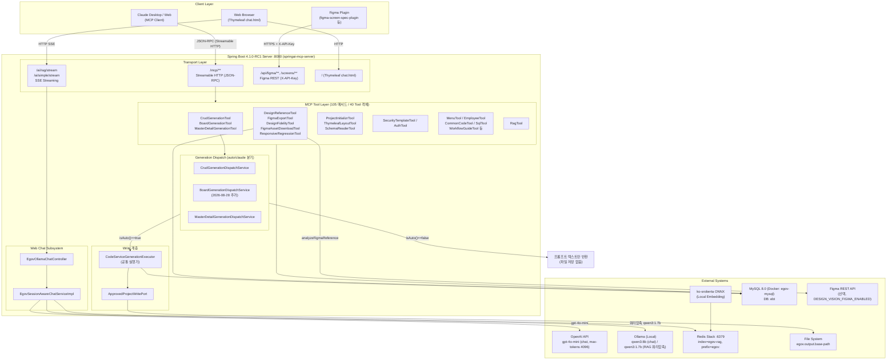
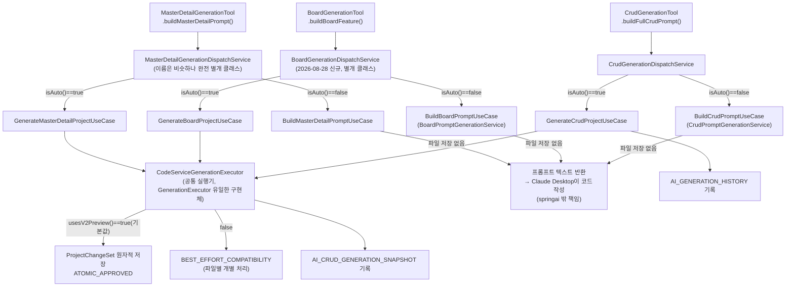
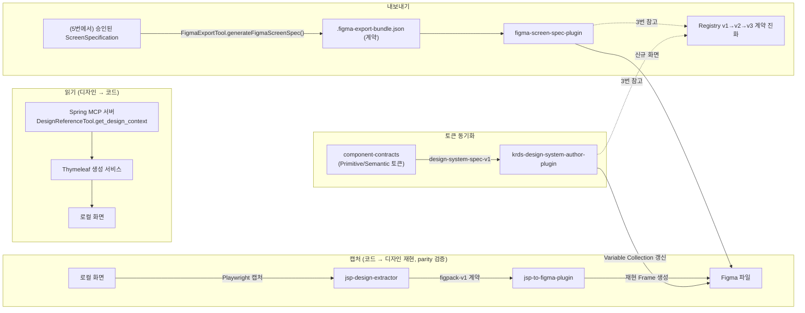
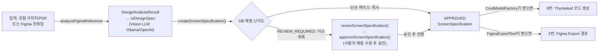
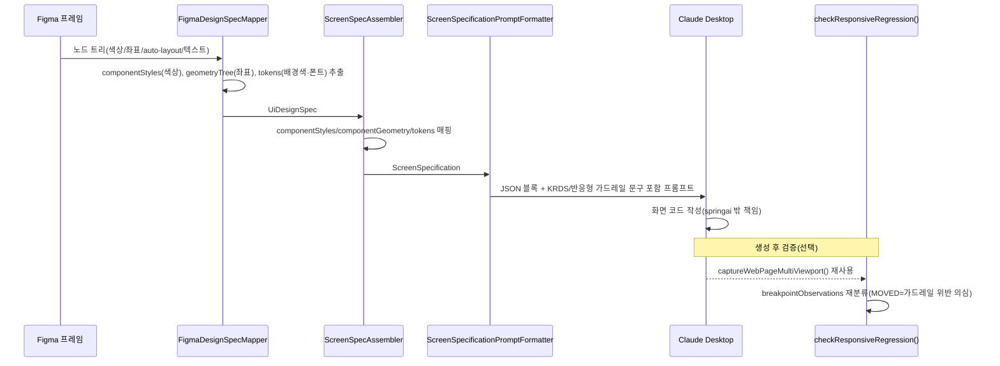
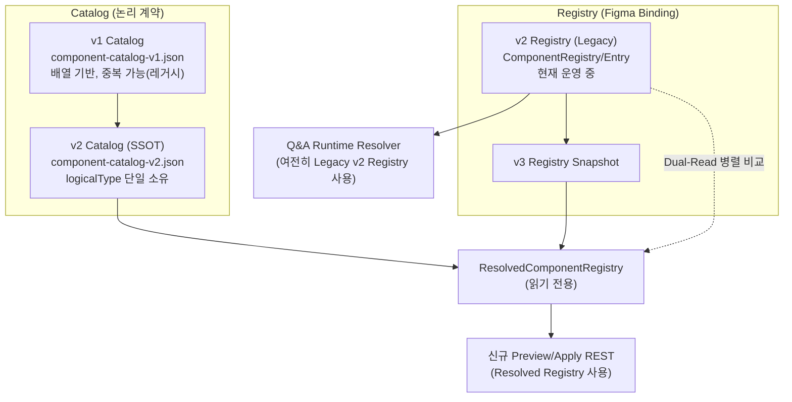
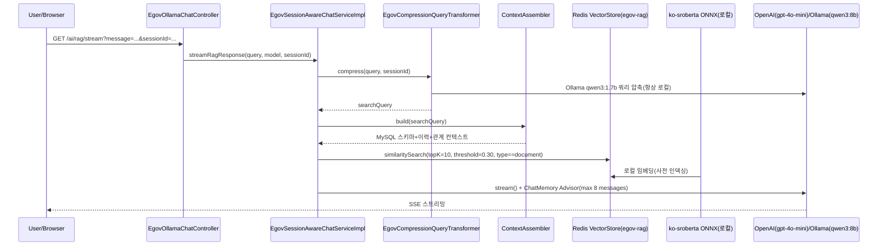
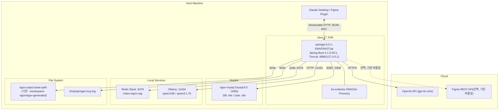

# Spring AI MCP Server — 아키텍처 심층 분석

Spring Boot 4.1.0-RC1 + Spring AI 2.0.0-RC1 기반 eGovFrame 5.x CRUD/Board/MasterDetail 소스 자동 생성 + Figma 디자인 파이프라인 AI 플랫폼

분석일: 2026-08-31 (전면 재작성 — [아키텍처 아티팩트](https://claude.ai/code/artifact/a4038e88-9752-458f-a246-4720a90d4da0) 및 `build.gradle`/`application.yaml`/Flyway 마이그레이션 직접 확인 기준)

> 이전 버전(2026-06-07)은 RAG/웹채팅 중심 구조를 다뤘습니다. 그 이후 CRUD/Board/MasterDetail 생성 오케스트레이션, Figma 픽셀재현 파이프라인, 화면명세 승인 흐름, Pipeline Evolution 등이 대폭 추가되어 이번에 전면 다시 작성했습니다. 세부 흐름(SVG, 14개 다이어그램)은 위 아티팩트에 더 상세히 있고, 이 문서는 Mermaid로 압축한 개요입니다.

---

## 1. 전체 시스템 아키텍처

**2026-06-07 버전 대비 주요 변경점**
- 전송 프로토콜: `/sse` MCP SSE → **`/mcp/**` Streamable HTTP**(`mcp.server.protocol: STREAMABLE`)
- DB: `com` → **`ebt`**(실제 `application-dev.yaml` 확인)
- Tool 개수: 19개 → **105개 메서드 / 40개 Tool 객체**(`McpToolDefinitionSnapshotTest` 기준선)
- CRUD 전용 → **CRUD/Board/MasterDetail 3종 생성 + Figma 디자인 파이프라인**으로 범위 대폭 확장

---

## 2. MCP Tool 카탈로그 (105 메서드 / 40 객체)

| 카테고리 | 대표 Tool 클래스 | 비고 |
|---|---|---|
| CRUD/Board/MasterDetail 생성 | `CrudGenerationTool`, `BoardGenerationTool`, `MasterDetailGenerationTool`, `CrudScreenSourceTool` 등 | `llmProvider=auto\|claude` 분기 |
| 디자인 참조·Figma | `DesignReferenceTool`, `FigmaExportTool`, `FigmaDesignOrchestrationTool`, `DesignFidelityTool`(구조 유사도), `FigmaAssetDownloadTool`, `ResponsiveRegressionTool`(반응형 가드레일 검증) | 최근 3종(Fidelity/AssetDownload/ResponsiveRegression)은 2026-08-28 픽셀재현 제외범위 트랙 산출물 |
| 프로젝트 초기화·레이아웃 | `ProjectInitializrTool`, `ThymeleafLayoutTool`, `SchemaReaderTool`, `ProjectScannerTool`, `ProjectHealthTool` | |
| 보안 | `SecurityTemplateTool`, `AuthTool` | |
| eGovFrame 운영 | `EmployeeTool`, `MenuTool`, `CommonCodeTool`, `SqlTool` | |
| 프로젝트 관리·가이드 | `WorkflowGuideTool`, `OutputPathResolverTool`, `GenerationHistoryTool`, `CrudGenerationSnapshotTool` | |
| RAG·유틸 | `RagTool`, `DateTimeTool` | |

전체 목록·`@Tool` 설명 원문은 `src/main/java/com/krdevops/springai/tools/**` 및 프로젝트 루트 `CLAUDE.md`의 "현재 등록된 MCP Tool" 표를 참고하십시오. 계약(개수·리스크 등급) 회귀는 `McpToolDefinitionSnapshotTest`/`McpToolRiskAnnotationCoverageTest`가 강제합니다.

---

## 3. CRUD/Board/MasterDetail 생성 오케스트레이션 (auto vs claude)

**핵심 설계 포인트**
- 세 Tool은 **각자 독립된 분기점**을 가지며 서로 공유하지 않습니다. `CrudGenerationDispatchService`/`BoardGenerationDispatchService`/`MasterDetailGenerationDispatchService`는 이름은 비슷해도 완전히 별개 클래스입니다.
- auto 경로가 실제로 파일을 쓰는 지점은 **`CodeServiceGenerationExecutor` 하나로 합류**합니다(`GenerationExecutor` 인터페이스 구현체가 코드베이스에 이것 하나뿐).
- claude 경로는 프롬프트 텍스트만 반환하고 파일 저장을 하지 않습니다 — 실제 코드 작성은 springai 밖(Claude Desktop)의 책임입니다.
- `CrudGenerationApprovalPolicy`(신규): `approval-required-tables`에 등록된 테이블(기본값 빈 목록)이면 승인된 화면명세 없이는 auto 생성을 차단합니다.

---

## 4. Figma ↔ Thymeleaf 디자인 파이프라인

- 4개 흐름은 **서로 독립된 시작점**을 갖습니다 — 읽기는 `Spring MCP 서버`, 캡처는 `로컬 화면`, 토큰 동기화는 `component-contracts`(정적 소스 파일)가 각자 시작점입니다.
- Export 경로는 5번(화면명세 승인)에서 나온 **같은 `ScreenSpecification`**을 소비하며, 6번(코드 생성)과는 완전히 독립적·선택적인 별도 소비 경로입니다.
- `figma-screen-spec-plugin`은 만들어진 `.figma-export-bundle.json`이 어떤 계약 버전(Catalog v1→v2, Registry v2→v3)을 거쳐 조립됐는지에 대해 3번(Registry 계약 진화) 다이어그램을 참조점으로 갖습니다. 2번 세션 안에서 3번을 직접 가리키는 곳은 이 지점 하나뿐이고, 토큰 동기화 경로는 10번(`krds-design-system-author-plugin` 상세)까지 들어가야 비로소 3번과 만납니다.

---

## 5. 화면명세(ScreenSpecification) 승인 흐름

- `createScreenSpecification()`은 자체 분기점입니다: **단순 케이스는 `approveScreenSpecification()` 호출 없이 즉시 APPROVED**로 나오고, REVIEW_REQUIRED만 `reviseScreenSpecification()` → `approveScreenSpecification()` 단계를 거칩니다.
- 같은 `APPROVED ScreenSpecification`을 소비하는 Tool에 따라 두 갈래로 갈립니다 — 코드 생성(6번)과 Figma Export(2번)는 서로 독립적이며 하나가 다른 하나를 전제하지 않습니다.
- (2026-08-28) `FigmaDesignSpecMapper` 파싱 단계에서 컴포넌트별 `fills`/`strokes`(SOLID 색상), 노드 트리 좌표·auto-layout·텍스트스타일(`geometryTree`), 루트 배경색·폰트(`tokens`)가 모두 캡처되어 `ScreenSpecAssembler.assemble()`이 `componentStyles`/`componentGeometry`/`tokens`로 매핑합니다 — 3필드 모두 claude 경로(`ScreenSpecificationPromptFormatter`) 프롬프트까지 생존하며, auto 경로(`CrudModelFactory`)는 KRDS 일관성 유지를 위해 의도적으로 이 필드들을 참조하지 않습니다.

---

## 6. 픽셀재현 데이터 흐름 및 후속 검증 Tool

- 신규 캡처·매칭 로직 없이 기존 `captureWebPageMultiViewport()`/`MultiViewportComponentMatcher`가 이미 계산해두는 신호를 재분류하는 방식으로 설계되었습니다(`ResponsiveRegressionAnalyzer`).
- `compareDesignFidelity()`는 픽셀 이미지 비교가 아니라 archetype·컴포넌트 타입·필드 역할·액션 타입 집합의 **Jaccard 구조적 유사도**입니다 — 이 프로젝트에 실제 스크린샷 캡처 기능이 없다는 걸 코드로 확인하고 설계된 대안입니다.
- `downloadFigmaAssets()`의 허용 호스트(`*.figma.com`)는 실제 API 응답으로 검증되지 않은 추정치이며, 실사용 전 재확인이 필요합니다.

---

## 7. Component Catalog / Registry 계약 진화 (v1 → v2 → v3)

- 3번은 여러 흐름(Figma Export, KRDS 토큰 동기화)이 참조하는 **종착점**입니다 — 3번 자체에서 다른 다이어그램으로 나가는 링크는 없습니다.
- component-contracts(디자인 **토큰** 값)와는 완전히 다른 축입니다 — 이쪽은 컴포넌트의 **논리 계약**(무엇이 존재하는지)을 다룹니다.

---

## 8. RAG 파이프라인

RAG 자체의 임베딩/청킹/유사도 임계값·쿼리 압축 로직은 2026-06-07 버전에서 구조가 크게 바뀌지 않았습니다(`rag.similarity.threshold=0.30`, `rag.top-k=10`, `chat.memory.max-messages=8`로 `application.yaml` 재확인).

---

## 9. MySQL AI_* 테이블 개요 (Flyway V1~V18)

| 그룹 | 대표 테이블 | 도입 시점 |
|---|---|---|
| 기존 AI 결과 (baseline) | (V1 baseline 처리) | V1 |
| Thymeleaf 마이그레이션 워크플로우 | `AI_THYMELEAF_PROJECT_OPERATION` | V2 |
| Artifact/이벤트/락 | `AI_ARTIFACT`, Operation Event/Lock | V3~V4 |
| 프로젝트 루트 레지스트리 | Project Root Registry | V5 |
| Thymeleaf 화면 인덱스 | Screen Operation Index | V6 |
| KRDS Role/Variant 계약 | Role Variant Contract | V7 |
| Figma 라이브러리/승인 워크플로우 | Library Inventory, Contract Approval | V8~V9 |
| Legacy Screen Pattern | Publish Legacy Screen Pattern JSON | V10 |
| Figma 수동 정제 | Manual Refinement | V11 |
| **Component Registry v3 SSOT** | `AI_COMPONENT_REGISTRY_V3` 계열 | V12~V13 |
| 디자인-코드 컴포넌트 매핑 | Design Code Component Mapping | V14 |
| **CRUD 생성 스냅샷** | `AI_CRUD_GENERATION_SNAPSHOT` | V15 |
| **Generation Control Plane** | Operation/Approval/Evidence/Audit | V16 |
| Operation Event 관측 컨텍스트 | Observation Context | V17 |
| Readiness 비교 관측 | Readiness Comparison | V18 |

`app.db.legacy-repository-ddl-enabled=true`(기본값)로 기존 `@PostConstruct` DDL과 Flyway가 이중 안전망으로 공존 중입니다(추후 검증 후 DDL 코드 제거 예정).

---

## 10. 배포 구조

`server.address=127.0.0.1`(로컬 바인딩 기본값), `MCP_AUTH_MODE=REQUIRED`(deny-by-default 공유 토큰 인증)로 운영됩니다.

---

## 11. 설계 핵심 결정 사항

| 항목 | 설계 결정 | 근거 |
|---|---|---|
| 전송 프로토콜 | SSE → **Streamable HTTP**로 전환 | `application.yaml: mcp.server.protocol=STREAMABLE` |
| 3개 생성 Tool의 분기 구조 | CRUD/Board/MasterDetail이 **각자 별개의** Dispatch/PromptGeneration Service를 가짐(공유 안 함) | `*GenerationDispatchService` 3종 |
| auto 경로 저장 방식 | `CodeServiceGenerationExecutor` 단일 실행기로 합류, `usesV2Preview()`에 따라 원자적/최선노력 분기 | `ProjectWritePolicy.ATOMIC_APPROVED` vs `BEST_EFFORT_COMPATIBILITY` |
| claude 경로 픽셀재현 | `componentStyles`/`componentGeometry`/`tokens`를 claude 경로 프롬프트에만 반영, auto 경로는 의도적 미참조 | KRDS 정부 표준 룩앤필 일관성 유지 |
| 화면명세 승인 게이트 | 기본 비활성(`approval-required-tables: []`), 특정 테이블만 옵트인 | `CrudGenerationApprovalPolicy` |
| 반응형 가드레일 검증 | 신규 캡처 로직 없이 기존 `captureWebPageMultiViewport()` 신호 재활용 | `ResponsiveRegressionAnalyzer` |
| DB 스키마 관리 | Flyway(V1~V18) + 기존 DDL 이중 안전망 | `app.db.legacy-repository-ddl-enabled` |
| RAG 임베딩 | 로컬 ko-sroberta ONNX(외부 API 불필요) | `application.yaml: model.embedding=transformers` |

---

## 12. Trade-offs 요약

| 설계 선택 | 장점 | 단점 |
|---|---|---|
| CRUD/Board/MasterDetail 각자 독립 분기 | 도메인별 관심사 분리, 서로 영향 없이 진화 가능 | 3개 클래스가 구조적으로 유사해 "유일한 분기 지점"이라는 JavaDoc 문구가 오해를 살 수 있음(각 클래스 내부 기준일 뿐) |
| claude 경로 픽셀재현 정보 확장 | 화면 재현 정확도 향상 가능성 | 프롬프트 컨텍스트 크기 증가, LLM이 가드레일 문구를 완전히 지킨다는 보장 없음(반응형 회귀는 사후 검증 신호일 뿐) |
| 구조적 유사도(Jaccard) 기반 픽셀 검증 | 스크린샷 인프라 없이도 빠르게 도입 가능 | 진짜 시각적(색상·정확 좌표) 일치는 보장 안 함 |
| Streamable HTTP 전환 | 최신 MCP 표준 정합 | 기존 `/sse/**` 경로도 Security 설정에 남아있어 혼선 가능성(정리 필요) |
| Flyway + 레거시 DDL 이중 안전망 | 마이그레이션 실패 리스크 완충 | 두 메커니즘이 공존하는 동안 스키마 드리프트 추적 복잡도 증가 |
| 로컬 ONNX 임베딩 유지 | 비용 0, 한국어 특화 | GPU 없을 경우 대량 임베딩 시 여전히 느림 |
