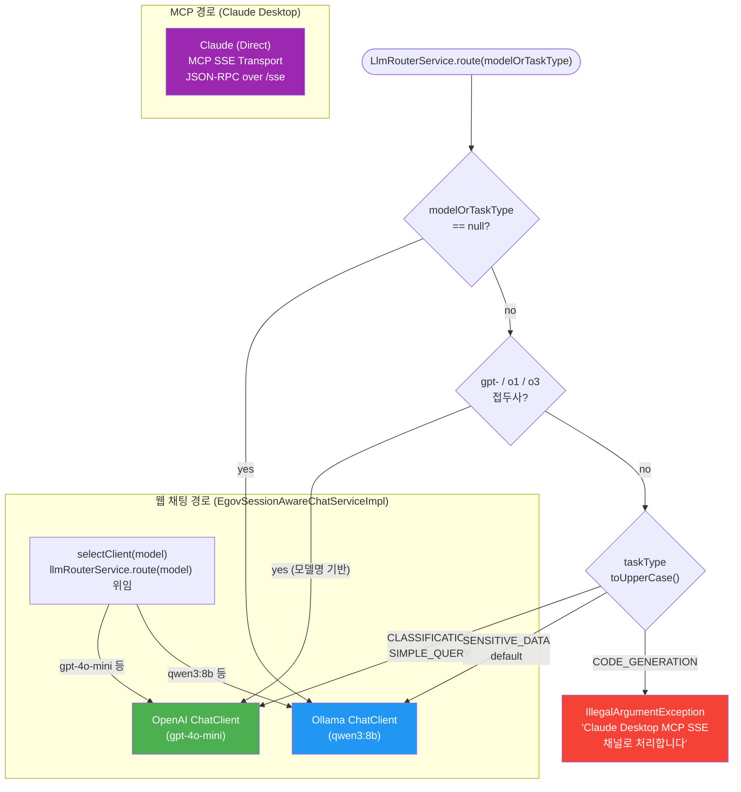
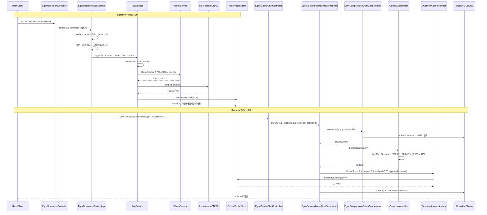
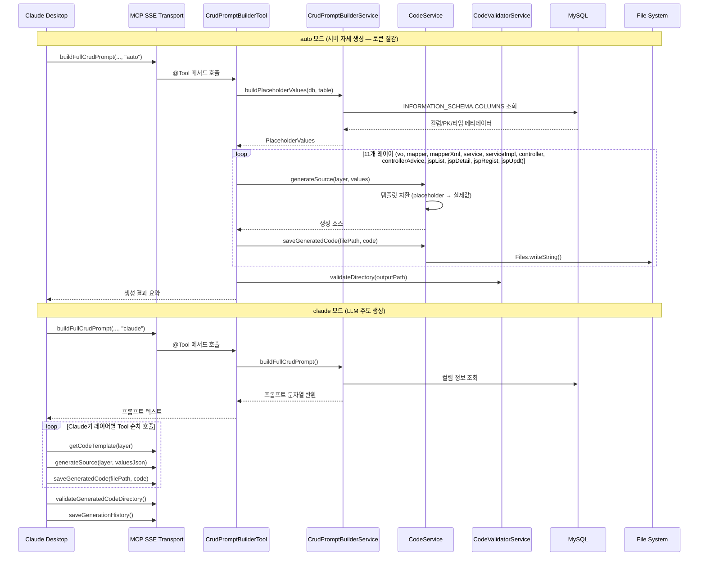
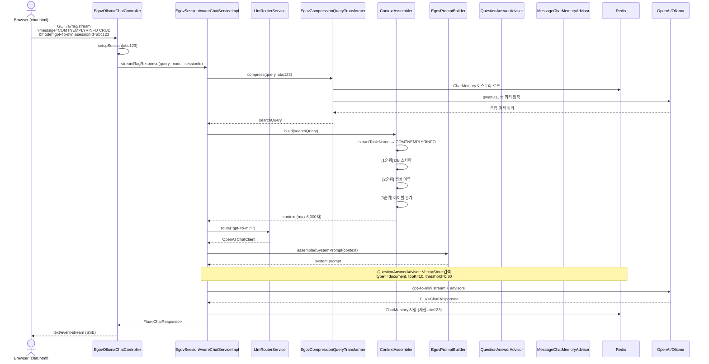
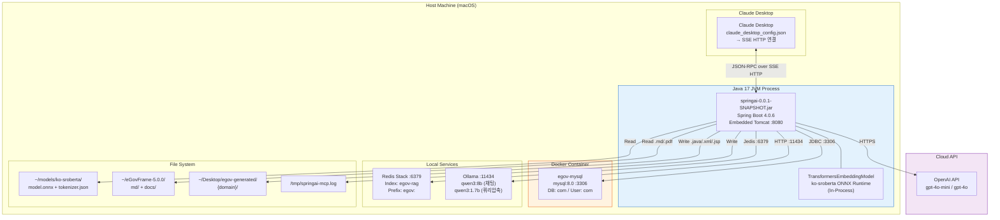

# Spring AI MCP Server — 아키텍처 심층 분석

Spring Boot 4.0.6 + Spring AI 2.0.0-M8 기반 eGovFrame 5.x CRUD 소스 자동 생성 AI 플랫폼

분석일: 2026-06-07

---

## 1. 전체 시스템 아키텍처

```mermaid
flowchart TB
    subgraph Clients["Client Layer"]
        CD["Claude Desktop<br/>(MCP SSE Client)"]
        Browser["Web Browser<br/>(Thymeleaf chat.html)"]
        ExtAPI["External API Client<br/>(X-API-Key Auth)"]
    end

    subgraph Server["Spring Boot 4.0.6 Server :8080"]
        subgraph Transport["Transport Layer"]
            SSE_EP["/sse + /mcp/**<br/>MCP SSE Endpoint"]
            WEB_EP["/ai/rag/stream<br/>/ai/simple/stream<br/>SSE Streaming"]
            REST_EP["/api/tools/**<br/>/api/rag/**<br/>REST JSON"]
            DOC_EP["/api/documents/**<br/>Document Mgmt"]
            STATIC["/ (Thymeleaf)<br/>/api/chat/**<br/>/api/ollama/**"]
        end

        subgraph MCP["MCP Tool Layer (19 Tools)"]
            CRUD_T["CrudPromptBuilderTool"]
            SCHEMA_T["SchemaReaderTool"]
            RAG_T["RagTool"]
            CODE_T["CodeTemplateTool<br/>CodeSaverTool<br/>CodeValidatorTool"]
            SEC_T["SecurityTemplateTool"]
            PROJ_T["ProjectInitializrTool<br/>ProjectScannerTool<br/>ProjectHealthTool"]
            OTHER_T["EmployeeTool / DateTimeTool<br/>CommonCodeTool / MenuTool<br/>AuthTool / SqlTool<br/>WorkflowGuideTool<br/>GenerationHistoryTool<br/>OutputPathResolverTool"]
        end

        subgraph Chat["Web Chat Subsystem"]
            CHAT_CTRL["EgovOllamaChatController"]
            CHAT_SVC["EgovSessionAwareChatServiceImpl"]
            DOC_SVC["EgovDocumentServiceImpl"]
            SESSION_SVC["EgovChatSessionServiceImpl"]
        end

        subgraph Core["Core Services"]
            LLM_ROUTER["LlmRouterService"]
            CTX_ASM["ContextAssembler"]
            PROMPT["EgovPromptBuilder"]
            CRUD_SVC["CrudPromptBuilderService"]
            CODE_SVC["CodeService"]
            RAG_SVC["RagService"]
            COMPRESS["EgovCompressionQueryTransformer"]
        end
    end

    subgraph External["External Systems"]
        OPENAI["OpenAI API<br/>gpt-4o-mini / gpt-4o"]
        OLLAMA["Ollama (Local)<br/>qwen3:8b / qwen3:1.7b"]
        MYSQL["MySQL 8.0<br/>(Docker: egov-mysql)<br/>DB: com"]
        REDIS["Redis Stack :6379<br/>VectorStore + ChatMemory"]
        ONNX["ko-sroberta ONNX<br/>(Local Model)"]
        FS["File System<br/>~/Desktop/egov-generated"]
    end

    CD -->|"JSON-RPC over SSE"| SSE_EP
    Browser -->|"HTTP SSE Stream"| WEB_EP
    Browser -->|"HTTP"| STATIC
    ExtAPI -->|"HTTP + X-API-Key"| REST_EP
    Browser -->|"HTTP"| DOC_EP

    SSE_EP --> MCP
    WEB_EP --> CHAT_CTRL
    REST_EP --> Core
    DOC_EP --> DOC_SVC

    CHAT_CTRL --> CHAT_SVC
    CHAT_SVC --> LLM_ROUTER
    CHAT_SVC --> CTX_ASM
    CHAT_SVC --> COMPRESS

    MCP --> Core
    CRUD_T --> CRUD_SVC
    CRUD_T --> CODE_SVC

    LLM_ROUTER -->|"gpt-*/o1/o3"| OPENAI
    LLM_ROUTER -->|"default/SENSITIVE"| OLLAMA
    COMPRESS -->|"qwen3:1.7b"| OLLAMA
    RAG_SVC --> REDIS
    CRUD_SVC --> MYSQL
    CODE_SVC --> FS
    ONNX --> REDIS
    CHAT_SVC -.->|"ChatMemory"| REDIS
```

---

## 2. 레이어 구조

```mermaid
flowchart TB
    subgraph ToolLayer["Tool Layer (MCP @Tool — 19개)"]
        direction LR
        T1["CrudPromptBuilderTool"] 
        T2["SchemaReaderTool"]
        T3["RagTool"]
        T4["CodeSaverTool / CodeTemplateTool / CodeValidatorTool"]
        T5["SecurityTemplateTool"]
        T6["ProjectInitializrTool / ProjectScannerTool / ProjectHealthTool"]
        T7["EmployeeTool / CommonCodeTool / MenuTool / AuthTool"]
        T8["SqlTool / WorkflowGuideTool / GenerationHistoryTool / DateTimeTool / OutputPathResolverTool"]
    end

    subgraph ControllerLayer["Controller Layer (REST/SSE — 7개)"]
        direction LR
        C1["EgovOllamaChatController<br/>/ai/rag/stream, /ai/simple/stream"]
        C2["ToolApiController<br/>/api/tools/**"]
        C3["RagController<br/>/api/rag/**"]
        C4["EgovDocumentController<br/>/api/documents/**"]
        C5["EgovChatSessionController / EgovOllamaModelController"]
        C6["EgovWebController<br/>/ (Thymeleaf)"]
    end

    subgraph ServiceLayer["Service Layer (23개)"]
        direction LR
        S1["LlmRouterService"]
        S2["CrudPromptBuilderService"]
        S3["CodeService / CodeValidatorService"]
        S4["RagService / ChunkService"]
        S5["SchemaService / TableRelationService"]
        S6["ContextAssembler / EgovPromptBuilder"]
        S7["SecurityTemplateService / ProjectInitializrService"]
        S8["EmployeeService / CommonCodeService / MenuService"]
        S9["GenerationHistoryService / SqlService / AuthService"]
        S10["EgovSessionAwareChatServiceImpl / EgovDocumentServiceImpl / EgovChatSessionServiceImpl"]
    end

    subgraph RepoLayer["Repository / Data Access"]
        direction LR
        R1["EmployeeRepository (JdbcTemplate)"]
        R2["GenerationHistoryRepository (JdbcTemplate)"]
        R3["RedisVectorStore"]
        R4["EgovRedisChatMemoryRepository"]
    end

    subgraph DataLayer["Data Stores"]
        direction LR
        D1[("MySQL 8.0<br/>egov-mysql")]
        D2[("Redis Stack<br/>VectorStore + Memory")]
        D3[("File System<br/>egov-generated")]
    end

    ToolLayer --> ServiceLayer
    ControllerLayer --> ServiceLayer
    ServiceLayer --> RepoLayer
    RepoLayer --> DataLayer
```

---

## 3. LLM 라우팅 결정 트리

---

## 4. RAG 파이프라인

---

## 5. MCP Tool 호출 흐름 (CRUD 소스 생성)

---

## 6. 웹 채팅 RAG 응답 시퀀스

---

## 7. 컴포넌트 의존성 맵

```mermaid
graph TD
    subgraph Config["Configuration Layer"]
        McpConfig --> ToolCallbackProvider["ToolCallbackProvider<br/>(19 Tools)"]
        EgovRagConfig --> OAClient["openAiChatClient"]
        EgovRagConfig --> OLClient["ollamaChatClient"]
        EgovRagConfig --> QAAdv["QuestionAnswerAdvisor"]
        EgovRagConfig --> |"@Primary"| OllamaChatModel
        VectorStoreConfig --> RedisVectorStore
        VectorStoreConfig --> ONNX["TransformersEmbeddingModel<br/>(ko-sroberta)"]
        EgovChatMemoryConfig --> MemAdv["MessageChatMemoryAdvisor"]
    end

    subgraph ChatServices["Chat Subsystem"]
        EgovSessionAwareChatServiceImpl --> LlmRouterService
        EgovSessionAwareChatServiceImpl --> ContextAssembler
        EgovSessionAwareChatServiceImpl --> EgovPromptBuilder
        EgovSessionAwareChatServiceImpl --> QAAdv
        EgovSessionAwareChatServiceImpl --> MemAdv
        EgovSessionAwareChatServiceImpl --> EgovCompressionQueryTransformer
        EgovDocumentServiceImpl --> RagService
        EgovCompressionQueryTransformer --> OllamaChatModel
    end

    subgraph RouterServices["Routing"]
        LlmRouterService --> OAClient
        LlmRouterService --> OLClient
    end

    subgraph CoreServices["Core Services"]
        ContextAssembler --> SchemaService
        ContextAssembler --> TableRelationService
        ContextAssembler --> GenerationHistoryService
        CrudPromptBuilderService --> EgovPromptBuilder
        CrudPromptBuilderService --> JdbcTemplate
        RagService --> RedisVectorStore
        RagService --> ChunkService
    end

    subgraph DataAccess["Data Access"]
        SchemaService --> JdbcTemplate
        EmployeeService --> EmployeeRepository
        GenerationHistoryService --> GenerationHistoryRepository
        JdbcTemplate --> MySQL[("MySQL 8.0")]
        RedisVectorStore --> Redis[("Redis Stack")]
        MemAdv --> Redis
    end
```

---

## 8. 배포 구조

---

## 9. 설계 핵심 결정 사항

| 항목 | 설계 결정 | 위치 |
|------|----------|------|
| MCP Tool 등록 | 19개 Tool을 단일 `ToolCallbackProvider` 빈으로 통합 | `McpConfig.java:37-64` |
| LLM 라우팅 | 모델명 접두사 또는 taskType 문자열 매칭 | `LlmRouterService.java:35-51` |
| 기본 ChatModel | Ollama를 `@Primary`로 지정 | `EgovRagConfig.java:27-29` |
| CRUD auto 모드 | 서버 사이드 템플릿 치환 — LLM 토큰 0 소비 | `CrudPromptBuilderTool.java:90-175` |
| 컨텍스트 예산 | 6,000자 한도 내 우선순위 조립 | `ContextAssembler.java:38` |
| 청크 전략 | 700자/100자 overlap, 자연경계 분할 | `ChunkService.java:27-31` |
| 문서 재인덱싱 | SHA Hash 비교 → 변경 파일만 처리 | `EgovDocumentServiceImpl.java:114-126` |
| VectorStore 필터 | `type == 'document'` (소스코드/이력 제외) | `EgovRagConfig.java:45-52` |
| 로컬 임베딩 | ko-sroberta ONNX (외부 API 불필요) | `application.yaml:22-35` |
| SSE 유지 | Tomcat connection-timeout 1시간, async 무제한 | `application.yaml:65-70` |

---

## 10. Trade-offs 요약

| 설계 선택 | 장점 | 단점 |
|-----------|------|------|
| 3-LLM 하이브리드 | 비용/품질/보안 최적화 | 운영 복잡도, 장애 포인트 3배 |
| auto 모드 (결정적 생성) | 토큰 97% 절감, 일관된 품질 | 커스터마이징 유연성 감소 |
| 로컬 ONNX 임베딩 | 비용 0, 한국어 특화 | GPU 없을 경우 대량 임베딩 느림 |
| Redis 통합 (VectorStore+Memory+세션) | 인프라 단순화 | 단일 장애점 |
| 이중 인터페이스 (MCP+웹) | Claude/브라우저 모두 지원 | 유지보수 복잡도 증가 |
| 쿼리 압축 (qwen3:1.7b) | 검색 정확도 향상 | Reactive 파이프라인 동기 블로킹 |
