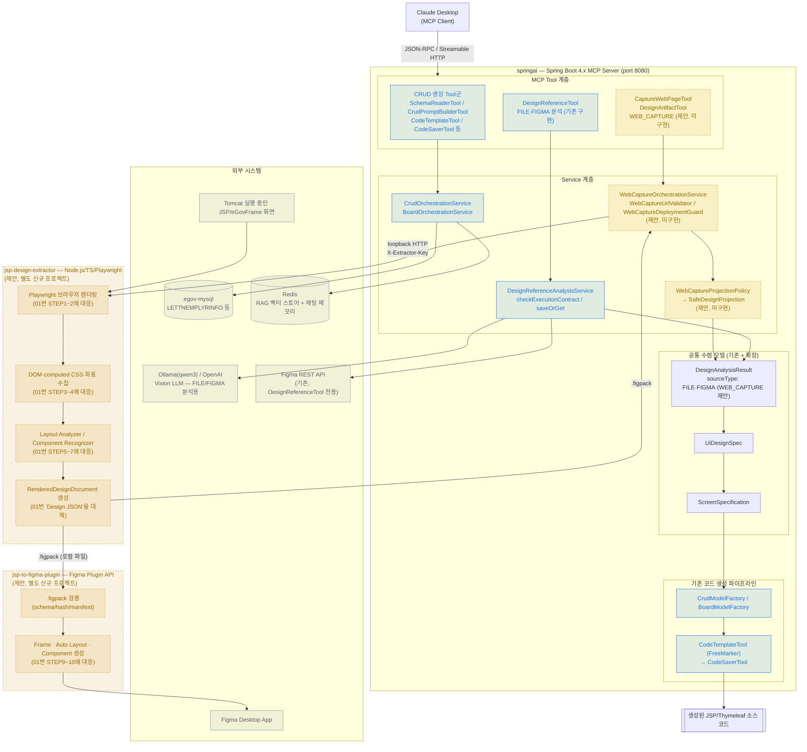

# springai 전체 구성 아키텍처 다이어그램

**문서명**: 05_Overall_Architecture_Diagram.md
**버전**: 1.2
**작성일**: 2026-07-21
**상태**: 참고용 개요도
**기준 문서**: `01_JSP_To_Figma_Design_Template_Guide.md`, `02_JSP_Website_Phased_Development_Impact_Assessment.md`, `03_Website_To_Figma_Implementation_Specification.md`, `04_Website_To_Figma_Implementation_List.md`

---

## 1. 목적

본 문서는 `01_JSP_To_Figma_Design_Template_Guide.md`가 제시한 "JSP → Figma" 원래 비전을, 이후 02~04번 문서에서 확정된 실제 구현 설계 및 springai의 기존 MCP 아키텍처와 함께 하나의 그림으로 정리한다. 01번 문서 자체는 여러 항목이 02~04번에서 대체·폐기되었으므로, 이 문서는 01번을 그대로 시각화한 것이 아니라 **01번의 목적(JSP 화면 → Figma 자동 변환)을 현재 확정된 아키텍처 위에 재배치한 것**이다.

이 문서는 코드 변경을 수반하지 않는 참고용 개요도이며, `CaptureWebPageTool`/`DesignArtifactTool`/`jsp-design-extractor`/`jsp-to-figma-plugin`은 아직 미구현 상태(03/04번 문서의 제안)이다.

---

## 2. 전체 구성도

Mermaid 렌더링을 지원하지 않는 뷰어를 위한 정적 미리보기(`mermaid-cli`로 생성한 SVG 스냅샷)이다. 다이어그램 자체를 수정할 때는 아래 Mermaid 소스를 편집하고 `05_Overall_Architecture_Diagram.svg`를 다시 생성해야 한다.

**범례**

- 🔵 실선 파랑: 이미 구현된 컴포넌트 (CRUD 생성 파이프라인, `DesignReferenceTool`의 FILE/FIGMA 분석 경로)
- 🟠 점선 주황: 02~04번 문서에서 제안했으나 아직 미구현인 컴포넌트 (`WEB_CAPTURE`, `jsp-design-extractor`, `jsp-to-figma-plugin`)
- ⚪ 회색: springai 외부 시스템

---

## 3. 01번 문서 대비 무엇이 바뀌었는가

01번 문서의 원래 10단계 파이프라인(JSP 실행 → Playwright → DOM/CSS 분석 → Layout 분석 → Component 분석 → Pattern 분석 → Design JSON → Figma Plugin → Design Template 생성)은 **개념적으로는 위 다이어그램에 그대로 살아있다.** 다만 02~04번 문서의 검토 과정에서 다음과 같이 구체화·수정되었다.

| 01번 원안 | 현재 확정 설계 | 사유 |
|---|---|---|
| `RenderJspTool` 등 springai 안에 Playwright 직접 내장 | `jsp-design-extractor`를 별도 Node.js/TS 프로세스로 분리, springai는 loopback HTTP로만 호출 | springai는 Java/Spring 기반이라 Chromium을 직접 구동하지 않는 편이 배포·격리에 유리 (02번 §5.1, 03번 원칙 #2~3) |
| Design JSON | `RenderedDesignDocument` (schema `rendered-design-document-v1`) | 좌표·스타일·자산까지 포함하는 정밀 모델과, 코드 생성용 의미 모델(`UiDesignSpec`)을 분리 (02번 §8.1) |
| GPT/Claude/Gemini 멀티 AI 스택으로 Design JSON 생성 | Release 1은 결정론적 규칙 기반, LLM을 필수 경로에서 제외 | 동일 입력의 재현성·버전 고정이 필요하기 때문 (03번 원칙 #7) |
| Figma 출력 후 React 코드까지 자동 생성 | React 코드 생성 제외, 기존 JSP/Thymeleaf 코드 생성 파이프라인(`CrudModelFactory` 등)과 연결 | springai가 이미 보유한 eGovFrame 코드 생성 자산을 재사용하는 것이 더 현실적 (03번 §4.2 제외 항목) |
| Figma Plugin이 무엇으로 만들어지는지 불명확 | 전용 `jsp-to-figma-plugin` TypeScript 프로젝트로 명시, Figma MCP(`use_figma`)는 개발 보조용으로만 사용하고 제품 실행 경로에서 제외 | 무인 재현성·결정론 확보 (03번 §4.3) |
| 보안/개인정보 처리 언급 없음 | URL allowlist, loopback 강제, `WebCaptureProjectionPolicy`를 통한 PII 구조적 배제 | 로컬 개발 도구가 아니라 실제 배포 가능한 기능으로 설계되었기 때문 (03번 §11) |

---

## 4. 문서 변경 이력

| 버전 | 작성일 | 변경 내용 |
|---|---|---|
| 1.2 | 2026-07-21 | `05_Overall_Architecture_Diagram.svg` 정적 미리보기 첨부 및 §2에 이미지 링크 추가 |
| 1.1 | 2026-07-21 | `mermaid-cli` 렌더링 검증 완료(exit code 0, SVG 정상 생성) 확인 |
| 1.0 | 2026-07-21 | 01~04번 문서 통합 개요도 최초 작성 |
