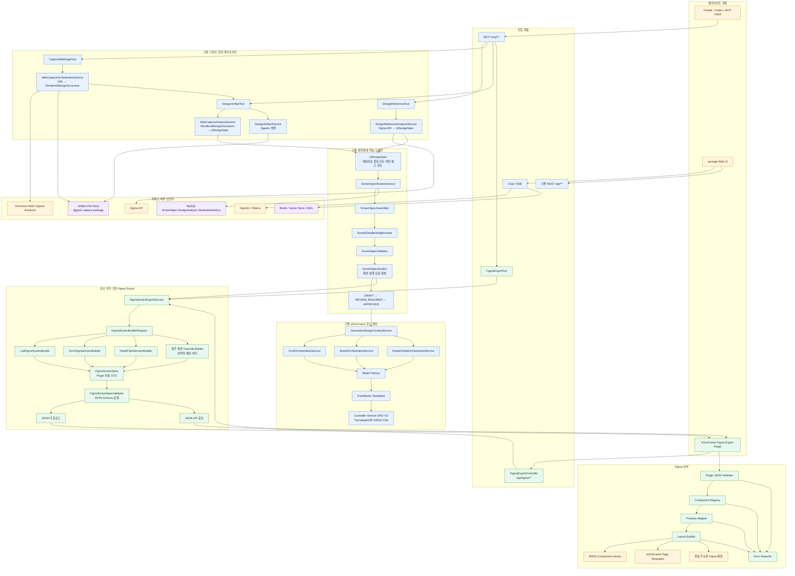
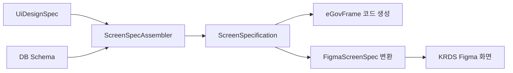
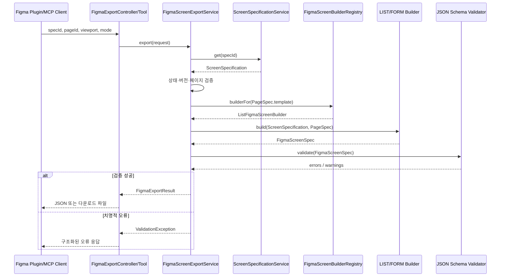
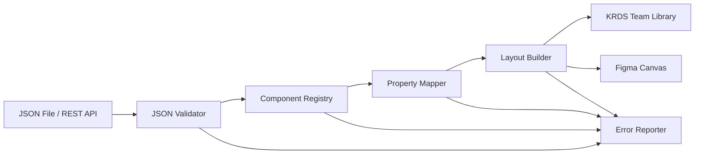

    # springai 의미 기반 KRDS/eGovFrame Figma Export 통합 아키텍처

**문서명**: `08_Semantic_Figma_Export_Integrated_Architecture.md`  
**버전**: 1.1  
**작성일**: 2026-07-27  
**상태**: 구현 설계안(신규 Figma Export 영역 미구현)  
**관련 문서**:

- `03_Website_To_Figma_Implementation_Specification.md`
- `05_Overall_Architecture_Diagram.md`
- `07_Design_System_Component_Mapping_Review.md`
- `../crud/design-reference-screen-specification-mapping-flow.md`
- `../crud/figma-design-system-ftc-portal-overview.md`

---

## 1. 목적

이 문서는 기존 `springai`의 다음 구현 축에 **KRDS/eGovFrame 컴포넌트 기반 의미형 Figma Export 기능**을 추가하는 통합 아키텍처를 정의한다.

1. FILE·FIGMA·WEB_CAPTURE 디자인 참조 분석
2. `UiDesignSpec` 생성
3. 데이터베이스 스키마와 결합한 `ScreenSpecification` 생성·검증·승인
4. 승인된 화면명세를 이용한 CRUD·게시판·마스터/디테일 코드 생성
5. 신규: 동일한 화면명세를 이용한 `FigmaScreenSpec` 생성
6. 신규: Figma Plugin에서 KRDS Component Instance 기반 화면 조립

핵심 원칙은 다음과 같다.

> `FigmaScreenSpec`을 새로운 화면 설계 원본으로 만들지 않는다. 기존 `ScreenSpecification`을 단일 원본으로 유지하고, `FigmaScreenSpec`은 Figma Plugin 전달을 위한 출력 Projection으로 사용한다.

따라서 eGovFrame 코드와 Figma 화면은 서로 다른 분석 결과가 아니라 동일한 승인 화면명세에서 생성된다.

---

## 2. 아키텍처 결정 요약

| 항목 | 결정 |
|---|---|
| 화면 설계 단일 원본 | 기존 `ScreenSpecification` |
| Figma 전달 모델 | 신규 `FigmaScreenSpec` 출력 DTO |
| Spring 구현 위치 | `springai` 내부 Controller·Tool·Service·Model |
| Figma 구현 위치 | TypeScript 기반 전용 Figma Plugin |
| 기본 Builder | LIST·FORM·DETAIL 등 화면 유형별 공통 Builder |
| 업무별 Builder | 공통 Builder로 표현할 수 없는 예외에만 적용 |
| 컴포넌트 매핑 위치 | Figma Plugin의 Component Registry |
| 색·간격·타이포그래피 | Figma Variables 및 KRDS Library에서 관리 |
| 기본 전송 방식 | JSON API 및 `.figma-spec.json` 다운로드 |
| 기존 `.figpack` | 시각적 복제 경로로 유지 |
| 신규 `FigmaScreenSpec` | KRDS Component Instance 기반 의미형 생성 경로 |
| 코드 생성 조건 | 기존과 동일하게 `APPROVED` 화면명세 사용 |
| 미승인 Figma Export | Preview 전용으로만 허용하는 정책 권장 |

---

## 3. 전체 통합 아키텍처



**범례**

- 파랑: 현재 `springai`에 구현된 영역
- 초록: 이 문서에서 추가하는 신규 영역
- 노랑: 외부 클라이언트·Figma·캡처 프로세스
- 보라: 영속 저장소

---

## 4. 기존 파이프라인과 신규 Export의 관계

현재 `springai`의 디자인 명세 흐름은 다음과 같다.

```text
FILE / FIGMA / WEB_CAPTURE
        ↓
DesignAnalysisResult
        ↓
UiDesignSpec
        ↓ DB 스키마·필드 바인딩
ScreenSpecification
        ↓ 검증·승인
CRUD / Board / MasterDetail 코드 생성
```

신규 기능은 승인된 `ScreenSpecification`에 두 번째 출력 경로를 추가한다.



`ScreenSpecification`의 주요 정보는 코드 생성과 Figma 생성에 다음처럼 공동 사용한다.

| `ScreenSpecification` | eGovFrame 출력 | Figma 출력 |
|---|---|---|
| `layoutDensity` | CSS 간격과 테이블 밀도 | Auto Layout spacing |
| `formColumnLayout` | 1열·2열 폼 HTML | 폼 Grid·Auto Layout |
| `actionPlacement` | 버튼 영역 위치 | 버튼 Frame 위치 |
| `searchPanelPlacement` | 검색 패널 HTML 위치 | SearchPanel Instance 위치 |
| `pages.fields` | 입력·출력 필드 | TextField·Select 등 Instance |
| `pages.actions` | 등록·저장·삭제 버튼 | KRDS Button Instance |
| `issues` | 코드 생성 차단·경고 | Figma Import Report |

---

## 5. `.figpack`과 `FigmaScreenSpec`의 역할 분리

기존 WEB_CAPTURE 기능에는 시각적 복제 목적의 `.figpack` 경로가 이미 있다.

```text
웹 URL
→ Chromium 캡처
→ RenderedDesignDocument
→ source.figpack
→ Figma Plugin
→ Frame·Text·Rectangle 기반 화면
```

신규 의미 기반 경로는 다음과 같다.

```text
ScreenSpecification
→ FigmaScreenSpec
→ Component Registry
→ KRDS Component Instance
→ 편집 가능한 디자인 시스템 화면
```

| 구분 | `.figpack` 경로 | `FigmaScreenSpec` 경로 |
|---|---|---|
| 목적 | 현재 렌더링 결과 복제 | KRDS 디자인 시스템으로 재구성 |
| 입력 | DOM·computed style·좌표 | 승인된 화면명세 |
| 출력 | 일반 Figma Node 중심 | Component Instance 중심 |
| 장점 | 원본 화면과 시각적으로 유사 | 디자인 시스템 편집성과 유지보수성 |
| 한계 | 디자인 시스템과 분리될 수 있음 | 등록된 컴포넌트만 정확히 생성 가능 |
| 권장 용도 | 레거시 화면 캡처·참조 | 신규 CRUD·표준 화면 설계 |

두 경로는 서로 대체하지 않고 병행한다.

> **갱신**: 이후 [09_Agent_Design_System_FigmaScreenSpec_Reference_Architecture.md](./09_Agent_Design_System_FigmaScreenSpec_Reference_Architecture.md)와
> [11_Semantic_Figma_Design_System_Implementation_Plan.md](./11_Semantic_Figma_Design_System_Implementation_Plan.md) R7에서
> `FigmaHybridExportService`가 하나의 캡처 `artifactId` 아래에 `.figpack` Reference 출력과
> `ScreenSpecification` 후보 → `FigmaScreenSpec` 의미 출력을 함께 연결하는 Hybrid 흐름을
> 추가했다. "병행"은 두 경로가 서로 대체하지 않는다는 의미로 유지되지만, 같은 캡처
> 아티팩트에서 두 출력을 함께 추적할 수 있다는 점은 이 갱신 이후의 사실이다.

---

## 6. springai 내부 권장 패키지 구조

```text
src/main/java/com/krdevops/springai/
├─ config/
│  ├─ McpConfig.java
│  ├─ SecurityConfig.java
│  └─ FigmaExportProperties.java
│
├─ controller/
│  └─ FigmaExportController.java
│
├─ tools/
│  └─ FigmaExportTool.java
│
├─ model/
│  ├─ design/
│  │  ├─ UiDesignSpec.java
│  │  ├─ PageSpec.java
│  │  └─ ScreenSpecification.java
│  │
│  └─ figma/
│     ├─ FigmaScreenSpec.java
│     ├─ FigmaNodeSpec.java
│     ├─ FigmaScreenMetadata.java
│     ├─ FigmaScreenExportRequest.java
│     ├─ FigmaExportMode.java
│     ├─ FigmaExportResult.java
│     └─ FigmaExportIssue.java
│
├─ service/
│  ├─ ScreenSpecificationService.java
│  ├─ GenerationDesignContextService.java
│  │
│  └─ figma/
│     ├─ FigmaScreenExportService.java
│     ├─ FigmaScreenSpecValidator.java
│     ├─ FigmaScreenBuilderRegistry.java
│     ├─ FigmaScreenSpecSerializer.java
│     │
│     └─ builder/
│        ├─ FigmaScreenBuilder.java
│        ├─ ListFigmaScreenBuilder.java
│        ├─ FormFigmaScreenBuilder.java
│        ├─ DetailFigmaScreenBuilder.java
│        └─ UserScreenOverrideBuilder.java
│
└─ mapper/
   ├─ ScreenSpecRepository.java
   └─ FigmaExportHistoryRepository.java
```

JSON Schema와 예제는 리소스에 둔다.

```text
src/main/resources/
└─ figma/
   └─ schema/
      ├─ figma-screen-spec-v1.schema.json
      └─ examples/
         ├─ user-list.json
         └─ user-form.json
```

Figma Plugin을 같은 저장소에서 관리할 경우 다음 구조를 권장한다.

```text
figma-plugin/
├─ manifest.json
├─ package.json
├─ tsconfig.json
└─ src/
   ├─ main/
   ├─ ui/
   ├─ schema/
   ├─ registry/
   ├─ mapping/
   ├─ layout/
   └─ errors/
```

초기에는 `springai` 저장소 안에서 JSON Schema·예제·계약 테스트를 공유하고, 배포 주기가 분리되면 Plugin을 별도 저장소로 이동할 수 있다.

---

## 7. Spring 컴포넌트 역할

### 7.1 `FigmaScreenSpec`

Figma Plugin에 전달하는 버전 고정 출력 계약이다.

```java
public record FigmaScreenSpec(
        String schemaVersion,
        String projectId,
        String screenSpecificationId,
        String screenId,
        String screenType,
        String name,
        String route,
        String viewport,
        String status,
        FigmaScreenMetadata metadata,
        FigmaNodeSpec content,
        List<FigmaExportIssue> issues) {
}
```

`ScreenSpecification`을 그대로 외부에 공개하지 않고 별도의 DTO로 투영하는 이유는 다음과 같다.

1. 내부 도메인 모델 변경이 Plugin 계약에 직접 전파되는 것을 방지한다.
2. Plugin에 불필요한 DB·생성기 내부 정보를 제거한다.
3. JSON Schema 버전을 독립적으로 관리한다.
4. 민감 데이터 배제 정책을 적용한다.
5. Figma 생성에 필요한 계층 구조로 정규화한다.

### 7.2 `FigmaNodeSpec`

화면과 컴포넌트의 공통 계층 모델이다.

```java
public record FigmaNodeSpec(
        String id,
        String type,
        Map<String, Object> properties,
        List<FigmaNodeSpec> children) {
}
```

예:

```json
{
  "id": "register-button",
  "type": "krds.button",
  "properties": {
    "label": "등록",
    "variant": "primary",
    "size": "medium",
    "disabled": false
  },
  "children": []
}
```

`FigmaNodeSpec`에는 임의의 좌표·색상보다 다음 의미 정보를 우선 저장한다.

- 컴포넌트 종류
- 레이블과 값
- Variant와 상태
- 필수 여부
- 반복 구조
- 부모·자식 계층
- 데이터 표시 역할

### 7.3 `FigmaScreenExportService`

신규 Export 기능의 애플리케이션 서비스다.

```java
public interface FigmaScreenExportService {
    FigmaExportResult export(FigmaScreenExportRequest request);
}
```

처리 순서:

1. `ScreenSpecificationService`로 화면명세 조회
2. 명세 상태·버전·데이터 소스 검증
3. 요청한 `PageSpec` 선택
4. `FigmaScreenBuilderRegistry`에서 Builder 선택
5. `FigmaScreenSpec` 생성
6. JSON Schema 검증
7. JSON API 응답 또는 다운로드 파일 생성

### 7.4 `FigmaScreenBuilderRegistry`

`PageSpec.template` 또는 화면 유형으로 Builder를 선택한다.

```text
list
→ ListFigmaScreenBuilder

regist
→ FormFigmaScreenBuilder(mode=CREATE)

updt
→ FormFigmaScreenBuilder(mode=UPDATE)

detail
→ DetailFigmaScreenBuilder
```

업무 테이블마다 Builder를 만들지 않는다. 기본 Builder로 표현할 수 없는 특수 화면에만 Override Builder를 사용한다.

```text
기본:
모든 LIST → ListFigmaScreenBuilder
모든 FORM → FormFigmaScreenBuilder

예외:
사용자 관리의 조직 선택기·권한 배지
→ UserScreenOverrideBuilder
```

### 7.5 `FigmaScreenSpecValidator`

서버가 잘못된 JSON을 Plugin으로 전달하지 않도록 검증한다.

검증 범위:

- `schemaVersion` 지원 여부
- 필수 최상위 필드
- `screenId`, `pageId`, Node ID 중복
- 컴포넌트별 필수 속성
- 테이블 컬럼과 행 데이터의 키 일치
- 지원 화면 유형
- 지원하지 않는 Variant
- 민감 필드 포함 여부

검증 결과는 Fatal·Error·Warning으로 구분한다.

| 등급 | 처리 |
|---|---|
| Fatal | 전체 Export 중단 |
| Error | 해당 노드 생성 실패 또는 정책에 따라 전체 중단 |
| Warning | 기본값·Fallback으로 대체하고 계속 |

---

## 8. Export 처리 시퀀스



---

## 9. LIST 화면 변환 규칙

```text
ScreenSpecification
└─ PageSpec(template=list)
   ├─ fields
   ├─ actions
   ├─ selectionSource
   └─ layout policies
        ↓
ListFigmaScreenBuilder
        ↓
egov.listPage
├─ krds.globalHeader
├─ krds.breadcrumb
├─ egov.pageHeader
├─ egov.searchPanel
│  ├─ krds.select
│  ├─ krds.textField
│  └─ krds.button
├─ egov.resultToolbar
├─ egov.dataTable
│  ├─ egov.tableHeader
│  └─ egov.tableRow × N
├─ krds.pagination
└─ krds.footer
```

테이블 데이터는 운영 데이터가 아니라 안전한 예제 데이터 또는 타입 기반 Placeholder를 기본값으로 사용한다.

---

## 10. FORM 화면 변환 규칙

```text
ScreenSpecification
└─ PageSpec(template=regist/updt)
   ├─ fields
   ├─ actions
   ├─ formColumnLayout
   └─ validation issues
        ↓
FormFigmaScreenBuilder
        ↓
egov.formPage
├─ krds.globalHeader
├─ krds.breadcrumb
├─ egov.pageHeader
├─ egov.formSection
│  ├─ krds.textField
│  ├─ krds.select
│  ├─ krds.checkbox
│  └─ krds.fileUpload
├─ egov.validationSummary
├─ egov.actionArea
│  ├─ krds.button(cancel)
│  └─ krds.button(save)
└─ krds.footer
```

`formColumnLayout`이 2열이면 Plugin이 Figma Auto Layout의 행·열 구조로 조립한다. 모바일 Viewport에서는 동일 Spec을 1열로 Projection할 수 있다.

---

## 11. REST API 설계

기존 `SecurityConfig`에서 `/api/**`는 인증 대상이므로 신규 API도 기본적으로 `X-API-Key` 정책을 따른다.

초기 구현은 이미 존재하는 `screenSpecificationId` 중심 API를 권장한다.

```http
GET /api/figma/screen-specifications/{specId}
GET /api/figma/screen-specifications/{specId}/pages
GET /api/figma/screen-specifications/{specId}/pages/{pageId}
GET /api/figma/screen-specifications/{specId}/pages/{pageId}/download
```

예:

```http
GET /api/figma/screen-specifications/spec-123/pages/list
X-API-Key: ********
```

응답:

```json
{
  "schemaVersion": "1.0",
  "screenSpecificationId": "spec-123",
  "screenId": "user-list",
  "screenType": "LIST",
  "name": "사용자 관리",
  "viewport": "DESKTOP",
  "content": {}
}
```

다운로드 응답:

```http
Content-Type: application/json
Content-Disposition: attachment; filename="user-list.figma-spec.json"
```

프로젝트 카탈로그가 필요해지면 다음 API를 추가한다.

```http
GET /api/figma/projects/{projectId}/screens
GET /api/figma/projects/{projectId}/screens/{screenId}
```

---

## 12. MCP Tool 설계

신규 `FigmaExportTool`을 `McpConfig.allToolCallbacks`에 등록한다.

권장 Tool:

```text
listFigmaExportPages(screenSpecificationId)
getFigmaScreenSpec(screenSpecificationId, pageId, viewport)
prepareFigmaScreenSpecDownload(screenSpecificationId, pageId, viewport)
validateFigmaScreenSpec(screenSpecificationId, pageId)
```

MCP Tool과 REST Controller는 중복 로직을 가지지 않고 동일한 `FigmaScreenExportService`를 호출한다.

```text
FigmaExportTool ─────┐
                     ├─→ FigmaScreenExportService
FigmaExportController┘
```

---

## 13. Figma Plugin 아키텍처



### 13.1 Component Registry

Spring의 논리 타입과 Figma Team Library의 Component Key를 연결한다.

```ts
const componentRegistry = {
  "krds.button": {
    componentKey: "published-component-key",
    propertyMappings: {
      label: { figmaProperty: "Label", type: "TEXT" },
      variant: {
        figmaProperty: "Type",
        type: "VARIANT",
        values: {
          primary: "Primary",
          secondary: "Secondary"
        }
      },
      disabled: {
        figmaProperty: "Disabled",
        type: "BOOLEAN"
      }
    }
  }
};
```

### 13.2 Property Mapper

```text
Spring JSON                  Figma Property
variant = primary       →    Type = Primary
size = medium           →    Size = Medium
label = 등록             →    Label = 등록
disabled = false        →    Disabled = false
```

컴포넌트 속성의 실제 API 이름에 내부 식별자가 포함될 수 있으므로 논리 이름과 실제 속성명을 동적으로 해석해야 한다.

> **갱신**: 위 `componentRegistry` 객체는 이 문서 작성 시점의 Plugin 로컬 상수 예시다.
> 이후 [09](./09_Agent_Design_System_FigmaScreenSpec_Reference_Architecture.md)/
> [10](./10_Semantic_Figma_Design_System_Impact_Analysis.md)/
> [11](./11_Semantic_Figma_Design_System_Implementation_Plan.md)/
> [12](./12_Semantic_Figma_Design_System_Implementation_List.md)번 문서에서 이 값의
> 원본을 Spring 쪽 `ComponentRegistry`/`ComponentRegistryEntry`(R1)로 옮기고, 사람이
> Figma Team Library를 Publish한 뒤 Registry Sync(R4)를 실행해 갱신하도록 구조를
> 확정했다. Plugin은 이 Registry를 조회만 하며 직접 값을 하드코딩하지 않는다.

### 13.3 Layout Builder

Component Instance를 생성하고 화면 유형에 맞는 Auto Layout 구조로 조립한다.

```text
Screen Frame 1440px
├─ Header
├─ Main
│  ├─ Breadcrumb
│  ├─ PageHeader
│  ├─ Search/Form Content
│  ├─ Table/Detail Content
│  └─ Actions
└─ Footer
```

### 13.4 Error Reporter

최종 생성 보고서에는 다음을 포함한다.

- 생성된 화면과 컴포넌트 수
- Fallback 처리된 Variant
- 찾지 못한 Component Key
- 지원하지 않는 논리 컴포넌트
- 누락된 필수 속성
- 원본 `screenSpecificationId`
- 사용한 Schema 및 Registry 버전

---

## 14. 상태 및 승인 정책

기존 코드 생성은 `APPROVED` 화면명세만 사용한다. Figma Export에는 다음 정책을 권장한다.

| 상태 | Preview | 정식 다운로드·API |
|---|---:|---:|
| `DRAFT` | 허용, Draft 표시 | 차단 |
| `REVIEW_REQUIRED` | 허용, Issue 표시 | 차단 |
| `APPROVED` | 허용 | 허용 |

Preview 결과에는 다음 메타데이터를 넣는다.

```json
{
  "status": "REVIEW_REQUIRED",
  "preview": true,
  "issues": [
    {
      "severity": "WARNING",
      "message": "화면명세 검토가 완료되지 않았습니다."
    }
  ]
}
```

---

## 15. 보안 및 개인정보 정책

1. `/api/figma/**`는 기존 `X-API-Key` 인증 정책을 적용한다.
2. Plugin JSON에 API Key·세션·쿠키·비밀번호를 포함하지 않는다.
3. 기본 Export는 실제 운영 데이터가 아닌 Template Mode를 사용한다.
4. Snapshot Mode는 명시적 권한과 마스킹 정책을 적용한다.
5. `SensitiveFieldPolicy`를 Figma Projection에도 재사용한다.
6. 주민등록번호·비밀번호·토큰·급여 등 민감 필드는 Placeholder로 대체하거나 Export를 차단한다.
7. Plugin의 `pluginData`는 보안 저장소로 사용하지 않는다.
8. Export 이력에는 데이터 본문 대신 Spec ID·화면 ID·사용자·시각·결과만 기록한다.

권장 모드:

```text
TEMPLATE
→ 안전한 예제 데이터
→ 기본값

SNAPSHOT
→ 현재 데이터 Projection
→ 권한·마스킹·감사 로그 필수
```

---

## 16. 버전 및 결정론 관리

동일 입력이 동일한 의미 구조를 생성하도록 다음 버전을 결과에 기록한다.

```json
{
  "schemaVersion": "1.0",
  "builderVersion": "1.0.0",
  "componentRegistryVersion": "2026.07",
  "screenSpecificationVersion": 3
}
```

Figma Team Library 변경은 완전한 결정론을 깨뜨릴 수 있으므로 Import Report에 다음 정보를 기록한다.

- Component Registry 버전
- 사용한 Component Key
- 누락·대체된 컴포넌트
- Import 실행 시각
- `ScreenSpecification` 버전

Component가 삭제·재생성되어 Key가 바뀌면 Registry 검증 단계에서 실패시키고 명시적 갱신을 요구한다.

---

## 17. 테스트 전략

### 17.1 Spring 단위 테스트

- `ListFigmaScreenBuilderTest`
- `FormFigmaScreenBuilderTest`
- `FigmaScreenBuilderRegistryTest`
- `FigmaScreenSpecValidatorTest`
- `FigmaScreenExportServiceTest`
- `FigmaExportControllerTest`
- `FigmaExportToolTest`

검증 항목:

- `PageSpec.template`별 Builder 선택
- 필드 Role별 KRDS 컴포넌트 결정
- 액션별 Button Variant 결정
- 민감 필드 제거
- Layout Policy Projection
- 상태별 Preview·Download 권한
- JSON Schema 적합성

### 17.2 계약 테스트

Spring이 생성한 JSON Fixture를 Plugin Validator에 입력한다.

```text
Spring Builder
→ user-list.figma-spec.json
→ Plugin Validator
→ Component Registry 조회
→ 오류 없이 통과
```

Java와 TypeScript가 동일한 JSON Schema를 사용하도록 CI에 계약 테스트를 둔다.

### 17.3 Figma Plugin 테스트

- Component Registry 조회
- Variant 값 변환
- Text·Boolean Property 이름 해석
- 누락 Component Key 처리
- Auto Layout 구조
- Import Report 생성
- 동일 Spec 재실행 정책

---

## 18. 구현 단계

### Phase 1: 계약 및 목록 화면 MVP

- `FigmaScreenSpec`·`FigmaNodeSpec`
- JSON Schema v1
- `ListFigmaScreenBuilder`
- 사용자 목록 Fixture
- JSON 다운로드 API
- Plugin 파일 선택 Import
- Button·TextField·Select·Table·Pagination 매핑

### Phase 2: FORM 화면

- `FormFigmaScreenBuilder`
- 등록·수정 모드
- Validation·Required·Error 상태
- 1열·2열 폼
- Checkbox·Radio·FileUpload 매핑

### Phase 3: REST·MCP 통합

- `FigmaExportController`
- `FigmaExportTool`
- Plugin API 연결
- `X-API-Key` 인증
- 화면·페이지 목록 조회

### Phase 4: 운영 안정화

- Export History
- Registry 호환성 검사
- Preview·Approved 정책
- 재가져오기·비교본 생성
- Fallback 및 Error Report
- 민감 데이터 마스킹 검증

---

## 19. 구현 완료 기준

첫 번째 Release는 다음 조건을 만족해야 한다.

1. 승인된 사용자 목록 `ScreenSpecification`을 조회할 수 있다.
2. 목록 Page를 `FigmaScreenSpec` JSON으로 변환할 수 있다.
3. JSON Schema 검증을 통과한다.
4. API와 다운로드 방식으로 동일한 JSON을 제공한다.
5. Figma Plugin에서 JSON 파일을 열 수 있다.
6. Button·Input·Select·Table·Pagination이 KRDS Component Instance로 생성된다.
7. 생성 결과에 원본 Spec ID와 버전이 기록된다.
8. 지원하지 않는 컴포넌트가 Import Report에 표시된다.
9. 실제 개인정보가 기본 Template Export에 포함되지 않는다.
10. 기존 CRUD·WEB_CAPTURE·`.figpack` 기능의 동작을 변경하지 않는다.

---

## 20. 최종 구조

```text
UiDesignSpec
    ↓
ScreenSpecification
    ├─ eGovFrame CRUD 코드 생성
    └─ FigmaScreenSpec 생성
          ↓
       Figma Plugin
          ↓
       KRDS Component Instance 화면
```

신규 Figma Export는 기존 WEB_CAPTURE 하위의 단순 파일 변환 기능이 아니라, `ScreenSpecification`의 두 번째 출력 어댑터로 구현한다.

```text
첫 번째 출력 어댑터
→ eGovFrame Java·Thymeleaf·JSP 코드

두 번째 출력 어댑터
→ KRDS 기반 FigmaScreenSpec

기존 보조 경로
→ 렌더링 복제용 .figpack
```

이 구조를 통해 코드와 디자인이 동일한 화면명세를 공유하며, eGovFrame 생성 결과와 Figma 설계 사이의 구조적 불일치를 최소화한다.

---

## 21. 변경 이력

| 버전 | 일자 | 변경 내용 |
|---|---|---|
| 1.1 | 2026-07-27 | 09~12번 문서(v1.2)와 동기화: §5에 `FigmaHybridExportService` R7 Hybrid 흐름 갱신 note 추가, §13.1 Component Registry가 Plugin 로컬 상수가 아니라 Spring `ComponentRegistry`/`ComponentRegistryEntry`(R1)+Publish Registry Sync(R4)로 갱신됨을 명시 |
| 1.0 | 2026-07-27 | 기존 springai 디자인 참조·화면명세·코드 생성 아키텍처에 의미 기반 KRDS/eGovFrame Figma Export를 통합한 최초 설계 |
