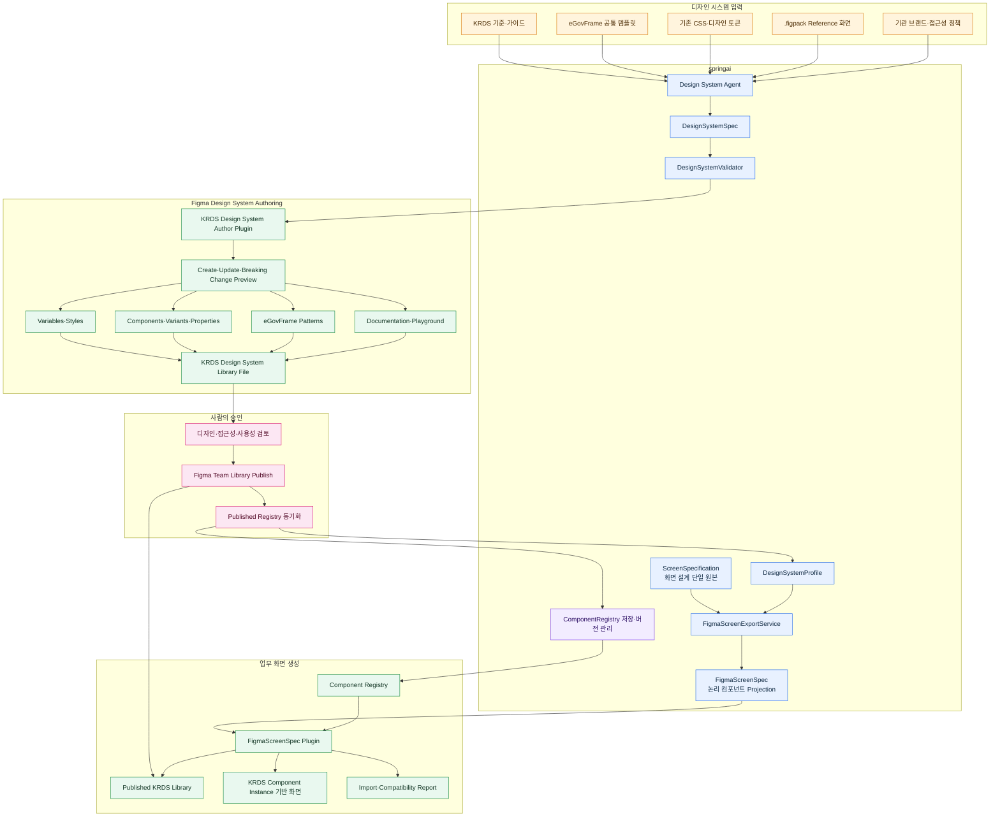
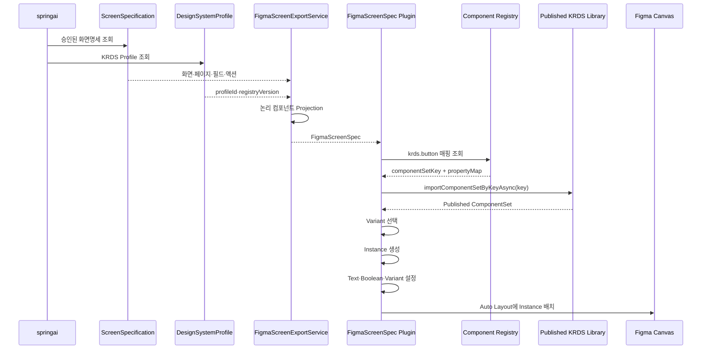
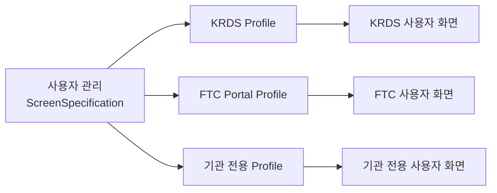

# 에이전트 디자인 시스템과 FigmaScreenSpec 참조 아키텍처

**문서명**: `09_Agent_Design_System_FigmaScreenSpec_Reference_Architecture.md`  
**버전**: 1.2  
**작성일**: 2026-07-27  
**상태**: 구현 설계안  
**관련 문서**:

- `07_Design_System_Component_Mapping_Review.md`
- `08_Semantic_Figma_Export_Integrated_Architecture.md`
- `../crud/figma-design-system-ftc-portal-overview.md`
- `../crud/design-reference-screen-specification-mapping-flow.md`

---

## 1. 목적

이 문서는 다음 전체 흐름의 책임과 참조 경계를 정의한다.

1. 에이전트가 KRDS/eGovFrame 디자인 시스템을 설계한다.
2. 전용 Figma Author Plugin이 Variables·Components·Variants를 생성한다.
3. 사람이 변경 Preview를 검토하고 Figma Team Library를 Publish한다.
4. `ScreenSpecification`을 `FigmaScreenSpec`으로 변환한다.
5. Figma Plugin이 Component Registry를 통해 Published Library를 참조한다.
6. KRDS Component Instance 기반 업무 화면을 생성한다.
7. 디자인 시스템 변경을 기존 업무 화면에 전파한다.

핵심 원칙은 다음과 같다.

> `ScreenSpecification`은 Figma Library의 물리적인 Component Key를 직접 참조하지 않는다.

`ScreenSpecification`은 업무 화면의 의미와 구조를 표현하고, 실제 Figma Library 연결은 `DesignSystemProfile`, `ComponentRegistry`, Figma Plugin이 담당한다.

---

## 2. 전체 참조 구조



---

## 3. 책임 경계

### 3.1 `ScreenSpecification`

`ScreenSpecification`은 다음 내용을 표현한다.

- 화면 유형: LIST·FORM·DETAIL 등
- 화면명과 기능 유형
- 데이터 소스와 기본 테이블
- 페이지와 필드
- 액션과 중요도
- 레이아웃 밀도
- 폼 컬럼 구성
- 검색 패널 위치
- 유효성 검증 이슈
- 승인 상태

다음 Figma 물리 정보는 포함하지 않는다.

- Figma `fileKey`
- Figma `componentKey`
- Figma `componentSetKey`
- Figma `variableKey`
- Figma `nodeId`
- Figma Component Property 내부 ID

예:

```json
{
  "id": "spec-user-management",
  "screenName": "사용자 관리",
  "featureType": "crud",
  "layoutDensity": "COMFORTABLE",
  "formColumnLayout": "TWO_COLUMN",
  "pages": [
    {
      "id": "user-list",
      "template": "list",
      "fields": [
        {
          "id": "userName",
          "label": "사용자명",
          "role": "TITLE",
          "control": "TEXT_FIELD",
          "required": true
        },
        {
          "id": "userStatus",
          "label": "사용 상태",
          "role": "STATUS",
          "control": "SELECT",
          "required": false
        }
      ],
      "actions": [
        {
          "type": "SEARCH",
          "label": "검색",
          "importance": "PRIMARY"
        },
        {
          "type": "CREATE",
          "label": "사용자 등록",
          "importance": "PRIMARY"
        }
      ]
    }
  ]
}
```

### 3.2 `FigmaScreenSpec`

`FigmaScreenSpec`은 `ScreenSpecification`을 Figma 업무 화면 생성에 적합한 논리 컴포넌트 트리로 Projection한 모델이다.

```json
{
  "schemaVersion": "1.0",
  "screenSpecificationId": "spec-user-management",
  "screenId": "user-list",
  "screenType": "LIST",
  "designSystem": {
    "profileId": "krds",
    "profileVersion": "1.0",
    "registryVersion": "2026.07"
  },
  "content": {
    "id": "user-list-page",
    "type": "egov.listPage",
    "children": [
      {
        "id": "search-user-name",
        "type": "krds.textField",
        "properties": {
          "label": "사용자명",
          "required": true,
          "state": "default"
        }
      },
      {
        "id": "search-user-status",
        "type": "krds.select",
        "properties": {
          "label": "사용 상태",
          "required": false
        }
      },
      {
        "id": "search-button",
        "type": "krds.button",
        "properties": {
          "label": "검색",
          "variant": "primary",
          "size": "medium"
        }
      }
    ]
  }
}
```

`FigmaScreenSpec`도 원칙적으로 실제 Component Key를 포함하지 않는다. 다음 논리 타입만 사용한다.

```text
krds.button
krds.textField
krds.select
krds.pagination
egov.searchPanel
egov.dataTable
egov.formSection
```

`screenType`(`LIST`/`FORM`/`DETAIL`/`DASHBOARD`/`CUSTOM`)은 `FigmaScreenTypeResolver`가
`PageSpec.template`(예: `{base}_LIST`/`{base}_FORM`/`{base}_DETAIL`)을 우선 사용하고,
값이 없을 때만 `ScreenSpecification.archetype`(예: `CRUD_LIST`, `BOARD_FORM`,
`MASTER_DETAIL`)으로 fallback하여 결정한다. 매핑되지 않는 자유 문자열은 조용히
`CUSTOM`으로 변환하지 않고 검증 오류 또는 사용자 선택으로 처리한다. 전체 매핑표는
[10_Semantic_Figma_Design_System_Impact_Analysis.md](./10_Semantic_Figma_Design_System_Impact_Analysis.md)와
[11_Semantic_Figma_Design_System_Implementation_Plan.md](./11_Semantic_Figma_Design_System_Implementation_Plan.md)를 따른다.

### 3.3 `DesignSystemProfile`

사용할 디자인 시스템의 식별자와 버전, Registry 정보를 관리한다.

```java
public record DesignSystemProfile(
        String id,
        String name,
        String version,
        String registryVersion,
        String libraryFileKey,
        DesignSystemProfileStatus status,
        Map<String, ComponentBinding> components,
        Map<String, VariableBinding> variables) {
}
```

예:

```json
{
  "id": "krds",
  "name": "KRDS Design System",
  "version": "1.0",
  "registryVersion": "2026.07",
  "libraryFileKey": "KRDS_FIGMA_LIBRARY_FILE_KEY",
  "status": "PUBLISHED"
}
```

### 3.4 `ComponentRegistry`

논리 타입과 Published Figma Library의 실제 Component를 연결한다.

```json
{
  "profileId": "krds",
  "profileVersion": "1.0",
  "registryVersion": "2026.07",
  "library": {
    "fileKey": "KRDS_FIGMA_LIBRARY_FILE_KEY",
    "name": "KRDS Design System"
  },
  "components": {
    "krds.button": {
      "componentSetKey": "FIGMA_BUTTON_COMPONENT_SET_KEY",
      "properties": {
        "label": {
          "figmaProperty": "Label",
          "type": "TEXT"
        },
        "variant": {
          "figmaProperty": "Type",
          "type": "VARIANT",
          "values": {
            "primary": "Primary",
            "secondary": "Secondary",
            "tertiary": "Tertiary"
          }
        },
        "size": {
          "figmaProperty": "Size",
          "type": "VARIANT",
          "values": {
            "small": "Small",
            "medium": "Medium",
            "large": "Large"
          }
        }
      }
    },
    "krds.textField": {
      "componentSetKey": "FIGMA_TEXT_FIELD_COMPONENT_SET_KEY",
      "properties": {
        "label": {
          "figmaProperty": "Label",
          "type": "TEXT"
        },
        "required": {
          "figmaProperty": "Required",
          "type": "BOOLEAN"
        },
        "state": {
          "figmaProperty": "State",
          "type": "VARIANT"
        }
      }
    }
  }
}
```

각 논리 타입 항목(`krds.button`, `krds.textField` 등)은 `ComponentRegistryEntry`
하나로 표현하며, `ComponentRegistry`는 `profileId`/`profileVersion`/`registryVersion`
단위로 `ComponentRegistryEntry` 목록을 묶어 저장·버전 관리한다.

### 3.5 `.figpack` Hybrid 연결과 `FigmaHybridExportService`

`.figpack` Reference 화면(§2의 `CAPTURE`)과 `FigmaScreenSpec` 기반 의미 화면은
서로 다른 산출물이지만, 하나의 캡처 아티팩트에서 함께 파생될 수 있다.
`FigmaHybridExportService`는 같은 `artifactId` 아래에 다음 두 출력을 연결한다.

```text
artifactId
├─ source.figpack → Reference Capture (jsp-to-figma-plugin)
└─ document.json
   → UiDesignSpec
   → ScreenSpecification 후보 (사람 승인 필요)
   → FigmaScreenSpec
   → Published KRDS Component Instance 기반 화면
```

생성된 Figma Reference Node를 다시 의미 분석하지 않고, 항상 원본 `document.json`을
사용한다. 상세 절차와 승인 게이트는
[11_Semantic_Figma_Design_System_Implementation_Plan.md](./11_Semantic_Figma_Design_System_Implementation_Plan.md)
R7을 따른다.

---

## 4. 에이전트 디자인 시스템 생성

### 4.1 에이전트 입력

```text
KRDS 기준 문서
eGovFrame Thymeleaf/JSP 템플릿
기존 CSS Variable과 Class
.figpack Reference 화면
기관 브랜드 정책
접근성 정책
사용자가 승인한 디자인 결정
```

### 4.2 `DesignSystemSpec`

에이전트는 다음 항목을 포함하는 디자인 시스템 명세를 생성한다.

```text
DesignSystemSpec
├─ Foundation Tokens
│  ├─ Color
│  ├─ Spacing
│  ├─ Typography
│  ├─ Radius
│  └─ Elevation
├─ Variable Collections
│  ├─ Light
│  ├─ Dark
│  └─ High Contrast
├─ Components
│  ├─ Button
│  ├─ Input
│  ├─ Select
│  └─ Pagination
├─ Variants
├─ Component Properties
├─ eGovFrame Patterns
│  ├─ PageHeader
│  ├─ SearchPanel
│  ├─ DataTable
│  └─ FormSection
├─ Documentation
└─ Validation Rules
```

예:

```json
{
  "id": "krds.button",
  "name": "KRDS/Button",
  "layout": {
    "mode": "HORIZONTAL",
    "paddingX": "{spacing.16}",
    "paddingY": "{spacing.12}",
    "gap": "{spacing.8}",
    "alignment": "CENTER"
  },
  "properties": [
    {
      "name": "Label",
      "type": "TEXT",
      "defaultValue": "버튼"
    },
    {
      "name": "Icon",
      "type": "INSTANCE_SWAP"
    },
    {
      "name": "ShowIcon",
      "type": "BOOLEAN",
      "defaultValue": false
    }
  ],
  "variants": {
    "Type": ["Primary", "Secondary", "Tertiary"],
    "Size": ["Small", "Medium", "Large"],
    "State": ["Default", "Hover", "Pressed", "Disabled"]
  }
}
```

### 4.3 Author Plugin

`KRDS Design System Author Plugin`은 `DesignSystemSpec`을 읽고 현재 열린 Figma Library 파일에 다음 자산을 생성한다.

- Variable Collection과 Mode
- Color·Number·String·Boolean Variable
- Paint·Text·Effect Style
- Component
- Component Set과 Variant
- TEXT·BOOLEAN·INSTANCE_SWAP Property
- Nested Component
- eGovFrame Pattern
- 문서 및 Playground Page
- Design System 변경 보고서

---

## 5. 생성이 아니라 제자리 업데이트

Published Component를 삭제하고 다시 만들면 Component Key가 바뀌어 기존 업무 화면과의 연결이 끊어진다.

```text
금지:
기존 KRDS/Button 삭제
→ 새로운 KRDS/Button 생성
→ Key 변경
→ 기존 Instance 연결 단절
```

모든 자산에 안정적인 논리 ID를 저장한다.

```ts
component.setPluginData(
  "designSystemId",
  "krds.button"
);

component.setPluginData(
  "designSystemVersion",
  "1.2.0"
);
```

Author Plugin 재실행 시:

```text
DesignSystemSpec: krds.button
        ↓
pluginData.designSystemId=krds.button 검색
        ↓
있음 → 기존 Component 제자리 Update
없음 → 신규 Component 생성
```

이 방식은 다음을 보장한다.

- Component Key 유지
- 기존 Instance 연결 유지
- 반복 실행 시 중복 생성 방지
- 변경사항 Diff 생성
- 디자인 시스템 변경의 전체 화면 전파 가능

---

## 6. 사람의 Preview 검토와 Publish

에이전트와 Author Plugin은 변경을 즉시 적용하기 전에 Preview를 제공한다.

```text
Design System Update 1.2.0

추가:
- FileUpload Component
- Button/Size=XL Variant

변경:
- Button/Medium 높이 44 → 48
- TextField Radius 6 → 8

Breaking Change:
- Select Property Value → SelectedValue
- Component Registry 갱신 필요

삭제 예정:
- Button/Type=Ghost
- 자동 삭제하지 않음
```

검토 항목:

- 시각적 위계
- 기관 브랜드 적합성
- 접근성
- 실제 업무 사용성
- Component Property 이름
- Variant 구조
- 기존 Instance 영향
- Breaking Change
- 삭제 예정 자산

검토 완료 후 사람이 Figma Team Library를 Publish한다.

---

## 7. Publish 후 Registry 동기화

Author Plugin이 생성한 Component는 다른 파일에서 사용하기 전에 Publish되어야 한다.

Publish 이후 `Sync Published Registry` 단계를 수행한다.

```text
Figma Library Publish
→ Component Publish 상태 확인
→ Component Key 수집
→ Variable Key 수집
→ Property·Variant 호환성 검증
→ Component Registry 생성
→ springai에 Registry 등록
```

동기화 검증 항목:

- 실제 Published Component인가
- 논리 ID와 Component가 1:1로 대응하는가
- Component Key가 유효한가
- 필수 Variant가 모두 존재하는가
- Component Property가 명세와 일치하는가
- 필요한 Variables가 Publish됐는가
- 삭제되거나 재생성된 Component가 있는가

예:

```json
{
  "profileId": "krds",
  "registryVersion": "2026.07",
  "status": "VALID",
  "components": {
    "krds.button": {
      "publishStatus": "CURRENT",
      "componentSetKey": "abc123"
    },
    "krds.textField": {
      "publishStatus": "CURRENT",
      "componentSetKey": "def456"
    }
  }
}
```

---

## 8. 업무 화면 생성 시퀀스



개념적인 Plugin 처리:

```ts
async function createNode(
  nodeSpec: FigmaNodeSpec,
  registry: ComponentRegistry
) {
  const mapping =
    registry.components[nodeSpec.type];

  if (!mapping) {
    throw new Error(
      `등록되지 않은 컴포넌트: ${nodeSpec.type}`
    );
  }

  const componentSet =
    await figma.importComponentSetByKeyAsync(
      mapping.componentSetKey
    );

  const component = selectVariant(
    componentSet,
    nodeSpec.properties,
    mapping
  );

  const instance = component.createInstance();

  applyComponentProperties(
    instance,
    nodeSpec.properties,
    mapping.properties
  );

  return instance;
}
```

---

## 9. ScreenSpecification이 Figma Key를 직접 참조하지 않는 이유

### 9.1 플랫폼 종속 방지

`ScreenSpecification`은 eGovFrame 코드 생성에서도 사용한다. Figma 전용 Key가 들어가면 핵심 도메인이 Figma에 종속된다.

### 9.2 다중 디자인 시스템 지원

동일한 화면명세를 서로 다른 디자인 시스템으로 생성할 수 있다.



```text
ScreenSpecification
→ control=TEXT_FIELD

KRDS Profile
→ KRDS/TextField

FTC Profile
→ FTC/Input

기관 Profile
→ Internal/FormField
```

### 9.3 Component 교체 영향 격리

Component Key가 변경돼도 모든 `ScreenSpecification`을 수정하지 않고 Registry만 갱신한다.

### 9.4 환경 분리

다음 환경이 다른 Library를 사용할 수 있다.

```text
개발 Library
검토 Library
운영 Published Library
```

화면명세를 바꾸지 않고 Design System Profile만 교체할 수 있다.

---

## 10. 디자인 시스템 변경의 전파

### 10.1 Component 내부 디자인 변경

```text
KRDS/Button 색상·Padding·Radius 변경
→ Library Publish
→ 사용 파일에서 Library Update 적용
→ 연결된 기존 Instance 갱신
```

`ScreenSpecification`과 `FigmaScreenSpec` 재생성은 필요하지 않다.

### 10.2 Variable 변경

```text
Color/Primary 변경
→ Variable Publish
→ Update 적용
→ Variable이 바인딩된 모든 Component와 화면 갱신
```

### 10.3 Component Key 변경

```text
KRDS/Button 삭제 후 재생성
→ Component Key 변경
→ Registry 갱신
→ 기존 Instance는 자동으로 새 Component에 연결되지 않음
```

필요 조치:

- Figma Library Swap
- Plugin Instance Migration
- `FigmaScreenSpec` 재Import

### 10.4 화면 구조 변경

```text
ScreenSpecification에 필드 추가
→ FigmaScreenSpec 재생성
→ 기존 화면 교체 또는 비교본 생성
```

### 10.5 Registry Variant 매핑 변경

```text
variant=primary
기존 매핑 → Primary
신규 매핑 → Filled
```

기존 Instance에는 자동 반영되지 않는다. Plugin의 `Reapply Mapping` 또는 재Import가 필요하다.

---

## 11. 변경 유형별 처리표

| 변경 | 기존 화면 반영 | 필요한 작업 |
|---|---:|---|
| Component 색·간격·Radius | 가능 | Publish 후 Library Update |
| Component 내부 Auto Layout | 가능 | Publish 후 Library Update |
| Published Variable 값 | 가능 | Publish 후 Library Update |
| 새 Variant 추가 | 기존 Instance 자동 선택 안 됨 | Update 후 필요 화면에서 선택 |
| Component Property 기본값 | Override가 없는 곳만 영향 | Update |
| Component Property 이름 변경 | Breaking Change | Registry·Plugin 갱신 |
| Component 삭제·재생성 | 자동 연결 불가 | Migration 또는 재Import |
| 논리 타입의 Registry 매핑 변경 | 자동 반영 안 됨 | Reapply Mapping |
| 화면 필드 추가·삭제 | 자동 반영 안 됨 | `FigmaScreenSpec` 재생성 |
| 화면 Section 순서 변경 | 자동 반영 안 됨 | 재생성 |
| Screen Builder 변경 | 자동 반영 안 됨 | 재생성 |

---

## 12. Component와 Instance 재사용 원칙

### 12.1 Component 재사용의 의미

Figma Component를 사용하는 핵심 목적은 디자인 정의를 여러 화면에서 재사용하는 것이다.

```text
KRDS/Button Main Component 1개
├─ 사용자 목록의 검색 Button Instance
├─ 사용자 목록의 등록 Button Instance
├─ 게시판 목록의 검색 Button Instance
└─ 사용자 등록의 저장 Button Instance
```

하나의 Main Component를 화면 여러 위치에서 직접 공유하는 것이 아니라, 동일한 Main Component에 연결된 Instance를 필요한 위치마다 생성한다.

| 구분 | Main Component | Instance |
|---|---|---|
| 목적 | 디자인 원본 정의 | 실제 업무 화면에서 사용 |
| 위치 | Published Library 파일 | 업무 화면 파일 |
| 개수 | 논리 컴포넌트별 한 개 | 필요한 화면 요소마다 한 개 |
| 변경 | 디자인 시스템에서 관리 | Property와 Override만 관리 |
| 전체 변경 전파 | 변경의 출발점 | Library Update를 전달받음 |

### 12.2 세 가지 재사용

#### 디자인 시스템 Component 재사용

여러 `FigmaScreenSpec` 노드가 같은 논리 타입을 사용하면 하나의 Published Main Component를 공유한다.

```text
FigmaScreenSpec
├─ krds.button
├─ krds.button
└─ krds.button

ComponentRegistry
└─ krds.button → KRDS/Button Component Key

Figma 결과
├─ KRDS/Button Instance 1
├─ KRDS/Button Instance 2
└─ KRDS/Button Instance 3
```

버튼마다 별도의 Main Component를 생성하지 않는다.

#### 동일 논리 화면 요소의 Instance 재사용

동일한 화면을 다시 동기화할 때 `logicalNodeId`가 같은 기존 Instance가 있으면 새로 만들지 않고 기존 Instance를 갱신한다.

```text
기존 Figma 화면:
logicalNodeId=search-button
→ KRDS/Button Instance

새 FigmaScreenSpec:
logicalNodeId=search-button
→ krds.button

처리:
기존 Instance 재사용
→ Label·Variant·Size 등 변경된 속성만 갱신
```

이를 통해 다음 정보를 보존한다.

- Figma Node ID
- 사용자가 허용 범위에서 적용한 Override
- Prototype 연결
- Annotation
- 디자이너 메모
- 다른 Layer가 가진 참조

#### eGovFrame Pattern 재사용

Button보다 큰 패턴도 Published Component 또는 조립 규칙으로 재사용할 수 있다.

```text
eGov/SearchPanel
├─ KRDS/Select Instance
├─ KRDS/TextField Instance
└─ KRDS/Button Instance

eGov/ListPage
├─ eGov/PageHeader Instance
├─ eGov/SearchPanel Instance
├─ eGov/DataTable
└─ KRDS/Pagination Instance
```

필드 개수가 동적으로 달라지는 SearchPanel·Table·Form은 단일 고정 Component보다 Auto Layout Frame과 하위 Component Instance를 조립하는 방식을 사용할 수 있다.

### 12.3 신규 생성의 정확한 의미

“신규만 생성”은 새로운 Main Component를 업무 화면마다 생성한다는 의미가 아니다.

```text
논리 화면 요소가 기존에 있음
→ 기존 Instance 재사용

논리 화면 요소가 새로 추가됨
→ 기존 Published Main Component에서 새 Instance 생성

ComponentRegistry에 논리 타입이 없음
→ 업무 화면 Plugin에서 임의 Main Component를 만들지 않음
→ Unsupported Component로 보고
→ Design System Authoring 절차에서 Main Component 추가
```

예를 들어 부서 검색 조건이 새로 추가되면:

```text
잘못된 처리:
KRDS/TextField Main Component를 다시 생성

올바른 처리:
기존 KRDS/TextField Main Component에서
logicalNodeId=search-department인 새 Instance만 생성
```

### 12.4 안정적인 화면과 Node 식별자

기존 화면 재사용 여부는 이름이 아니라 Plugin 전용 메타데이터로 판단한다.

화면 식별자:

```text
screenSpecificationId
+ pageId
+ viewport
+ designSystemProfileId
```

Root Frame:

```ts
screenFrame.setPluginData(
  "managedBy",
  "figma-screen-spec-plugin"
);

screenFrame.setPluginData(
  "screenSpecificationId",
  "spec-user-management"
);

screenFrame.setPluginData(
  "pageId",
  "user-list"
);

screenFrame.setPluginData(
  "viewport",
  "DESKTOP"
);

screenFrame.setPluginData(
  "designSystemProfileId",
  "krds"
);
```

각 관리 Node:

```ts
instance.setPluginData(
  "logicalNodeId",
  "search-user-name"
);

instance.setPluginData(
  "logicalType",
  "krds.textField"
);

instance.setPluginData(
  "registryVersion",
  "2026.07.1"
);

instance.setPluginData(
  "componentKey",
  mapping.componentKey
);
```

Layer 이름은 사용자가 변경할 수 있고 중복될 수 있으므로 식별자로 사용하지 않는다.

### 12.5 증분 동기화 규칙

| 새 Spec와 기존 Figma 상태 | 처리 |
|---|---|
| 같은 논리 ID, 같은 Component | 기존 Instance 재사용 |
| 같은 논리 ID, Variant만 변경 | 기존 Instance Property 변경 |
| 같은 논리 ID, Label 변경 | 기존 Text Property 변경 |
| 같은 논리 ID, 순서·부모 변경 | 기존 Node 이동·재배치 |
| 같은 논리 ID, Component 타입 변경 | Instance Swap 또는 안전한 교체 |
| 새로운 논리 ID | 기존 Main Component에서 새 Instance 생성 |
| 기존에는 있으나 새 Spec에는 없음 | 즉시 삭제하지 않고 Obsolete 처리 |
| 기존 Instance가 Detach됨 | 충돌로 보고하고 사용자 선택 요구 |
| Component Key 변경 | Migration 또는 Instance Swap |
| Design System Profile 변경 | Library Swap 또는 새 비교본 생성 |

예:

```text
기존:
user-list
├─ search-user-name
├─ search-user-status
├─ search-button
└─ user-table

새 FigmaScreenSpec:
user-list
├─ search-user-name
├─ search-user-status
├─ search-department
├─ search-button
└─ user-table

처리:
재사용 → search-user-name
재사용 → search-user-status
신규 Instance → search-department
재사용 → search-button
재사용 → user-table
```

### 12.6 제거된 Node 정책

새 Spec에서 사라진 Node를 즉시 삭제하면 사용자 메모·Prototype·Override가 함께 손실될 수 있다.

기본 정책은 `SAFE`를 사용한다.

```text
SAFE
→ Removed Section으로 이동
→ Obsolete 메타데이터 기록

STRICT
→ 자동 삭제

KEEP
→ 기존 위치에 유지하고 경고만 표시
```

권장 Removed 구조:

```text
99 Removed by Sync
└─ search-user-status
   ├─ removedAt
   ├─ previousType=krds.select
   └─ reason=새 ScreenSpecification에서 제거됨
```

### 12.7 속성 소유권

기존 Instance 재사용 시 Plugin이 모든 속성을 덮어쓰면 사용자 작업이 손실될 수 있으므로 소유권을 구분한다.

#### FigmaScreenSpec Plugin 관리

- 논리 Component 타입
- Variant
- Size
- Required
- Disabled
- Field State
- Action Type
- 화면 내 순서
- 부모 Auto Layout

#### 사용자 Override 허용

- Annotation
- Prototype 연결
- 디자이너 메모
- 화면 외부 비교 설명
- 정책이 허용하는 샘플 텍스트

#### Design System Library 관리

- 색상
- Padding
- Radius
- Typography
- 내부 아이콘 크기
- Component 내부 Auto Layout

디자인 시스템 관리 속성은 화면 동기화 Plugin이 직접 덮어쓰지 않고 Library Update에 맡긴다.

### 12.8 동기화 모드

#### Preview

Figma 문서를 변경하지 않고 차이만 계산한다.

```text
재사용: 28개
속성 변경: 5개
신규 Instance: 3개
이동: 2개
삭제 후보: 1개
충돌: 1개
```

#### Merge

- 기존 Instance 최대한 재사용
- 신규 논리 요소만 새 Instance 생성
- 제거 대상은 Archive
- 허용된 사용자 Override 보존

기본 권장 모드다.

#### Replace

- 기존 관리 화면 전체를 Archive
- 새 화면 전체 생성

Registry 대규모 변경이나 화면 구조가 완전히 달라진 경우에만 사용한다.

### 12.9 Component 타입 변경

기존:

```text
search-user-status
→ krds.textField
```

변경:

```text
search-user-status
→ krds.select
```

Registry에서 호환 가능한 Component로 판정하면 Instance Swap을 시도한다. 안전한 Swap이 불가능하면 기존 Instance를 Removed Section으로 이동하고 새 Select Instance를 생성한다.

```text
TYPE_CHANGED
previous=krds.textField
current=krds.select
action=REPLACED_AND_ARCHIVED
```

### 12.10 Unsupported Component 처리

새 논리 타입이 Registry에 없을 때 업무 화면 Plugin에서 임의 Main Component를 생성하지 않는다.

```text
FigmaScreenSpec:
type=krds.organizationPicker

ComponentRegistry:
매핑 없음

처리:
1. UNSUPPORTED_COMPONENT 경고
2. Generic Placeholder 배치
3. Design System 변경 요청 생성
4. Agent와 Author Plugin에서 Main Component 설계·생성
5. 사람의 Preview 검토와 Publish
6. Registry 동기화
7. 화면 Reapply Mapping
```

### 12.11 현재 구현과 목표 동작

현재 `jsp-to-figma-plugin`은 `.figpack` Import마다 전체 Root Frame과 하위 Node를 새로 생성한다. 선택된 `componentCandidates`는 `createComponentFromNode()`를 통해 매 Import마다 로컬 Component로 승격될 수 있으므로 Published KRDS Component 재사용 방식과 다르다.

```text
현재 .figpack Plugin
→ 매번 전체 신규 생성
→ 기존 업무 화면 Instance 재사용 없음
→ KRDS Team Library 연결 없음

신규 FigmaScreenSpec Plugin 목표
→ Published Main Component 재사용
→ 동일 logicalNodeId의 기존 Instance 재사용
→ 신규 logicalNodeId에 대해서만 새 Instance 생성
→ 제거 Node는 기본적으로 Archive
→ 변경 전 Preview 제공
```

### 12.12 재사용 최종 원칙

> Main Component는 디자인 시스템 Library에 한 번만 만들고, 업무 화면에서는 항상 해당 Component의 Instance를 사용한다. 화면을 다시 동기화할 때는 동일한 `logicalNodeId`를 가진 기존 Instance를 재사용하며, 새로 추가된 논리 화면 요소에 대해서만 기존 Main Component에서 새 Instance를 생성한다.

---

## 13. springai 권장 패키지

```text
src/main/java/com/krdevops/springai/
├─ model/designsystem/
│  ├─ DesignSystemSpec.java
│  ├─ DesignTokenSpec.java
│  ├─ VariableCollectionSpec.java
│  ├─ ComponentDefinitionSpec.java
│  ├─ ComponentPropertySpec.java
│  ├─ ComponentVariantSpec.java
│  ├─ PatternDefinitionSpec.java
│  ├─ DesignSystemProfile.java
│  ├─ ComponentBinding.java
│  ├─ VariableBinding.java
│  ├─ ComponentRegistry.java
│  ├─ ComponentRegistryEntry.java
│  └─ DesignSystemIssue.java
│
├─ model/figma/
│  ├─ FigmaScreenSpec.java
│  ├─ FigmaNodeSpec.java
│  ├─ FigmaScreenExportRequest.java
│  ├─ FigmaExportResult.java
│  ├─ FigmaExportIssue.java
│  ├─ FigmaExportMode.java
│  └─ FigmaSyncMode.java
│
├─ service/designsystem/
│  ├─ DesignSystemGenerationService.java
│  ├─ KrdsTokenExtractor.java
│  ├─ ComponentInventoryService.java
│  ├─ ComponentDefinitionBuilder.java
│  ├─ DesignSystemValidator.java
│  ├─ DesignSystemDiffService.java
│  └─ ComponentRegistryService.java
│
├─ service/figma/
│  ├─ FigmaScreenExportService.java
│  ├─ FigmaScreenBuilderRegistry.java
│  ├─ FigmaScreenSpecValidator.java
│  ├─ FigmaScreenSpecSerializer.java
│  ├─ FigmaScreenTypeResolver.java
│  ├─ LogicalNodeIdFactory.java
│  ├─ FigmaHybridExportService.java
│  └─ builder/
│     ├─ FigmaScreenBuilder.java
│     ├─ ListFigmaScreenBuilder.java
│     ├─ FormFigmaScreenBuilder.java
│     └─ DetailFigmaScreenBuilder.java
│
├─ controller/
│  ├─ DesignSystemController.java
│  └─ FigmaExportController.java
│
└─ tools/
   ├─ DesignSystemTool.java
   └─ FigmaExportTool.java
```

Figma Author Plugin:

```text
krds-design-system-author-plugin/
├─ manifest.json
└─ src/
   ├─ spec-reader/
   ├─ variable-author/
   ├─ style-author/
   ├─ component-author/
   ├─ variant-author/
   ├─ pattern-author/
   ├─ update-engine/
   ├─ diff-reporter/
   └─ registry-exporter/
```

업무 화면 생성 Plugin:

```text
figma-screen-spec-plugin/
├─ manifest.json
└─ src/
   ├─ spec-reader/
   ├─ validator/
   ├─ registry/
   ├─ component-importer/
   ├─ property-mapper/
   ├─ layout-builder/
   ├─ migration/
   └─ error-reporter/
```

기존 `.figpack` Plugin과 책임을 분리한다.

| Plugin | 책임 |
|---|---|
| `jsp-to-figma-plugin` | `.figpack` Reference 화면 생성 |
| `krds-design-system-author-plugin` | KRDS Library 생성·업데이트 |
| `figma-screen-spec-plugin` | `FigmaScreenSpec` 업무 화면 생성 |

---

## 14. FigmaScreenExportRequest

화면 Export 시 사용할 디자인 시스템을 명시한다.

```json
{
  "screenSpecificationId": "spec-user-management",
  "pageId": "user-list",
  "designSystemProfileId": "krds",
  "viewport": "DESKTOP"
}
```

처리:

```text
ScreenSpecification
        +
DesignSystemProfile
        ↓
FigmaScreenExportService
        ↓
FigmaScreenSpec
```

---

## 15. 안전 정책

### 자동 허용

- 설명 추가
- 누락된 Playground 예제 생성
- Variable 바인딩
- 새로운 Variant 추가
- Auto Layout 비파괴 수정
- 문서 링크 추가

### 검토 후 허용

- 기본 색상 변경
- Padding·높이 변경
- Component Property 이름 변경
- Variant 이름 변경
- 내부 계층 변경
- Nested Component 교체

### 자동 금지

- Published Component 삭제
- Published Variable 삭제
- Component Key가 바뀌는 재생성
- 기존 Variant 삭제
- 기존 Instance Detach
- Registry 자동 교체
- Breaking Change 자동 Publish

---

## 16. 구현 순서

### Phase 1: DesignSystemSpec

- 토큰 모델
- Component 정의 모델
- Variant·Property 모델
- eGovFrame Pattern 모델
- JSON Schema
- 검증기

### Phase 2: Author Plugin

- Variable 생성
- Button·TextField·Select 생성
- Variant Set 생성
- 논리 ID 저장
- 기존 Component 제자리 Update
- 변경 Preview

### Phase 3: Publish Registry

- Publish 상태 검사
- Component Key 수집
- Property·Variant 호환성 검사
- Registry Export
- `springai` Profile 등록

### Phase 4: FigmaScreenSpec Plugin

- Registry 조회
- Published Component Import
- Instance 생성
- Property·Variant 설정
- LIST·FORM 화면 조립
- Import Report

### Phase 5: 변경 전파와 Migration

- Library Update 검증
- Registry 버전 비교
- Component Key 변경 탐지
- Instance Migration
- `Reapply Mapping`
- Breaking Change 보고

---

## 17. 완료 기준

1. 에이전트가 KRDS Button·TextField·Select DesignSystemSpec을 생성한다.
2. Author Plugin이 Variables와 Component Set을 생성한다.
3. 동일 명세 재실행 시 Main Component가 중복 생성되지 않는다.
4. 기존 Main Component가 삭제·재생성되지 않고 제자리 수정된다.
5. 사람이 변경 Preview를 검토할 수 있다.
6. Publish 이후 Component Registry를 생성할 수 있다.
7. Registry의 모든 Component가 `CURRENT` Publish 상태인지 검증한다.
8. `ScreenSpecification`에 Figma Key가 포함되지 않는다.
9. `FigmaScreenSpec`은 논리 컴포넌트 타입과 안정적인 `logicalNodeId`를 사용한다.
10. Plugin이 Registry를 통해 Published Component Instance를 생성한다.
11. 동일 화면 재동기화 시 기존 `logicalNodeId`의 Instance를 재사용한다.
12. 신규 `logicalNodeId`에 대해서만 기존 Main Component에서 새 Instance를 생성한다.
13. 제거된 논리 Node는 기본적으로 자동 삭제하지 않고 Archive한다.
14. Preview·Merge·Replace 동기화 모드를 제공한다.
15. Component 디자인 변경이 기존 Instance에 Library Update로 반영된다.
16. 구조 변경은 `FigmaScreenSpec` 재생성 대상으로 명확히 구분된다.

---

## 18. 최종 참조 구조

```text
ScreenSpecification
│
│ 업무 화면 의미
│ - LIST / FORM / DETAIL
│ - Fields
│ - Actions
│ - Layout 정책
│
▼
FigmaScreenSpec
│
│ 논리 디자인 컴포넌트
│ - krds.button
│ - krds.textField
│ - egov.dataTable
│
▼
DesignSystemProfile / ComponentRegistry
│
│ Figma 물리 연결
│ - Library fileKey
│ - Component Key
│ - Variable Key
│ - Property Mapping
│
▼
FigmaScreenSpec Plugin
│
│ Published Component Import
│ Instance 생성
│ Property·Variant 설정
│ Auto Layout 조립
│
▼
Figma 업무 화면
```

정확한 설계 문장은 다음과 같다.

> 에이전트가 디자인 시스템을 설계·생성·검증하고 사람이 Figma Team Library를 Publish한 후, `ScreenSpecification`에서 생성된 `FigmaScreenSpec`을 Figma Plugin이 해석하면서 `DesignSystemProfile`과 `ComponentRegistry`를 통해 Published Figma Library를 참조하여 업무 화면을 만든다.

---

## 19. 변경 이력

| 버전 | 일자 | 변경 내용 |
|---|---|---|
| 1.2 | 2026-07-27 | 10·11·12번 문서(v1.2)와 동기화: `screenType`이 `PageSpec.template` 우선/`ScreenSpecification.archetype` fallback으로 결정됨을 §3.2에 명시, §3.5 `.figpack` Hybrid 연결(`FigmaHybridExportService`) 추가, §13 패키지 목록에 `model/figma/`, `service/figma/`(+builder), `ComponentRegistry`/`ComponentRegistryEntry`, `FigmaExportController`, `FigmaExportTool` 보완(01/08/10/11번과 통일된 명칭 사용) |
| 1.1 | 2026-07-27 | §12 Component와 Instance 재사용 원칙 추가: Main Component 재사용, 동일 logicalNodeId Instance 재사용, 신규 논리 요소만 Instance 생성, 제거 Node Archive, 속성 소유권, Preview·Merge·Replace 동기화 모드 정의 |
| 1.0 | 2026-07-27 | 에이전트 디자인 시스템 생성, 사람의 Publish, ScreenSpecification/FigmaScreenSpec/ComponentRegistry/Figma Library 참조 경계를 정의한 최초 설계 |
