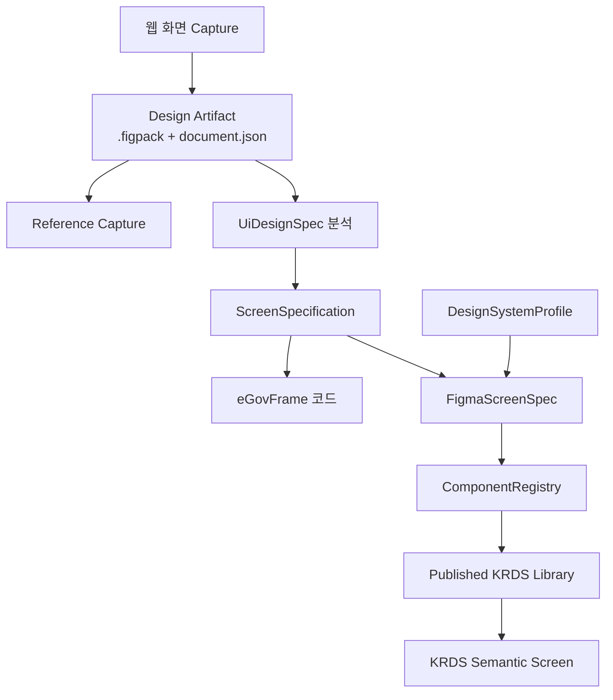

# 의미 기반 Figma Export·에이전트 디자인 시스템 영향분석

**문서명**: `10_Semantic_Figma_Design_System_Impact_Analysis.md`  
**버전**: 1.4  
**작성일**: 2026-07-27  
**상태**: 구현 전 영향분석  
**분석 기준 문서**:

- [07_Design_System_Component_Mapping_Review.md](./07_Design_System_Component_Mapping_Review.md)
- [08_Semantic_Figma_Export_Integrated_Architecture.md](./08_Semantic_Figma_Export_Integrated_Architecture.md)
- [09_Agent_Design_System_FigmaScreenSpec_Reference_Architecture.md](./09_Agent_Design_System_FigmaScreenSpec_Reference_Architecture.md)

**후속 문서**:

- [11_Semantic_Figma_Design_System_Implementation_Plan.md](./11_Semantic_Figma_Design_System_Implementation_Plan.md)
- [12_Semantic_Figma_Design_System_Implementation_List.md](./12_Semantic_Figma_Design_System_Implementation_List.md)

---

## 1. 목적

본 문서는 기존 `springai`의 WEB_CAPTURE·`.figpack`·디자인 참조 분석·`ScreenSpecification`·eGovFrame 코드 생성 구조에 다음 기능을 추가할 때의 영향을 분석한다.

1. 에이전트 기반 `DesignSystemSpec` 설계·생성·검증
2. Figma Author Plugin을 통한 Variables·Components·Variants 생성
3. 사람의 Preview 검토 및 Team Library Publish
4. Publish 후 `ComponentRegistry` 동기화
5. `ScreenSpecification`에서 `FigmaScreenSpec` 생성
6. Published Component Instance 기반 업무 화면 생성
7. 기존 Instance 재사용과 신규 논리 요소만 생성하는 증분 동기화
8. `.figpack` Reference 화면과 KRDS Semantic 화면의 병행 생성

---

## 2. 결론 요약

기술적으로 구현 가능하며 기존 아키텍처와의 결합점도 명확하다. 가장 중요한 결정은 다음과 같다.

> 기존 `ScreenSpecification`을 업무 화면의 단일 원본으로 유지하고, `FigmaScreenSpec`은 Figma 전용 출력 Projection으로 추가한다.

또한 다음 책임을 분리해야 한다.

```text
ScreenSpecification
→ 업무 화면의 의미·필드·액션·데이터 바인딩

DesignSystemProfile
→ 사용할 디자인 시스템의 식별자·버전·지원 정책

ComponentRegistry
→ 논리 컴포넌트와 Published Figma Key의 물리 매핑

FigmaScreenSpec
→ Figma Plugin이 소비할 논리 컴포넌트 트리
```

기존 기능에 대한 파괴적 변경은 필수가 아니다. 신규 모델·서비스·API·Plugin을 추가하고 기존 `ScreenSpecificationService`, `ScreenSpecRepository`, `McpConfig`, `SecurityConfig`를 확장하는 방식이 적절하다.

---

## 3. 현재 구현 기준선

### 3.1 이미 구현된 기능

| 영역 | 현재 구현 |
|---|---|
| 웹 캡처 | `CaptureWebPageTool`, `WebCaptureOrchestrationService` |
| 캡처 계약 | `rendered-design-document-v1`, `figpack-v1` |
| 아티팩트 저장 | `DesignArtifactService` |
| Figma Reference Import | `jsp-to-figma-plugin` |
| 캡처 의미 분석 | `WebCaptureProjectionPolicy`, `RenderedDesignSpecMapper` |
| Figma 참조 분석 | `DesignReferenceAnalysisService`, `FigmaDesignSpecMapper` |
| 공통 디자인 모델 | `UiDesignSpec`, `DesignAnalysisResult` |
| 화면명세 | `ScreenSpecification`, `PageSpec`, `ScreenFieldBinding` |
| 화면명세 생성·검증 | `ScreenSpecificationService`, `ScreenSpecAssembler`, `ScreenSpecValidator` |
| 화면명세 저장 | `ScreenSpecRepository` |
| 코드 생성 연계 | `GenerationDesignContextService`, CRUD·Board·MasterDetail Orchestration |
| MCP 노출 | `DesignReferenceTool`, `CaptureWebPageTool`, `DesignArtifactTool` |

### 3.2 현재 `.figpack` Plugin 동작

현재 `jsp-to-figma-plugin`은 다음 방식이다.

```text
.figpack
→ Frame·Text·Rectangle 생성
→ 선택된 Component Candidate를 로컬 Component로 승격
→ Root Frame에 captureId·documentKey·contentHash 저장
```

제약:

- Published KRDS Library를 참조하지 않는다.
- `FigmaScreenSpec`을 입력받지 않는다.
- 기존 화면·Node를 찾아 재사용하지 않는다.
- Import할 때마다 새로운 Root Frame을 생성한다.
- `networkAccess`가 `none`이므로 `springai` API를 호출하지 않는다.

### 3.3 기존 설계 문서와 현재 코드 상태 차이

`05_Overall_Architecture_Diagram.md` 등 일부 과거 문서는 WEB_CAPTURE와 Plugin을 미구현으로 표시하지만 현재 코드에는 관련 구현이 존재한다. 신규 문서와 구현 시 현재 코드를 기준선으로 사용하고, 과거 문서의 상태 표시는 후속 문서 정합성 작업에서 갱신해야 한다.

---

## 4. 목표 구조



---

## 5. Spring 도메인 모델 영향

### 5.1 기존 `ScreenSpecification`

기존 필드와 상태 모델은 유지한다.

영향:

- Figma Key를 추가하지 않는다.
- `ScreenSpecification` 직렬화 계약을 불필요하게 변경하지 않는다.
- 신규 Export는 기존 `id`, `version`, `status`, `pages`, `layoutDensity`, `formColumnLayout`, `actionPlacement`, `searchPanelPlacement`를 읽는다.
- 기존 코드 생성 경로는 변경하지 않는다.

위험:

- Figma 전용 편의를 위해 내부 모델에 `componentKey`를 추가하면 도메인 오염이 발생한다.
- 기존 저장 JSON과의 역호환성을 깨뜨릴 수 있다.

결정:

- Figma 전용 정보는 `FigmaScreenSpec`, `DesignSystemProfile`, `ComponentRegistry`에만 둔다.

#### 기존 `archetype`과 Figma 화면유형의 경계

현재 `ScreenSpecification.archetype`은 자유 문자열이며 코드 생성과 화면 분석에서
`CRUD_LIST`, `CRUD_DETAIL`, `CRUD_FORM`, `BOARD_LIST`, `BOARD_DETAIL`,
`BOARD_FORM`, `MASTER_DETAIL` 등을 사용한다. 신규 Figma 쪽은 이 값을 대체하지 않고
Figma Projection 단계에서 `screenType`(`LIST`/`FORM`/`DETAIL`)과 `layoutPattern`
(`STANDARD`/`MASTER_DETAIL`/`DASHBOARD`)이라는 **서로 다른 두 필드**로 독립 계산한다.
하나로 합쳐 `LIST`/`FORM`/`DETAIL`/`DASHBOARD`/`CUSTOM`처럼 한 열거형에 두면
`MASTER_DETAIL`(리터럴 패턴)과 `*_DETAIL`(와일드카드)이 같은 값에 동시에 매치되는
충돌이 생기므로, 두 필드로 분리하는 것 자체가 이 충돌을 없애는 설계 결정이다.

초기 매핑 후보는 다음과 같으며 R0에서 승인해야 한다.

**`screenType`** — `PageSpec.template` 접미사 우선, 값이 없을 때만
`ScreenSpecification.archetype` 접미사로 fallback.

| 접미사 | `screenType` | 추가 의미 |
|---|---|---|
| `_LIST` | `LIST` | 목록 Builder 선택 |
| `_FORM`, `_REGIST` | `FORM` | 등록·수정 Form Builder 선택 |
| `_DETAIL` | `DETAIL` | 상세 Builder 선택 |

**`layoutPattern`** — `ScreenSpecification.archetype` 전체 문자열의 키워드 포함
여부로 독립 판정.

| archetype에 포함된 키워드 | `layoutPattern` |
|---|---|
| `MASTER_DETAIL` | `MASTER_DETAIL` |
| `DASHBOARD` | `DASHBOARD` |
| (해당 없음) | `STANDARD` |

`screenType` 접미사 판정에 실패한 값은 조용히 임의 값으로 바꾸지 않는다. 명시적
매핑, 사용자 선택 또는 검증 오류 중 하나로 처리해 잘못된 Builder가 선택되는 것을
막아야 한다. 예: `archetype="MASTER_DETAIL"`은 접미사가 없으므로
`ScreenSpecAssembler`가 생성하는 `PageSpec.template`(페이지별로 `MASTER_LIST`/
`MASTER_DETAIL`/`MASTER_FORM`)로 `screenType`을 판정하고, `layoutPattern`은 원본
`archetype` 문자열에 `MASTER_DETAIL` 키워드가 포함되므로 `MASTER_DETAIL`로
판정한다 — 두 판정이 서로 다른 필드에 쓰이므로 충돌하지 않는다.

### 5.2 신규 `FigmaScreenSpec`

추가 모델:

```text
model/figma/
├─ FigmaScreenSpec
├─ FigmaNodeSpec
├─ FigmaScreenMetadata
├─ FigmaScreenExportRequest
├─ FigmaExportResult
├─ FigmaExportIssue
├─ FigmaExportMode
└─ FigmaSyncMode
```

영향:

- 별도 JSON Schema가 필요하다.
- Java와 TypeScript Plugin 간 계약 테스트가 필요하다.
- `logicalNodeId` 생성 규칙이 장기 호환성에 직접 영향을 준다.
- Schema·Builder·Registry 버전을 결과에 기록해야 한다.

### 5.3 신규 디자인 시스템 모델

추가 모델:

```text
model/designsystem/
├─ DesignSystemSpec
├─ DesignTokenSpec
├─ VariableCollectionSpec
├─ ComponentDefinitionSpec
├─ ComponentPropertySpec
├─ ComponentVariantSpec
├─ PatternDefinitionSpec
├─ DesignSystemProfile
├─ ComponentBinding
├─ VariableBinding
├─ ComponentRegistry
├─ ComponentRegistryEntry
└─ DesignSystemIssue
```

영향:

- 신규 Repository와 DB 테이블이 필요하다.
- Design System Profile과 Registry의 상태·버전 정책을 정의해야 한다.
- Published Library를 기준으로 Registry를 불변 Snapshot으로 저장해야 한다.

---

## 6. Service 계층 영향

### 6.1 신규 Figma Export 서비스

```text
service/figma/
├─ FigmaScreenExportService
├─ FigmaScreenBuilderRegistry
├─ FigmaScreenSpecValidator
├─ FigmaScreenSpecSerializer
├─ FigmaScreenTypeResolver
├─ LogicalNodeIdFactory
└─ builder/
   ├─ FigmaScreenBuilder
   ├─ ListFigmaScreenBuilder
   ├─ FormFigmaScreenBuilder
   └─ DetailFigmaScreenBuilder
```

기존 의존:

- `ScreenSpecificationService`
- `ScreenSpecRepository`
- `SensitiveFieldPolicy`

주요 영향:

- 기존 승인 정책과 Figma Preview 정책을 분리해야 한다.
- `APPROVED`만 정식 Export, 미승인 상태는 Preview만 허용하는 정책이 필요하다.
- LIST·FORM Projection이 기존 FreeMarker 코드 생성과 동일한 의미를 유지하는지 계약 테스트가 필요하다.

### 6.2 신규 Design System 서비스

```text
service/designsystem/
├─ DesignSystemGenerationService
├─ DesignSystemValidator
├─ DesignSystemDiffService
├─ ComponentInventoryService
├─ ComponentRegistryService
├─ DesignSystemProfileService
└─ PublishedRegistryValidator
```

주요 영향:

- Figma Author Plugin과의 JSON 계약이 추가된다.
- Published 상태는 Plugin 또는 Figma API 결과를 기반으로 검증해야 한다.
- Component 삭제·재생성을 자동 허용하면 기존 화면 연결이 끊기므로 금지 정책이 필요하다.

### 6.3 기존 WEB_CAPTURE 서비스

기존 `WebCaptureOrchestrationService`, `DesignArtifactService`, `WebCaptureAnalysisService`는 유지하고,
Reference·Semantic 출력을 조정하는 `FigmaHybridExportService`를 추가한다.

추가 가능 기능:

- `artifactId` 기반 Hybrid Export
- `.figpack`과 `FigmaScreenSpec`을 함께 반환하는 응답
- Reference Capture와 Semantic Screen의 공통 추적 ID

영향:

- `.figpack` 포맷 변경은 필수가 아니다.
- `document.json`에서 이미 `UiDesignSpec`으로 변환할 수 있으므로 생성된 Figma Node를 재분석할 필요가 없다.

---

## 7. Controller·MCP Tool 영향

### 7.1 REST Controller

신규:

```text
FigmaExportController
DesignSystemController
```

예상 API:

```http
GET  /api/figma/screen-specifications/{specId}/pages
GET  /api/figma/screen-specifications/{specId}/pages/{pageId}
GET  /api/figma/screen-specifications/{specId}/pages/{pageId}/download
POST /api/figma/artifacts/{artifactId}/hybrid-export

GET  /api/design-systems
POST /api/design-systems/specs
POST /api/design-systems/profiles/{profileId}/registries
GET  /api/design-systems/profiles/{profileId}/registries/{version}
```

보안 영향:

- 기존 `/api/**` 인증 정책에 따라 `X-API-Key`가 필요하다.
- Plugin이 API를 직접 호출하면 API Key 저장·전송 정책을 별도로 결정해야 한다.

### 7.2 MCP Tool

신규:

```text
FigmaExportTool
DesignSystemTool
```

`McpConfig.allToolCallbacks` 등록이 필요하다.

**인증 경계**: 현재 `SecurityConfig`는 `/mcp/**` 전체를 기존 21개 Tool 기준으로
무인증(`permitAll()`) 허용한다. 신규 Tool은 `ScreenSpecification`/Registry 조회·생성
권한을 갖게 되므로, 이 전역 정책은 그대로 두고 신규 Tool 메서드 내부에서 호출
파라미터(공유 비밀키)를 검증하는 자체 인가를 추가해야 한다(11번 §10, 12번 `DEC-11`).

기존 MCP Tool과의 관계:

- `DesignArtifactTool.analyzeCapturedDesign` 결과를 `ScreenSpecification`으로 연결
- `DesignReferenceTool.createScreenSpecification` 결과를 Figma Export 입력으로 재사용

---

## 8. DB와 저장소 영향

### 8.1 기존 테이블

기존 `ScreenSpecRepository`, `DesignAnalysisRepository`는 유지한다.

### 8.2 신규 테이블

권장:

```text
design_system_profile
├─ id
├─ version
├─ name
├─ registry_version
├─ library_file_key
├─ status
├─ capabilities_json
├─ created_at
└─ published_at
```

```text
design_system_registry
├─ profile_id
├─ registry_version
├─ status
├─ registry_json
├─ content_hash
├─ created_at
└─ validated_at
```

선택:

```text
figma_export_history
├─ export_id
├─ screen_specification_id
├─ screen_specification_version
├─ page_id
├─ profile_id
├─ registry_version
├─ mode
├─ result_status
├─ issue_summary
└─ created_at
```

마이그레이션 영향:

- 기존 테이블 변경 없이 신규 테이블 추가가 가능하다.
- Registry JSON은 버전별 불변 Snapshot으로 저장한다.
- Component Key 변경 이력을 추적해야 한다.

---

## 9. JSON 계약 영향

### 9.1 유지 계약

- `figpack-v1.schema.json`
- `rendered-design-document-v1.schema.json`

### 9.2 신규 계약

```text
figma-screen-spec-v1.schema.json
design-system-spec-v1.schema.json
component-registry-v1.schema.json
```

영향:

- Java Validator와 Plugin Validator가 동일 Schema를 사용해야 한다.
- Schema 변경은 호환성 문서와 Fixture를 포함해야 한다.
- `additionalProperties` 정책을 명확히 해야 한다.
- 논리 타입·Variant enum 확장 정책이 필요하다.

---

## 10. Figma Plugin 영향

### 10.1 기존 `jsp-to-figma-plugin`

권장 영향:

- Reference Capture 전용으로 유지
- Published Design System Authoring 책임을 추가하지 않음
- `captureId`·`contentHash` 메타데이터는 Hybrid 연결에 재사용

선택 확장:

- `.figpack`과 `.figma-spec.json` 동시 입력
- Reference와 Semantic 화면 나란히 배치

### 10.2 신규 Author Plugin

책임:

- Variables·Styles 생성
- Main Component·Variant·Property 생성
- 기존 `designSystemId` 자산 제자리 Update
- Breaking Change Preview
- Registry Export

핵심 위험:

- 기존 Published Component 삭제 후 재생성
- Component Key 변경
- Variant·Property 이름 변경
- Nested Library 의존성 순환

### 10.3 신규 FigmaScreenSpec Plugin

책임:

- JSON 검증
- Registry 호환성 검증
- Published Component Import
- Component Instance 생성
- LIST·FORM·DETAIL Layout 조립
- 기존 `logicalNodeId` Instance 재사용
- 신규 논리 Node만 새 Instance 생성
- 삭제 Node Archive
- Preview·Merge·Replace
- Import Report

---

## 11. 기존 코드 생성 영향

기존 코드 생성 파이프라인은 `ScreenSpecification`을 계속 사용한다.

```text
ScreenSpecification
├─ 기존: CrudModelFactory → FreeMarker → eGovFrame 코드
└─ 신규: FigmaScreenExportService → FigmaScreenSpec
```

호환성:

- `CrudOrchestrationService` 변경 불필요
- `BoardOrchestrationService` 변경 불필요
- `MasterDetailOrchestrationService` 변경 불필요
- 기존 `GenerationDesignContextService` 승인 정책 유지

주의:

- Figma Export 편의를 위해 `ScreenSpecification` 의미를 변경하면 코드 생성 결과가 달라질 수 있다.
- Figma Projection 로직은 별도 Builder에 둔다.

---

## 12. 보안·개인정보 영향

### 12.1 `.figpack`

실제 화면의 텍스트·입력값·이미지가 들어갈 수 있으므로 내부 민감 아티팩트로 취급한다.

### 12.2 `FigmaScreenSpec`

기본값은 Template Mode로 한다.

```text
TEMPLATE
→ 안전한 샘플·Placeholder

SNAPSHOT
→ 권한·마스킹·감사 로그 필수
```

### 12.3 API Key

Plugin API 연결 시:

- Plugin 코드에 API Key 하드코딩 금지
- Figma `pluginData`에 비밀값 저장 금지
- 단기 토큰 또는 파일 Import 방식 우선 검토
- 초기 Release는 `.figma-spec.json` 파일 방식 권장

### 12.4 Design System 정보

Component Key와 Library File Key는 비밀번호는 아니지만 내부 자산 식별 정보이므로 최소 권한과 접근 제어를 적용한다.

---

## 13. 성능 영향

### Spring

- `ScreenSpecification` 조회와 Projection은 상대적으로 가볍다.
- Registry 검증 결과를 버전·Hash 기준으로 캐시할 수 있다.
- 대형 Table의 실제 행 데이터는 제한하고 샘플 행만 생성해야 한다.

### Figma Plugin

- 반복적인 `importComponentByKeyAsync` 호출을 Component Key별 캐시해야 한다.
- 전체 문서 DFS 대신 관리 Root Frame 내부만 조회한다.
- `logicalNodeId` Index를 한 번 생성한 후 Reconciliation한다.
- 대량 화면은 청크 단위 진행률과 취소 기능이 필요하다.

### Figma Library Update

- Nested Component·Variable 의존성 체인이 길수록 Update 적용과 충돌 가능성이 증가한다.
- Foundations → Components → Patterns → Screens의 단방향 의존성을 유지한다.

---

## 14. 운영 영향

신규 운영 절차:

```text
1. Agent가 DesignSystemSpec 생성
2. Author Plugin에서 Preview
3. 사람의 검토
4. Library Publish
5. Registry Sync
6. Profile PUBLISHED 전환
7. FigmaScreenSpec Export 허용
8. 업무 화면 생성·Merge
9. Import Report 보관
```

운영자가 관리할 항목:

- Design System Profile 상태
- Registry 버전
- Component Key 변경
- Deprecated Component
- FigmaScreenSpec Schema 호환성
- 화면별 Export 이력

---

## 15. 테스트 영향

### 기존 테스트 유지

- WEB_CAPTURE Release 1 Flow
- `.figpack` 계약 테스트
- ScreenSpecification 생성·검증
- 코드 생성 디자인 컨텍스트 테스트

### 신규 Java 테스트

- `FigmaScreenExportServiceTest`
- `FigmaScreenBuilderRegistryTest`
- `ListFigmaScreenBuilderTest`
- `FormFigmaScreenBuilderTest`
- `FigmaScreenSpecValidatorTest`
- `LogicalNodeIdFactoryTest`
- `DesignSystemProfileServiceTest`
- `ComponentRegistryServiceTest`
- `PublishedRegistryValidatorTest`
- Controller·Tool 테스트

### 신규 TypeScript 테스트

- Design System Authoring
- 기존 Main Component 제자리 Update
- Registry Export
- Published Component Import
- Instance Reconciliation
- Preview·Merge·Replace
- Removed Archive
- Property Ownership

### 계약·E2E

- Java 생성 Fixture → Plugin Validator
- `.figpack` + `FigmaScreenSpec` Hybrid Import
- Library Component 변경 → 기존 Instance Update
- Registry Key 변경 → Migration Report

---

## 16. 위험 분석

| ID | 위험 | 영향 | 대응 |
|---|---|---|---|
| R-01 | 정확한 Figma Library 대상 미확정 | 구현 착수 차단 | 실제 Design URL·fileKey 재검증 |
| R-02 | Library가 Publish되지 않음 | 다른 파일에서 Import 불가 | Publish Gate |
| R-03 | Component 삭제·재생성 | 기존 Instance 연결 단절 | 제자리 Update·자동 삭제 금지 |
| R-04 | Property·Variant 이름 변경 | Registry·Override 파손 | Breaking Change 승인 |
| R-05 | logicalNodeId 불안정 | 기존 Instance 재사용 실패 | 결정론적 ID 규칙·테스트 |
| R-06 | Registry와 실제 Library 불일치 | Import 실패 | Publish 후 Registry Sync |
| R-07 | 사용자 Override 덮어쓰기 | 디자이너 작업 손실 | Property Ownership 정책 |
| R-08 | 제거 Node 자동 삭제 | Prototype·Annotation 손실 | SAFE Archive 기본값 |
| R-09 | `.figpack` 개인정보 | 정보 노출 | Projection Policy·Template Mode |
| R-10 | Plugin API Key 저장 | 인증정보 노출 | 파일 Import 우선·단기 토큰 |
| R-11 | 신규 기능이 기존 코드 생성에 영향 | 회귀 | 별도 Projection 계층 |
| R-12 | Figma Library 다단계 의존성 충돌 | Update 불일치 | 단방향 계층·순서 Publish |
| R-13 | 현재 07번 문서의 FTC 실사 불일치 | 잘못된 Library 설계 | 정확한 편집 파일 재검증 |
| R-14 | 모든 HTML을 의미 컴포넌트로 변환하려는 범위 확대 | 일정·품질 실패 | LIST·FORM MVP로 제한 |

---

## 17. 호환성 분석

### 하위 호환

- 기존 `.figpack` Schema 유지
- 기존 Plugin Reference Import 유지
- 기존 ScreenSpecification JSON 유지
- 기존 MCP Tool 시그니처 유지
- 신규 API·Tool 추가 방식

### 상위 호환

- `FigmaScreenSpec.schemaVersion`
- `DesignSystemProfile.version`
- `ComponentRegistry.registryVersion`
- `builderVersion`

을 독립 관리한다.

### Breaking Change

다음은 명시적 Migration이 필요하다.

- Component Key 변경
- 논리 Component Type 변경
- Component Property 이름 변경
- Variant 값 제거
- logicalNodeId 생성 규칙 변경
- Schema Major Version 변경

---

## 18. 선행 의사결정

구현 전에 다음을 확정해야 한다.

1. 정확한 KRDS/FTC Figma Library 편집 파일과 `fileKey`
2. Team Library Publish 가능 권한
3. 초기 필수 Component 목록
4. Component·Variant·Property 명명 규칙
5. 논리 타입 네임스페이스(`krds.*`, `egov.*`)
6. `logicalNodeId` 결정론 규칙
7. Preview·Merge·Replace 기본 정책
8. Removed Node 기본 정책
9. Plugin 입력 연결 방식: 파일 우선(`FigmaExportBundle`) 또는 REST
10. Design System Profile·Registry DB 저장 방식
11. 신규 Figma/DesignSystem MCP Tool의 인증 방식(`/mcp/**` 전역 무인증 정책과 별개로)

> **갱신(2026-07-28)**: 위 항목별 실시간 상태는
> [12_Semantic_Figma_Design_System_Implementation_List.md](./12_Semantic_Figma_Design_System_Implementation_List.md)
> §4 선행 결정 목록(`DEC-01`~`DEC-12`)을 기준으로 본다.

---

## 19. 권장 착수 범위

초기 Release는 다음으로 제한한다.

```text
화면:
- LIST
- REGIST
- UPDT

컴포넌트:
- Button
- TextField
- Select
- Checkbox
- PageHeader
- SearchPanel
- DataTable
- Pagination
- FormSection
- ActionArea

전송:
- JSON 파일 다운로드
- Figma Plugin 파일 Import

동기화:
- Preview
- Merge
- Removed Archive
```

REST 자동 연결, Mobile, Dark Mode, Component Migration은 후속 Release로 분리한다.

---

## 20. 최종 판단

본 기능은 기존 아키텍처를 재작성하지 않고 다음 신규 출력·디자인 시스템 계층을 추가하는 방식으로 구현할 수 있다.

```text
기존 단일 원본
ScreenSpecification

신규 출력
FigmaScreenSpec

신규 디자인 시스템 선택
DesignSystemProfile

신규 Figma 물리 매핑
ComponentRegistry
```

가장 큰 기술 위험은 Figma API 자체보다 Component Key·Property·Variant·logicalNodeId의 장기 안정성이다. 따라서 구현 순서는 UI보다 계약·버전·Registry·재사용 정책을 먼저 확정해야 한다.

---

## 21. 변경 이력

| 버전 | 일자 | 변경 내용 |
|---|---|---|
| 1.4 | 2026-07-28 | §18 선행 의사결정에 12번 문서 §4 DEC 표를 최신 상태 기준으로 안내하는 note 추가(중복 유지보수 방지) |
| 1.3 | 2026-07-27 | 11·12번 문서(v1.3/v1.4)와 동기화: archetype 매핑을 `screenType`/`layoutPattern` 분리 구조로 재작성해 `MASTER_DETAIL`/`DASHBOARD` 리터럴과 와일드카드 접미사 간 충돌 제거, MCP Tool 인증 경계 note 추가, 선행 의사결정에 MCP 인증 항목 추가 |
| 1.1 | 2026-07-27 | archetype 매핑 경계·우선순위, `FigmaScreenTypeResolver`, `FigmaHybridExportService`, Registry 모델 명칭을 보완 |
| 1.0 | 2026-07-27 | 07·08·09번 문서와 현재 구현을 기준으로 의미 기반 Figma Export·에이전트 디자인 시스템 영향분석 최초 작성 |
