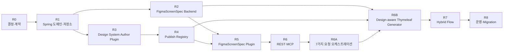

# 의미 기반 Figma Export·에이전트 디자인 시스템 구현 계획서

**문서명**: `11_Semantic_Figma_Design_System_Implementation_Plan.md`  
**버전**: 1.8  
**작성일**: 2026-07-30  
**상태**: 구현 착수 전 계획  
**선행 문서**:

- [07_Design_System_Component_Mapping_Review.md](./07_Design_System_Component_Mapping_Review.md)
- [08_Semantic_Figma_Export_Integrated_Architecture.md](./08_Semantic_Figma_Export_Integrated_Architecture.md)
- [09_Agent_Design_System_FigmaScreenSpec_Reference_Architecture.md](./09_Agent_Design_System_FigmaScreenSpec_Reference_Architecture.md)
- [10_Semantic_Figma_Design_System_Impact_Analysis.md](./10_Semantic_Figma_Design_System_Impact_Analysis.md)
- [디자인_시스템_기반_Figma_MCP_업무화면_자동_생성_아키텍처_및_구현_명세서.md](./디자인_시스템_기반_Figma_MCP_업무화면_자동_생성_아키텍처_및_구현_명세서.md)

**실행 체크리스트**:

- [12_Semantic_Figma_Design_System_Implementation_List.md](./12_Semantic_Figma_Design_System_Implementation_List.md)

---

## 1. 목적

본 계획서는 다음 기능을 기존 `springai`에 단계적으로 구현하기 위한 순서·산출물·테스트·완료 게이트를 정의한다.

- `DesignSystemSpec`
- Figma Design System Author Plugin
- 사람의 Preview·Publish Workflow
- `DesignSystemProfile`
- `ComponentRegistry`
- `FigmaScreenSpec`
- Published Component Instance 기반 업무 화면
- 기존 Instance 재사용과 증분 동기화
- `.figpack` Reference와 Semantic 화면 Hybrid Flow
- 텍스트·기존 화면·이미지·다중 화면·지정 컴포넌트·플랫폼 변환을 포괄하는 7가지 디자인 요청 오케스트레이션

---

## 2. 구현 원칙

1. 기존 `ScreenSpecification`을 단일 원본으로 유지한다.
2. Figma Key를 `ScreenSpecification`에 저장하지 않는다.
3. 신규 계약은 JSON Schema부터 확정한다.
4. Main Component는 삭제·재생성하지 않고 제자리 Update한다.
5. 동일 `logicalNodeId`의 기존 Instance를 재사용한다.
6. 신규 논리 Node에 대해서만 새 Instance를 생성한다.
7. 제거 Node는 기본적으로 Archive한다.
8. Published Library 변경과 화면 구조 변경을 구분한다.
9. 기존 `.figpack` Reference 경로를 유지한다.
10. 초기 Release는 파일 Import 중심으로 구현한다.
11. `디자인_시스템_기반_Figma_MCP_업무화면_자동_생성_아키텍처_및_구현_명세서.md`의 Node.js/TypeScript 구조는 기능 참조 모델로 사용하고, 실행 서버는 기존 Spring Boot MCP 서버로 통합한다.
12. 명세서의 Claude API 직접 호출은 Spring AI `ChatModel` 기반 모델 선택 정책으로 추상화하여 Anthropic 단일 공급자에 결합하지 않는다.
13. Figma REST API는 파일·노드·스타일·이미지 조회에 사용하고, 캔버스 쓰기는 Figma Plugin에서 사용자가 Preview를 확인하고 명시적으로 Apply할 때만 수행한다.
14. 디자인 시스템 교체는 고정 `assetId`를 코드에 넣는 방식이 아니라 `DesignSystemProfile`·`ComponentRegistry`·기본 Layout 정책의 버전 스냅샷 교체로 처리한다.
15. 7가지 요청 도구는 기존 `ScreenSpecification` 단일 원본, `FigmaScreenSpec`, `logicalNodeId`, Published Instance 재사용 정책을 우회하지 않는다.

---

## 3. Release 구조



---

## 4. R0 — 선행 결정과 계약

### 목표

코드보다 먼저 장기 호환성을 결정하는 단계다.

### 작업

1. 정확한 Figma Library 파일과 `fileKey` 확인
2. Team Library Publish 권한 확인
3. MVP Component 목록 확정
4. 논리 타입 네임스페이스 확정
5. Component·Variant·Property 명명 규칙 확정
6. `logicalNodeId` 규칙 확정
7. JSON Schema 5종 초안 작성
8. 버전 정책 확정
9. Preview·Merge·Replace 정책 확정
10. Removed Archive 정책 확정
11. 기존 `ScreenSpecification.archetype` → `screenType`/`layoutPattern` 매핑 표 확정(두 필드를 분리해 archetype 매핑 충돌 방지)
12. Plugin 입력 연결 방식을 파일 우선(`FigmaExportBundle`) 또는 REST 우선 중 하나로 승인
13. 신규 Figma/DesignSystem MCP Tool의 인증 방식 승인
14. 7가지 요청 유형의 공통 입력·출력·오류 계약 확정
15. LLM 공급자 선택·Vision 지원·구조화 출력 검증 정책 확정
16. Figma REST 조회와 Plugin 쓰기 실행 경계 확정
17. 플랫폼별 Layout/Component Swap 정책의 Profile 저장 형식 확정

> **갱신(2026-07-30)**: 위 항목별 실시간 상태(`DEC-01`~`DEC-15`, 기술 기준안이 이미 구현된 항목과
> 순수 조직 승인만 남은 항목 구분)는 이 목록이 아니라
> [12_Semantic_Figma_Design_System_Implementation_List.md](./12_Semantic_Figma_Design_System_Implementation_List.md)
> §4 선행 결정 목록을 기준으로 본다. 여기 목록은 최초 계획 당시의 항목 나열로만 유지한다.

### 논리 타입 초기안

```text
krds.button
krds.textField
krds.select
krds.checkbox
krds.pagination
egov.pageHeader
egov.searchPanel
egov.dataTable
egov.formSection
egov.actionArea
egov.listPage
egov.formPage
```

`krds.button`, `krds.textField`, `krds.select`, `krds.checkbox`,
`krds.pagination`을 1차 Component로, `egov.pageHeader`, `egov.searchPanel`,
`egov.dataTable`, `egov.formSection`, `egov.actionArea`를 1차 Pattern으로 승인한다.
`egov.listPage`와 `egov.formPage`는 이 항목들을 조립하는 Page Template으로 구분한다.

### 기존 archetype 매핑 초기안

`screenType`과 `layoutPattern`을 서로 다른 필드로 독립 판정한다. 하나의 archetype
문자열(예: `MASTER_DETAIL`)이 두 표에 동시에 걸려도 서로 다른 필드에 쓰이므로
우선순위 충돌이 생기지 않는다.

**`screenType`** — `PageSpec.template`(예: `{base}_LIST`/`{base}_FORM`/`{base}_DETAIL`)
접미사를 먼저 사용하고, 값이 없을 때 `ScreenSpecification.archetype` 접미사로
fallback한다.

| 접미사 | `screenType` | Builder |
|---|---|---|
| `_LIST` | `LIST` | `ListFigmaScreenBuilder` |
| `_FORM`, `_REGIST` | `FORM` | `FormFigmaScreenBuilder` |
| `_DETAIL` | `DETAIL` | `DetailFigmaScreenBuilder` |

**`layoutPattern`** — `ScreenSpecification.archetype` 전체 문자열에 포함된 키워드로
독립 판정한다.

| archetype에 포함된 키워드 | `layoutPattern` |
|---|---|
| `MASTER_DETAIL` | `MASTER_DETAIL` |
| `DASHBOARD` | `DASHBOARD` |
| (해당 없음) | `STANDARD` |

`screenType` 접미사 판정에 실패한 자유 문자열은 자동으로 임의 값을 부여하지 않고
검증 오류 또는 사용자 선택 대상으로 반환한다. 예: `archetype="MASTER_DETAIL"`은
`ScreenSpecAssembler`가 만드는 `PageSpec.template`(페이지별로 `MASTER_LIST`/
`MASTER_DETAIL`/`MASTER_FORM`)로 `screenType`을 판정하고, `layoutPattern`은 원본
`archetype` 문자열에 `MASTER_DETAIL` 키워드가 포함되므로 `MASTER_DETAIL`로 판정한다.

### 계약 파일

```text
website-figma-contract/
├─ figma-screen-spec-v1.schema.json
├─ design-system-spec-v1.schema.json
├─ design-system-profile-v1.schema.json
├─ component-registry-v1.schema.json
├─ figma-generation-report-v1.schema.json
├─ figma-export-bundle-v1.schema.json
├─ fixtures/
│  ├─ valid-user-list-figma-screen-spec.json
│  ├─ valid-user-form-figma-screen-spec.json
│  ├─ valid-krds-design-system-spec.json
│  └─ valid-krds-component-registry.json
└─ COMPATIBILITY.md
```

### 완료 게이트

- Schema 계약 테스트 통과
- 논리 타입·Property·Variant 표 승인
- 정확한 Figma Library 대상 확인
- MVP Component·Pattern 목록 승인
- 기존 `archetype` → `screenType`/`layoutPattern` 매핑 표 승인(충돌 없음을 확인)
- Plugin 입력 연결 방식(`FigmaExportBundle` 계약 포함) 승인
- 신규 MCP Tool 인증 방식 승인
- 7가지 요청 유형과 공통 `DesignOperation` 계약 승인
- Figma REST 조회 전용·Plugin 명시적 쓰기 경계 승인
- Spring AI 기반 텍스트·Vision 모델 capability 정책 승인
- Desktop·Mobile·Tablet 변환 규칙과 Component Swap 정책 승인

---

## 5. R1 — Spring 도메인과 저장소

### 목표

`DesignSystemProfile`, `ComponentRegistry`, `FigmaScreenSpec`을 표현하고 저장할 기반을 구현한다.

### 신규 패키지

```text
model/figma/
model/designsystem/
service/designsystem/
mapper/
```

### 주요 클래스

```text
FigmaScreenSpec
FigmaNodeSpec
FigmaScreenType
LayoutPattern
FigmaScreenExportRequest
FigmaExportResult
FigmaExportIssue
FigmaExportMode
FigmaSyncMode
FigmaExportBundle
DesignSystemProfileSnapshot
ComponentRegistrySnapshot
FigmaExportMetadata

DesignSystemSpec
DesignSystemProfile
ComponentBinding
VariableBinding
ComponentRegistry
ComponentRegistryEntry
DesignSystemIssue
```

### 저장소

```text
FigmaScreenSpecRepository
DesignSystemProfileRepository
ComponentRegistryRepository
FigmaReviewHistoryRepository
```

### DB 초기화

현재 Repository 패턴에 맞춰 `JdbcTemplate` 기반 `createTableIfNotExists`를 사용한다.

### 검증기

```text
DesignSystemSpecValidator
ComponentRegistryValidator
DesignSystemProfileValidator
```

### 테스트

- Record 생성·직렬화
- 이전 JSON 역호환
- Profile 상태 전환
- Registry 불변 Snapshot
- 중복 Version 차단
- Content Hash 안정성

### 완료 게이트

- `./gradlew test` 통과
- Profile·Registry 저장/조회 Integration Test 통과
- 기존 ScreenSpecification 테스트 무변경 통과

---

## 6. R2 — FigmaScreenSpec Backend

### 목표

기존 `ScreenSpecification`을 논리 Figma Component Tree로 변환한다.

### 서비스 구조

```text
service/figma/
├─ FigmaScreenExportService
├─ FigmaScreenBuilderRegistry
├─ FigmaScreenSpecValidator
├─ FigmaScreenSpecSerializer
├─ FigmaScreenTypeResolver
├─ LogicalNodeIdFactory
├─ FigmaExportBundleAssembler
└─ builder/
   ├─ FigmaScreenBuilder
   ├─ ListFigmaScreenBuilder
   ├─ FormFigmaScreenBuilder
   └─ DetailFigmaScreenBuilder
```

### LIST Builder

```text
egov.listPage
├─ egov.pageHeader
├─ egov.searchPanel
├─ egov.resultToolbar
├─ egov.dataTable
├─ krds.pagination
└─ egov.actionArea
```

### FORM Builder

```text
egov.formPage
├─ egov.pageHeader
├─ egov.formSection
├─ krds.textField/select/checkbox
├─ egov.validationSummary
└─ egov.actionArea
```

### 결정론적 ID

예:

```text
{pageId}/{section}/{fieldId}

user-list/search/userName
user-list/table/userName
user-list/action/search
user-regist/form/userName
```

ID 규칙은 Label이 아니라 업무 Field ID와 Action Type을 사용한다.

### 상태 정책

```text
DRAFT
→ Preview만 허용

REVIEW_REQUIRED
→ Preview만 허용, Issue 포함

APPROVED
→ Preview·정식 Export 허용
```

### 테스트

- LIST Fixture
- REGIST Fixture
- UPDT Fixture
- 동일 입력 동일 JSON
- 필드 순서 변경
- 민감 필드 제거
- 지원하지 않는 Control
- Profile 미지원 Component
- Viewport 미지원
- 필수값·중복 ID·순환 트리 검증(`FigmaScreenSpecValidator` 책임)
- `FigmaExportBundle` 내부 schema/profile/registry 버전 불일치 시 오류 반환

### 완료 게이트

- User LIST·REGIST·UPDT JSON Fixture 승인
- Java Schema Validation 통과
- 동일 입력 Hash 안정성 확인

---

## 7. R3 — Design System Author Plugin

### 목표

`DesignSystemSpec`을 Figma Library 파일의 Variables·Components·Patterns로 생성한다.

### 프로젝트

```text
krds-design-system-author-plugin/
├─ manifest.json
├─ package.json
├─ tsconfig.json
└─ src/
   ├─ spec-reader/
   ├─ validator/
   ├─ variable-author/
   ├─ style-author/
   ├─ component-author/
   ├─ variant-author/
   ├─ pattern-author/
   ├─ update-engine/
   ├─ diff-reporter/
   └─ registry-exporter/
```

### 1차 Component

- Button
- TextField
- Select
- Checkbox
- Pagination

### 1차 Pattern

- PageHeader
- SearchPanel
- ActionArea
- FormSection
- DataTable 기본 구조

### 제자리 Update

모든 Main Component와 Variable에 `designSystemId`를 저장한다.

```text
있음 → 기존 자산 Update
없음 → 신규 생성
삭제 요청 → 자동 삭제하지 않고 Breaking Change 보고
```

### Preview

```text
ADD
UPDATE
NO_CHANGE
BREAKING
DEPRECATE
DELETE_REQUESTED
```

### 테스트

- 동일 Spec 두 번 실행 시 중복 없음
- Component Key 유지
- Variable 값 Update
- Variant 추가
- Property 이름 변경 Breaking 검출
- 삭제 요청 자동 차단

### 완료 게이트

- 핵심 5개 Component 생성
- 동일 Spec 재실행 멱등성 검증
- Preview Diff 승인
- Publish 전 Checklist 통과

---

## 8. R4 — Publish Registry Sync

### 목표

사람이 Publish한 Library를 검증하고 실제 Component Key·Variable Key를 Registry로 만든다.

### Workflow

```text
Author Plugin Apply
→ 사람의 검토
→ Library Publish
→ Registry Sync 실행
→ Publish Status 확인
→ Property·Variant 검증
→ Registry JSON Export
→ springai 저장
→ Profile PUBLISHED
```

### 검증

- `CURRENT` Publish Status
- 논리 ID 1:1
- Component Key 존재
- Variant Option 완전성
- Property Type 일치
- Variable Key 존재
- Nested Component 의존성

### 실패 시

```text
UNPUBLISHED
→ Profile REVIEW 유지

CHANGED
→ 미게시 변경 경고

필수 Variant 누락
→ Registry INVALID

Component Key 변경
→ Breaking Change
```

### 테스트

- Valid Registry
- Unpublished Component
- Missing Variant
- Property Type Mismatch
- Duplicate logical ID
- Component Key 변경

### 완료 게이트

- Registry 상태 `VALID`
- Profile 상태 `PUBLISHED`
- Registry Snapshot 저장
- Component Import 사전 점검 통과

---

## 9. R5 — FigmaScreenSpec Plugin

### 목표

`FigmaScreenSpec`과 `ComponentRegistry`를 읽어 Published Instance 기반 업무 화면을 생성하고 증분 동기화한다.

### 프로젝트

```text
figma-screen-spec-plugin/
├─ manifest.json
├─ package.json
├─ tsconfig.json
└─ src/
   ├─ spec-reader/
   ├─ validator/
   ├─ registry/
   ├─ component-importer/
   ├─ property-mapper/
   ├─ layout-builder/
   ├─ reconciliation/
   ├─ migration/
   └─ error-reporter/
```

### Import

```text
FigmaScreenSpec logical type
→ Registry lookup
→ importComponentSetByKeyAsync
→ Variant 선택
→ Instance 생성
→ Property 적용
→ Auto Layout 배치
```

### Reconciliation

```text
같은 logicalNodeId
→ 기존 Instance 재사용

신규 logicalNodeId
→ 새 Instance 생성

Spec에서 제거
→ Removed Section Archive

타입 변경
→ Swap 또는 Archive+Create
```

### 동기화 모드

- Preview
- Merge
- Replace

### Property Ownership

- Plugin 관리
- 사용자 Override 허용
- Library 관리

### 테스트

- 기존 Instance 재사용
- 신규 Instance만 생성
- Label·Variant Update
- 순서·부모 이동
- Removed Archive
- Detached Instance 충돌
- Component Key 변경 Migration
- Unsupported Placeholder
- Import Report
- 필수(Required) Component 누락 시 생성 실패, 선택(Optional) Component 누락 시에만 Preview fallback 허용
- 정식 Merge/Replace 실행 시 fallback 노드가 남아 있으면 완료 처리 차단

### 완료 게이트

- LIST·FORM 화면 생성
- Published Component Instance 확인
- 동일 Spec 재Import 중복 없음
- Preview Diff와 실제 Merge 일치
- 필수 Component fallback 없이 정식 생성 완료

---

## 10. R6 — REST·MCP 통합

### REST

```text
FigmaExportController
DesignSystemController
```

### MCP

```text
FigmaExportTool
DesignSystemTool
FigmaDesignOrchestrationTool
```

### `McpConfig`

기존 Tool 2종과 7가지 디자인 요청 callback을 제공하는
`FigmaDesignOrchestrationTool`을 `allToolCallbacks`에 등록한다.

### 초기 전송 정책

DEC-10 최종 결정은 다음과 같다.

```text
기본:
.figma-export-bundle.json(FigmaExportBundle) 다운로드

선택:
운영 환경에서 명시적으로 활성화한 Plugin REST 연결
```

파일 우선 방식은 Plugin에 장기 API Key를 저장하지 않고 입력 계약과 승인 산출물을 보존한다.
REST는 단기 토큰, CORS, 서버 접근성, 재시도와 파일 fallback이 설정·검증된 환경에서만
선택적으로 활성화한다. 세부 근거는
[15_DEC10_DEC12_Final_Decision.md](./15_DEC10_DEC12_Final_Decision.md)를 따른다.

### 보안

- `/api/**` X-API-Key 유지
- Plugin 비밀정보 저장 금지
- API 연결 시 단기 토큰 검토
- `SecurityConfig`는 현재 `/mcp/**` 전체를 기존 21개 Tool 기준으로 무인증 허용한다.
  신규 `FigmaExportTool`/`DesignSystemTool`/`FigmaDesignOrchestrationTool`은 이 전역
  정책을 바꾸지 않고, Tool 메서드 내부에서 호출 파라미터(공유 비밀키)를 검증하는 자체
  인가를 수행한다.

### 테스트

- Controller MVC
- API Key 인증
- Tool Callback 등록
- MCP Tool 결과
- 파일명·Content-Disposition
- 신규 MCP Tool 무인증 호출 거부와 응답 내 민감 필드(Registry key 등) 미노출
- DEC-10 승인 경로(파일 우선/REST 우선)의 Plugin 입력 동작과 REST 선택 시 단기 토큰·CORS·재시도·오프라인 fallback
- 7가지 요청 유형별 라우팅·입력 검증·권한·감사 로그
- LLM 구조화 출력 Schema 검증과 timeout·rate limit·재시도
- Figma REST 401·403·404·429·5xx 오류 정규화
- MCP 응답이 캔버스 쓰기 완료를 허위 보고하지 않고 `PREVIEW_READY`/`APPLY_REQUIRED` 상태를 반환하는지 검증

### 완료 게이트

- API·MCP 동일 Service 결과
- 인증 회귀 없음
- JSON 다운로드 Plugin Import 성공

---

## 10.1 R6A — 7가지 디자인 요청 오케스트레이션

### 목표

`디자인_시스템_기반_Figma_MCP_업무화면_자동_생성_아키텍처_및_구현_명세서.md`의 7가지 요청 방식을 기존
`ScreenSpecification → FigmaScreenSpec → FigmaExportBundle → Plugin Apply` 흐름에
통합한다. MCP 서버는 요청을 분석하고 결정론적인 디자인 작업 계획과 Bundle을 만들며,
Figma 캔버스 변경은 Plugin에서 Preview 후 실행한다.

### 호환성 결정

| 원본 명세서 표현 | `springai` 반영 방식 |
|---|---|
| 별도 Node.js/TypeScript MCP Server | 기존 Spring Boot Streamable HTTP MCP 서버에 통합 |
| Claude API 직접 호출 | Spring AI `ChatModel`/멀티모달 모델 capability로 추상화 |
| `figma-writer.ts`가 스크립트 생성·실행 | `FigmaDesignOperation`을 Bundle에 포함하고 Plugin이 검증·Preview·Apply |
| `design-system.json` | `DesignSystemProfile`과 Token/Variable Snapshot |
| `component-catalog.json` | `ComponentRegistry`와 `component-catalog-v1.json` |
| `default-layouts.json` | 버전 관리되는 `DefaultLayoutPolicy` |
| `assetId`/로컬 Node ID 중심 매핑 | Published Component Key + 논리 타입 중심 매핑 |
| `ANTHROPIC_API_KEY` 필수 | 선택한 Spring AI 공급자의 기존 환경 설정 사용 |

원본 명세서의 `figmaFileKey=6fcm04dwSEH2IUizZfaZCj`와 예시 StateGroup/Symbol ID는
샘플 값으로만 취급한다. 운영 기준은 DEC-01의 Library fileKey와 승인된 Registry Snapshot이며,
로컬 Node ID를 장기 계약이나 MCP 응답에 고정하지 않는다.

### 현재 구현 기준선과 중복 방지

7가지 이름과 입력 계약이 동일한 MCP Tool은 아직 없지만, 다음 요청은 기존 기능을 조합하거나
확장해야 한다. 같은 분석기·저장소·Plugin 동기화 엔진을 새 클래스로 중복 구현하지 않는다.

| 요청 | 현재 상태 | 반드시 재사용할 기존 기능 | 추가 구현 범위 |
|---|---|---|---|
| `create_design_from_text` | 부분 기반 | `ScreenSpecificationService`, `FigmaScreenExportService` | 자연어 구조화 분석과 공통 Operation 조립 |
| `create_design_from_reference` | 부분 구현 | `DesignReferenceTool.analyzeFigmaReference`, `DesignReferenceAnalysisService.analyzeFigma`, `FigmaApiClient`, `FigmaDesignSpecMapper` | prompt 반영, 새 Spec/Bundle 생성까지 오케스트레이션 |
| `modify_existing_design` | 부분 구현 | `reviseScreenSpecification`, Screen Plugin `logicalNodeId` MERGE/REPLACE | 자연어 diff, `editableNodeIds`, source revision 검증 |
| `create_design_from_image` | 부분 구현 | `analyzeDesignReference`, `DesignReferenceAnalysisService`, `VisionAnalysisClient`의 OpenAI/Ollama 구현 | Figma `imageNodeIds` export 입력과 Operation 연결 |
| `create_multi_screen_flow` | 미구현 | 화면별 기존 Builder·Bundle 생성 | 공유 Flow ID, 원자 Preview/Apply, 부분 실패 방지 |
| `create_design_with_components` | 부분 기반 | `ComponentRegistryResolver`, 필수/선택 Component 검증 | 요청한 logical type allowlist 제약 |
| `convert_platform` | 부분 기반 | `FigmaScreenExportRequest.viewport`, Plugin Layout annotation | 실제 Layout 재계산과 Component Swap |

기존 `FigmaApiClient`는 단일 Figma Node 조회와 retry/backoff를 제공하므로 폐기하지 않고
files/images/styles/components 조회 기능을 확장한다. 기존 `FigmaDesignSpecMapper`의
layout/token 추출도 참조 스타일 분석의 시작점으로 사용한다.

### 공통 요청 계약

```text
FigmaDesignRequest
├─ requestType
├─ prompt
├─ fileKey 또는 designSystemProfileId
├─ referenceNodeIds[]
├─ editableNodeIds[]
├─ imageNodeIds[]
├─ targetPlatform: DESKTOP | TABLET | MOBILE
├─ componentLogicalTypes[]
├─ screens[{name, description}]
└─ syncMode: PREVIEW | MERGE | REPLACE

FigmaDesignOperation
├─ operationId
├─ requestType
├─ sourceRevision
├─ FigmaScreenSpec[]
├─ FigmaExportBundle[]
├─ previewSummary
├─ issues[]
└─ status: ANALYZED | PREVIEW_READY | APPLY_REQUIRED | APPLIED | FAILED
```

`fileKey`를 클라이언트가 임의 지정할 때는 허용 목록과 Profile 연결을 검증한다.
`targetNodeIds`라는 별도 이름 대신 쓰기 가능 대상을 뜻하는 `editableNodeIds`를 공통 계약으로
사용하고, 해당 노드가 선택한 파일·페이지·승인 범위에 속하는지 Plugin이 다시 확인한다.

### MCP 요청 도구

| Tool | 입력 핵심값 | 처리 |
|---|---|---|
| `create_design_from_text` | `prompt`, `platform` | 도메인·화면 유형 분석 후 `ScreenSpecification` 후보와 Bundle 생성 |
| `create_design_from_reference` | `prompt`, `referenceNodeIds` | REST로 참조 노드를 읽고 Style Token 후보를 추출하되 Registry 논리 컴포넌트로 재투영 |
| `modify_existing_design` | `prompt`, `editableNodeIds` | 기존 `logicalNodeId` 인덱스와 source revision을 기준으로 변경 diff 생성 |
| `create_design_from_image` | `prompt`, `imageNodeIds` | Figma 이미지 export 후 Vision 분석, 의미 구조 후보와 불확실성 Issue 생성 |
| `create_multi_screen_flow` | `prompt`, `screens[]` | 공유 Profile·Token·Flow ID를 고정하고 화면별 Spec/Bundle을 원자적으로 생성 |
| `create_design_with_components` | `prompt`, `componentLogicalTypes[]` | Registry에 존재하는 허용 논리 타입만 사용하도록 제약 생성 |
| `convert_platform` | `sourceNodeIds`, `targetPlatform` | 소스 의미 트리를 읽고 플랫폼 Layout/Swap 정책으로 새 Spec 생성 |

자유 텍스트 자동 분류가 필요한 클라이언트를 위해 내부 `FigmaDesignRequestRouter`를 두되,
명시적으로 호출된 Tool의 유형을 LLM이 다른 유형으로 바꾸지 않는다. 분류 confidence가 기준보다
낮거나 필수 입력이 누락되면 추측 실행하지 않고 검증 오류를 반환한다.

### 핵심 서비스

```text
service/figma/orchestration/
├─ FigmaDesignOrchestrationService
├─ FigmaDesignRequestRouter
├─ FigmaContextAnalyzer
├─ FigmaStyleExtractor
├─ FigmaPlatformConversionService
├─ FigmaMultiScreenFlowService
└─ FigmaDesignOperationRepository

기존 확장:
├─ DesignReferenceAnalysisService
├─ FigmaApiClient
├─ FigmaDesignSpecMapper
├─ VisionAnalysisClient
├─ ComponentRegistryResolver
├─ ScreenSpecificationService
└─ FigmaScreenExportService
```

- `FigmaContextAnalyzer`는 Spring AI 구조화 출력으로 도메인, `screenType`,
  `layoutPattern`, 필요 논리 컴포넌트, 불확실성을 반환한다.
- 기존 `ComponentRegistryResolver`를 확장해 Registry, 승인된 Catalog, 화면 유형별 기본
  Layout의 교집합만 허용하며 이름 유사도만으로 미승인 Component를 선택하지 않는다.
- `FigmaStyleExtractor`는 기존 `FigmaDesignSpecMapper`의 layout/token 추출을 재사용해
  참조 노드들의 색·타이포그래피·간격·Layout을 Token 후보로 만들고 원본 Library Key와
  사용자 콘텐츠는 민감정보 정책에 따라 제거한다.
- 기존 `FigmaApiClient`를 `GET /v1/files/:key`, `/nodes`, `/images`, `/styles`,
  `/components` 조회까지 확장하며 쓰기 성공 상태를 만들지 않는다.
- 이미지 분석은 별도 공급자 클라이언트를 새로 만들지 않고 기존
  `DesignReferenceAnalysisService`와 `VisionAnalysisClient` 구현을 확장한다.

### 교체 가능한 디자인 시스템 정책

다음 세 스냅샷을 하나의 `designSystemProfileId`와 버전으로 원자 결합한다.

```text
DesignSystemProfile
├─ token/variable 정책: color, typography, spacing, radius
├─ ComponentRegistry: logicalType, published key, variants, properties
└─ DefaultLayoutPolicy
   ├─ FORM
   ├─ LIST
   ├─ DETAIL
   └─ DASHBOARD
```

교체 시에는 Profile·Registry·Layout Policy의 버전 호환성, 필수 논리 타입, 플랫폼별 대체
컴포넌트, 실제 Published 상태를 Preflight에서 검사한다. 설정 파일 경로와 환경변수는 배포
편의를 위한 입력 수단일 뿐, 런타임 단일 원본은 승인된 불변 Snapshot이다.

### 플랫폼 변환 초기 정책

| Platform | 기준 폭 | Grid | Navigation | spacingScale | fontScale |
|---|---:|---:|---|---:|---:|
| Desktop | 1440 | 12 columns | side navigation | 1.0 | 1.0 |
| Tablet | 768 | 8 columns | drawer | 0.875 | 0.9375 |
| Mobile | 390 | 4 columns | bottom navigation | 0.75 | 0.875 |

`footer__pc ↔ footer__mo`, side navigation → drawer/bottom navigation 같은 교체는
하드코딩하지 않고 `DefaultLayoutPolicy.componentSwaps`로 관리한다. 원본 컴포넌트가
Registry에 없거나 대체 대상이 미게시 상태면 변환을 완료하지 않고 Issue를 반환한다.

### 보안·운영

- Figma access token과 LLM API key를 Tool 파라미터·Bundle·로그·MCP 응답에 포함하지 않는다.
- Figma fileKey, node ID, image export URL은 최소 권한·짧은 수명·redaction 정책을 적용한다.
- 참조·수정·이미지 요청은 fileKey와 node ID의 소속 관계를 서버와 Plugin 양쪽에서 검증한다.
- `modify_existing_design`, `convert_platform`, 다중 화면 Apply는 source revision 불일치 시 중단한다.
- 다중 화면 생성은 전부 Preview 성공 후 Apply하거나 전부 실패하는 원자적 Operation으로 관리한다.
- LLM 원문 응답을 곧바로 Plugin 명령으로 실행하지 않고 Schema와 의미 검증을 통과한 Spec만 전달한다.

### 테스트와 완료 게이트

- 7개 Tool의 정상·누락 입력·잘못된 node/file 소속·미지원 capability 계약 테스트
- Router의 결정론적 명시 유형 우선과 낮은 confidence 거부 테스트
- Text/Reference/Modify/Image/Multi-screen/Component-specified/Platform 변환 fixture
- Spring AI 구조화 출력 오류·Vision 미지원 모델·timeout·rate limit fallback 테스트
- Figma REST pagination·429 retry/backoff·권한 오류·만료 이미지 URL 테스트
- Plugin Preview와 Operation diff 일치, revision 충돌 시 Apply 차단
- 플랫폼별 폭·Grid·Navigation·Component Swap golden test
- 동일 Operation 재시도 멱등성 및 멀티 스크린 부분 적용 방지
- 기존 R2 Builder·R5 Reconciliation·R6 인증·redaction 회귀 테스트 통과

---

## 10.2 R6B — Design-aware Thymeleaf Generator

상세 실행 명세는
[JSP_eGovFrame_화면을_Spring_Boot·Thymeleaf로_전환하는_작업.md](./JSP_eGovFrame_화면을_Spring_Boot·Thymeleaf로_전환하는_작업.md)를
기준으로 한다.

### 목표

기존 JSP·Controller·VO의 업무 계약은 보존하면서 승인된 Component Inventory,
`DESIGN.md`, 회사 표준 Design Token을 적용해 Thymeleaf 화면을 생성하고
Desktop·Tablet·Mobile 렌더링과 빌드까지 검증한다.

```text
JSP·Controller·VO
→ Source Analysis
→ Binding Contract
→ Screen Type
→ Component Inventory Selection
→ DESIGN.md Rules
→ Company Design Token Mapping
→ HTML Skeleton
→ Controller Model Binding
→ Desktop·Tablet·Mobile Transformation
→ Build and Render Validation
```

이 흐름은 Figma 화면을 HTML로 그대로 변환하는 기능이 아니다. 업무 Binding의 단일 기준은
분석된 Controller·VO·`ScreenSpecification`이며, Figma/`DESIGN.md`/Token은 시각·Layout·
Component 선택만 제어한다.

### 단계별 처리 계약

| 단계 | 입력 | 처리 | 산출물 |
|---|---|---|---|
| 1. JSP·Controller·VO 분석 | 프로젝트 경로, 대상 화면 | JSP form/tag/EL, Controller route/model, VO field/validation을 정적 분석 | `LegacyScreenAnalysis` |
| 2. Binding Contract 생성 | 분석 결과, DB Schema, `ScreenSpecification` | request/model/form/field/action binding을 하나의 계약으로 정규화 | `ThymeleafBindingContract` |
| 3. 화면 유형 판단 | route, JSP 구조, Binding | LIST/FORM/DETAIL/DASHBOARD와 layoutPattern 판정 | `ScreenTypeDecision` |
| 4. Component Inventory 선택 | 화면 유형, field role, Registry | 승인된 논리 Component·Pattern만 선택하고 근거 기록 | `SelectedComponentInventory` |
| 5. `DESIGN.md` 규칙 적용 | 프로젝트 `DESIGN.md`, 선택 Inventory | typography, color usage, spacing, layout, component, voice, 금지 규칙 적용 | `AppliedDesignRules` |
| 6. 회사 표준 Design Token 로드·매핑 | 승인 `DesignSystemProfile`, Token Snapshot | semantic token을 실제 CSS Variable과 Component Property로 매핑 | `ResolvedDesignTokens` |
| 7. HTML Skeleton 생성 | Binding·Component·Rule·Token 계약 | FreeMarker 기반 Thymeleaf 구조와 fragment/slot 생성 | `ThymeleafSkeleton` |
| 8. Controller Model Binding 적용 | Binding Contract, HTML Skeleton | `th:object`, `th:field`, `th:text`, iteration, error, CSRF, route 적용 | `BoundThymeleafView` |
| 9. Desktop·Tablet·Mobile 변환 | Bound View, Platform Policy | breakpoint, grid, navigation, table/form/card 변환과 component swap | `ResponsiveThymeleafViewSet` |
| 10. 빌드·렌더링 검증 | 생성 프로젝트, View Set, fixture model | Thymeleaf parse/render, binding audit, 빌드, viewport screenshot 검증 | `ThymeleafGenerationReport` |

각 단계는 입력 Hash, 사용한 계약 버전, Issue, 산출물 경로를 보고서에 남긴다. 선행 단계가
FATAL이면 이후 단계는 실행하지 않으며, 동일 입력·동일 버전 재실행은 동일 결과를 내야 한다.

### 현재 구현 기준선

| 단계 | 현재 상태 | 재사용 자산 | 보완점 |
|---|---|---|---|
| JSP·Controller·VO 분석 | 부분 | `jsp-design-extractor`, `ProjectScannerTool`, 기존 Schema/metadata 서비스 | Controller method·Model attribute·VO validation을 화면 단위로 연결 |
| Binding Contract | 부분 | `ScreenFieldBinding`, `GenerationQueryContract`, `GenerationQueryContractFactory` | 화면 Binding 전체를 표현하는 상위 계약과 JSP EL/form 추적 |
| 화면 유형 판단 | 부분 | `FigmaScreenTypeResolver`, `ScreenSpecAssembler`, CRUD/Board/MasterDetail 구분 | JSP/route 근거와 confidence를 포함한 공통 판정 |
| Component Inventory | 부분 | `ComponentCandidate`, `ComponentRegistryResolver`, Figma Component Catalog | Generator용 선택 결과·근거·fallback 계약 |
| `DESIGN.md` 적용 | 미구현 | 없음 | 탐색·파싱·버전·규칙 우선순위·위반 보고 |
| 회사 Token 매핑 | 부분 | `DesignSystemProfile`, `DesignSystemSpec`, `VariableBinding` | CSS Variable/Thymeleaf class/property 매핑 |
| HTML Skeleton | 구현 기반 | `CrudTemplateRenderer`, `BoardTemplateRenderer`, `MasterDetailTemplateRenderer`, FreeMarker template | Binding 전 Skeleton과 binding 적용 단계를 분리 |
| Controller Binding | 부분 | `CrudModelFactory`, `BoardModelFactory`, Controller/Thymeleaf `.ftl` | Binding Contract 기반 생성·정적 감사 |
| 반응형 변환 | 미구현 | Figma viewport·platform policy 초기안 | HTML/CSS breakpoint와 component swap 변환 |
| 검증 | 구현 기반 | `ThymeleafRenderValidator`, `GeneratedProjectBuildValidator`, `CodeValidatorTool` | 파이프라인 자동 gate와 viewport screenshot/접근성 검증 |

### 규칙 우선순위

충돌 시 다음 순서를 적용한다.

1. Controller·VO·DB Schema의 실제 업무 Binding과 보안 제약
2. 승인된 `ScreenSpecification`과 `ThymeleafBindingContract`
3. 회사 `DesignSystemProfile`·Component Registry·Design Token
4. 프로젝트 `DESIGN.md`
5. 화면별 명시 Override
6. Generator 기본값

`DESIGN.md`는 route, field source, validation, 권한, CSRF 같은 업무 계약을 변경할 수 없다.
회사 Token에 없는 임의 색상·간격·font 값을 만들지 않으며, 필요한 Token이 없으면 자동
하드코딩하지 않고 `TOKEN_MAPPING_MISSING` Issue로 보고한다.

### Generator 서비스 구조

```text
service/thymeleaf/generator/
├─ ThymeleafGenerationOrchestrationService
├─ LegacyScreenSourceAnalyzer
├─ ThymeleafBindingContractFactory
├─ GeneratorScreenTypeResolver
├─ ComponentInventorySelector
├─ DesignMdRuleLoader
├─ CompanyDesignTokenResolver
├─ ThymeleafSkeletonGenerator
├─ ThymeleafModelBindingApplicator
├─ ResponsiveThymeleafTransformer
└─ ThymeleafGenerationReportService

기존 재사용:
├─ ScreenSpecAssembler
├─ GenerationQueryContractFactory
├─ Crud/Board/MasterDetailModelFactory
├─ Crud/Board/MasterDetailTemplateRenderer
├─ ThymeleafRenderValidator
└─ GeneratedProjectBuildValidator
```

### 검증 게이트

- JSP EL/form binding과 Controller Model attribute가 Binding Contract와 일치한다.
- VO 필드·validation·enum/code binding 누락을 차단한다.
- 화면 유형 판정 근거와 confidence가 보고서에 포함된다.
- 선택 Component가 승인 Registry에 존재하고 현재 Publish 상태다.
- `DESIGN.md` 규칙 위반과 알 수 없는 규칙을 위치 정보와 함께 보고한다.
- 모든 CSS 값이 승인 Token 또는 명시적으로 허용된 예외에 연결된다.
- 생성 HTML이 Thymeleaf parse/render를 통과하고 Controller route와 일치한다.
- Desktop 1440, Tablet 768, Mobile 390 기준 overflow·navigation·form/table 변환을 검증한다.
- 생성 프로젝트의 Maven/Gradle 빌드는 `EGOV_ALLOW_BUILD_EXECUTION=true`이고 허용 경로일 때만 실행한다.
- 기존 JSP와 생성 Thymeleaf의 field/action/route parity 및 핵심 viewport visual regression을 검증한다.

### 완료 게이트

- CRUD LIST·FORM·DETAIL fixture가 10단계를 순서대로 통과한다.
- 각 단계의 입력·출력·버전·Issue가 하나의 생성 보고서로 추적된다.
- Binding Contract 없는 임의 `th:field`·Controller Model attribute 생성이 없다.
- `DESIGN.md`와 회사 Token 적용 결과가 생성 HTML/CSS에서 역추적된다.
- Desktop·Tablet·Mobile 결과가 동일 업무 Binding을 공유한다.
- Thymeleaf 렌더링과 허용 환경의 프로젝트 빌드가 통과한다.

---

## 11. R7 — `.figpack` Hybrid Flow

### 목표

하나의 캡처 아티팩트에서 Reference와 Semantic 화면을 생성한다.

```text
artifactId
├─ source.figpack → Reference Capture
└─ document.json
   → UiDesignSpec
   → ScreenSpecification
   → FigmaScreenSpec
   → KRDS Semantic Screen
```

### 신규 서비스

```text
FigmaHybridExportService
```

### Plugin UX

```text
01 Reference Capture
02 KRDS Semantic Screen
03 Conversion Report
```

### 주의

- 생성된 Figma Reference Node를 다시 의미 분석하지 않는다.
- 원본 `document.json`을 사용한다.
- DB와 Field Binding이 필요한 경우 사용자 입력 또는 기존 Spec 연결이 필요하다.

### 테스트

- 하나의 `captureId`로 두 출력 추적
- Reference·Semantic Viewport 일치
- Sensitive Projection
- Mapping 누락 Report

### 완료 게이트

- User LIST Hybrid E2E
- 원본 아티팩트와 생성 Spec 추적 가능
- Reference와 Semantic 비교 보고서 생성

---

## 12. R8 — 운영 안정화와 Migration

### 기능

- Export History
- Registry Compatibility Audit
- Deprecated Component
- Instance Migration
- Reapply Mapping
- Library Swap 지원
- 대량 화면 Batch Preview

### Breaking Change Workflow

```text
변경 감지
→ 영향 화면 목록
→ Preview
→ 사람 승인
→ Registry 새 버전
→ Instance Migration
→ 결과 검증
```

### 운영 지표

- Export 성공률
- Unsupported Component 수
- Fallback 수
- Registry 불일치 수
- Reused Instance 비율
- 신규 Instance 수
- Removed Archive 수
- Migration 실패 수

### 완료 게이트

- Registry 한 버전 Rollback 가능
- Component Key 변경 Migration 검증
- 운영 Runbook 작성

---

## 13. 테스트 전략

### 단위 테스트

각 Model·Builder·Validator·Mapper·Reconciler를 독립 검증한다.

### 계약 테스트

```text
Java 생성 JSON
→ 공용 JSON Schema
→ TypeScript Plugin Validator
```

### 통합 테스트

```text
ScreenSpecification
→ FigmaScreenSpec
→ Plugin
→ Instance Tree 검증
```

### E2E

```text
웹 화면
→ .figpack
→ Reference Capture
→ ScreenSpecification
→ FigmaScreenSpec
→ KRDS Semantic Screen
```

### 회귀 테스트

- 기존 `.figpack` Import
- WEB_CAPTURE
- DesignReferenceTool
- CRUD·Board 생성
- ScreenSpecification 승인 정책

---

## 14. 검증 명령

Spring:

```bash
./gradlew test
./gradlew bootJar
```

Contract:

```bash
cd website-figma-contract
npm test
```

Extractor:

```bash
cd jsp-design-extractor
npm test
```

기존 Plugin:

```bash
cd jsp-to-figma-plugin
npm test
```

신규 Plugin은 각각 `npm test`, `npm run lint`, `npm run build`를 제공해야 한다.

---

## 15. 구현 우선순위

### P0

- 계약과 버전
- Profile·Registry
- LIST·FORM Builder
- Author Plugin 핵심 Component
- Screen Plugin Published Instance 생성
- logicalNodeId와 Merge
- 보안·민감정보

### P1

- Hybrid Flow
- REST·MCP 통합
- 텍스트·기존 참조·기존 수정·컴포넌트 지정 요청 오케스트레이션
- Detail Builder
- Registry Diff
- Import Report

### P2

- 이미지 참조·멀티 스크린 Flow
- Mobile·Tablet 플랫폼 변환
- Dark·High Contrast Mode
- Batch Export
- Instance Migration
- Library Swap

---

## 16. 일정 산정 원칙

본 계획서는 기간을 고정하지 않는다. 각 Release는 이전 Release의 완료 게이트를 통과한 후 착수한다.

특히 다음은 병렬 구현하지 않는다.

- Registry 계약 확정 전 Screen Plugin 구현
- logicalNodeId 규칙 확정 전 Merge 구현
- 정확한 Library 확인 전 Component Key 등록
- Author Plugin 멱등성 검증 전 Publish
- MCP 인증 방식(`DEC-11`) 확정 전 신규 Figma/DesignSystem MCP Tool `McpConfig` 등록·공개
- 공통 요청·Operation 계약 확정 전 7가지 Tool callback 구현
- Profile·Registry·Default Layout Policy 버전 결합 검증 전 플랫폼 변환 구현
- `ThymeleafBindingContract` 확정 전 HTML Skeleton에 `th:*` Binding 적용
- `DESIGN.md` 규칙과 회사 Token 매핑 확정 전 반응형 최종 HTML 생성

---

## 17. 최종 완료 조건

1. 하나의 승인 `ScreenSpecification`에서 LIST·FORM `FigmaScreenSpec`을 생성한다.
2. KRDS Library가 Author Plugin으로 생성·업데이트된다.
3. 사람이 Preview 검토 후 Publish한다.
4. Published Registry가 `VALID` 상태로 저장된다.
5. FigmaScreenSpec Plugin이 Published Component Instance만 사용한다.
6. 동일 화면 재동기화 시 기존 Instance를 재사용한다.
7. 신규 논리 Node만 새 Instance를 생성한다.
8. 제거 Node는 기본 Archive된다.
9. 디자인 시스템 변경은 Library Update로 전파된다.
10. 화면 구조 변경은 Merge로 반영된다.
11. `.figpack` Reference 경로가 회귀 없이 유지된다.
12. Hybrid Reference·Semantic E2E가 통과한다.
13. 7가지 디자인 요청이 동일한 Profile·Registry·`FigmaScreenSpec` 계약을 사용한다.
14. Figma REST 조회와 Plugin 쓰기 경계가 지켜지고 모든 쓰기는 Preview·명시적 Apply를 거친다.
15. 디자인 시스템 교체와 플랫폼 변환이 하드코딩된 Node ID가 아닌 버전 Snapshot 정책으로 검증된다.
16. JSP·Controller·VO 분석부터 Thymeleaf 빌드·렌더 검증까지 10단계 Generator가 추적 가능한 보고서를 생성한다.
17. `DESIGN.md`와 회사 표준 Token이 업무 Binding을 침범하지 않고 생성 HTML/CSS에 적용된다.

---

## 18. 변경 이력

| 버전 | 일자 | 변경 내용 |
|---|---|---|
| 1.8 | 2026-07-30 | Design-aware Thymeleaf Generator R6B 추가: JSP·Controller·VO 분석부터 Binding Contract, 화면 유형, Component Inventory, DESIGN.md, 회사 Token, HTML Skeleton, Model Binding, 반응형 변환, 빌드·렌더 검증까지 10단계 계약과 기존 자산 재사용·규칙 우선순위·완료 게이트 정의 |
| 1.7 | 2026-07-30 | 7가지 요청과 현재 코드 대조 결과 반영: 동일 Tool은 없지만 참조·이미지 분석, ScreenSpecification 수정, Registry 해석, Figma Export, Plugin MERGE/REPLACE 기반이 존재함을 명시하고 기존 서비스 확장 우선 원칙 추가 |
| 1.6 | 2026-07-30 | `디자인_시스템_기반_Figma_MCP_업무화면_자동_생성_아키텍처_및_구현_명세서.md` 반영: 7가지 디자인 요청 오케스트레이션(R6A), Spring MCP/Spring AI 통합 원칙, Figma REST 조회·Plugin 쓰기 경계, 교체 가능한 Profile·Registry·Layout 정책, 플랫폼 변환·보안·테스트 게이트 추가 |
| 1.5 | 2026-07-28 | DEC-10 최종 결정(FILE 우선·REST 선택 기능)을 초기 전송 정책에 반영하고 15번 최종 결정 문서 연결 |
| 1.4 | 2026-07-28 | §4 작업 목록에 12번 문서 §4 DEC 표를 최신 상태 기준으로 안내하는 note 추가(중복 유지보수 방지) |
| 1.3 | 2026-07-27 | 12번 체크리스트(v1.4)와 동기화: `screenType`/`layoutPattern` 분리로 archetype 매핑 충돌 제거, `FigmaExportBundle` 계약과 클래스 추가, 신규 MCP Tool 전용 인증 방침 추가(항목 13, 보안 절), Repository 4종으로 확장, 필수/선택 Component fallback 정책 분리 |
| 1.2 | 2026-07-27 | 12번 체크리스트(v1.2)와 동기화: archetype 매핑에서 실재하지 않는 `PageSpec.archetype`을 실제 필드 `PageSpec.template`으로 정정, R6 테스트에 DEC-10(파일/REST 입력 경로) 검증 항목 추가 |
| 1.1 | 2026-07-27 | MVP Component 게이트, Plugin 입력 방식 결정, archetype 매핑, Schema·클래스 명칭 추적성을 보완 |
| 1.0 | 2026-07-27 | 의미 기반 Figma Export·에이전트 디자인 시스템을 R0~R8 단계로 구현하는 최초 계획서 작성 |
