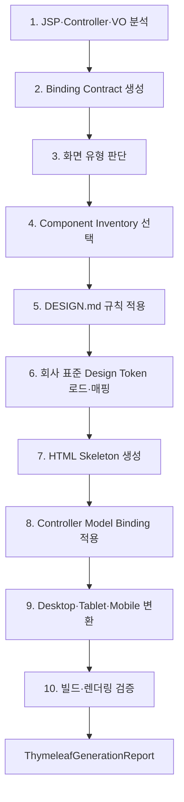

# eGovFrame JSP를 Spring Boot·Thymeleaf로 전환하는 작업 명세서

**문서 버전**: 1.2  
**작성일**: 2026-07-30  
**상태**: 구현 계획  
**관련 문서**:

- [11_Semantic_Figma_Design_System_Implementation_Plan.md](./11_Semantic_Figma_Design_System_Implementation_Plan.md)
- [12_Semantic_Figma_Design_System_Implementation_List.md](./12_Semantic_Figma_Design_System_Implementation_List.md)
- [Figma_MCP_디자인_오케스트레이션_아키텍처_및_구현_명세서.md](./Figma_MCP_디자인_오케스트레이션_아키텍처_및_구현_명세서.md)

---

## 1. 목적

기존 JSP/eGovFrame 화면과 관련 Controller·VO를 분석하여 업무 동작을 보존한
Spring Boot·Thymeleaf 화면으로 전환한다.

전환 결과는 다음 조건을 만족해야 한다.

1. 기존 route, request parameter, model attribute, validation, 권한 계약을 보존한다.
2. 승인된 Component Inventory와 회사 표준 Design Token을 사용한다.
3. 프로젝트 `DESIGN.md`의 시각·Layout·Component 규칙을 적용한다.
4. Desktop·Tablet·Mobile에서 같은 업무 Binding을 공유한다.
5. 생성 결과를 Thymeleaf 엔진으로 렌더링하고 대상 프로젝트를 빌드하여 검증한다.
6. 각 단계의 입력·출력·규칙 버전·Issue를 보고서로 추적한다.

---

## 2. 범위

### 포함

- JSP form/tag/EL 구조 분석
- Spring MVC/eGovFrame Controller route·Model 분석
- VO field·validation 분석
- LIST·FORM·DETAIL 화면 유형
- CRUD·Board·MasterDetail 기본 화면
- Component Inventory 선택
- `DESIGN.md` 규칙 적용
- 회사 표준 Design Token 매핑
- Thymeleaf HTML·fragment 생성
- Controller Model Binding 적용
- Desktop·Tablet·Mobile 반응형 변환
- Thymeleaf parse/render 및 Maven·Gradle 빌드 검증

### 제외

- 업무 규칙을 LLM이 임의로 변경하는 기능
- JSP Java scriptlet의 무인 자동 변환
- Controller·Service·DAO의 비즈니스 로직 재설계
- Figma 화면을 픽셀 단위로 HTML에 복사하는 기능
- 승인되지 않은 외부 CSS·JavaScript·폰트 자동 반입
- 실패한 Binding을 임의 필드명으로 보정하는 기능
- 사용자 승인 없는 운영 프로젝트 직접 덮어쓰기

---

## 3. 전체 파이프라인



```text
JSP·Controller·VO
→ LegacyScreenAnalysis
→ ThymeleafBindingContract
→ ScreenTypeDecision
→ SelectedComponentInventory
→ AppliedDesignRules
→ ResolvedDesignTokens
→ ThymeleafSkeleton
→ BoundThymeleafView
→ ResponsiveThymeleafViewSet
→ Build/Render Validation
→ ThymeleafGenerationReport
```

---

## 3.1 로컬 서버 크롤링 불가 환경의 소스 직접 분석 영향평가

### 평가 결론

로컬 JSP/eGovFrame 서버가 실행 중이거나 브라우저에서 수동 접근할 수 있어도
`jsp-design-extractor` 실행 환경에서 해당 서버를 자동 크롤링하지 못할 수 있다.
프로젝트 소스에 접근할 수 있다면 전환 작업은 계속 수행할 수 있지만, 이 경우 Browser Capture
단계를 우회하는 `LOCAL_SOURCE` 분석 모드를 별도로 구현해야 한다.

```text
기존 RENDERED_URL 모드:
로컬 서버 URL → Playwright → 실제 DOM/computed style/layout/screenshot

신규 LOCAL_SOURCE 모드:
Project Root
├─ CSS/SCSS
├─ Bootstrap/Tailwind 설정
├─ JSP/Thymeleaf
├─ JavaScript
└─ 이미지/아이콘
→ 정적 Source Graph
→ LegacyScreenAnalysis
```

`LOCAL_SOURCE`는 로컬 서버의 존재 여부와 무관하게 크롤러 접근을 사용하지 않고 선언된
구조·규칙·참조 관계를 분석한다. 브라우저가 계산한 최종 Layout과 실행 중 JavaScript 상태는
직접 관찰할 수 없으므로 분석 결과에 `provenance`, `confidence`,
`runtimeVerificationRequired`를 필수로 포함하고, 생성 후 Thymeleaf 렌더 단계에서 동적
결과를 보완 검증한다.

### 로컬 서버가 있어도 크롤링이 실패하는 경우

- Extractor와 애플리케이션이 서로 다른 Container/VM/Network namespace에 있어
  Extractor의 `localhost`가 대상 서버를 가리키지 않는다.
- `EXTRACTOR_ALLOWED_ORIGINS`, 요청의 `allowedOrigins`, Resource Origin 정책에 대상 주소가 없다.
- 로그인·SSO·세션·인증서가 필요하지만 Playwright Context에 인증 상태가 전달되지 않는다.
- Chromium 실행 파일이나 Browser dependency를 설치할 수 없다.
- 화면 준비 Selector가 나타나지 않거나 JavaScript 요청이 차단되어 readiness timeout이 발생한다.
- CSS·JavaScript·이미지 Origin이 차단되어 불완전한 DOM과 Style만 수집된다.
- 보안 정책상 Headless Browser, loopback 접속 또는 자동화된 페이지 접근 자체가 금지된다.

이 상황은 “웹 서버 URL이 존재하지 않는다”는 뜻이 아니다. **크롤러에서 렌더 결과를 확보할
수 없다는 뜻**이며, 프로젝트 소스 직접 분석이 대체 입력 경로가 된다.

### Figma MCP 명세와의 경계

[Figma_MCP_디자인_오케스트레이션_아키텍처_및_구현_명세서.md](./Figma_MCP_디자인_오케스트레이션_아키텍처_및_구현_명세서.md)의
Figma REST API 조회는 로컬 JSP 서버 크롤링과 다른 기능이다.

```text
Figma MCP:
fileKey/nodeId
→ Figma REST API
→ Figma Node·Style·Component 분석

JSP 전환:
로컬 서버 Crawl 또는 Project Source
→ JSP·Controller·VO·CSS·JavaScript 분석
→ ThymeleafBindingContract
```

Figma MCP가 정상이어도 JSP Source/Rendered Page를 자동으로 알 수 없고, 로컬 서버
크롤링이 실패해도 승인된 Figma `DesignSystemProfile`·`ComponentRegistry`는 사용할 수 있다.
두 흐름은 Component·Token 계약을 공유하지만 입력과 분석 책임은 분리한다.

### 현재 구조에 미치는 영향

| 영역 | 현재 방식 | `LOCAL_SOURCE` 영향 | 판정 |
|---|---|---|---|
| 입력 | `CaptureWebPageRequest.url` | `projectRoot`, source include/exclude, entry view 필요 | 계약 변경 큼 |
| Extractor | Playwright `page.goto()` | 파일 유형별 Reader와 참조 Graph 필요 | 신규 구현 |
| Style | `getComputedStyle()` | CSS/SCSS 선언·cascade 후보·media query 정적 분석 | 정확도 특성 변경 |
| Component | 실제 DOM 패턴 인식 | View class/tag + framework 설정 + JS selector 교차 분석 | 신규 선택 로직 |
| Asset | 브라우저가 로드한 URL 수집 | 로컬 경로·CSS `url()`·import·sprite 참조 Graph | 신규 구현 |
| Responsive | viewport별 실제 Layout | media query·framework breakpoint·utility class 분석 | 런타임 검증 필요 |
| JavaScript | 실행 후 DOM 관찰 가능 | AST 기반 event/selector/class/API 분석 | 동적 실행 한계 |
| Preview | 실제 페이지 screenshot | 소스만으로 불가 | 생성 후 render로 이동 |
| 보안 | URL/origin/redirect 제한 | path traversal/symlink/secret/config 실행 제한 | 정책 교체 |
| 산출물 | `RenderedDesignDocument` | `LocalSourceDesignDocument` 또는 공통 `DesignSourceDocument` 필요 | Schema 확장 |

전체 일정 영향은 **높음**이다. 1단계 Source Analysis의 구현 범위가 커지고 4단계 Component
Inventory, 6단계 Token Mapping, 9단계 Responsive 변환의 입력 계약이 바뀐다. 반면
Controller·VO·JSP Binding은 렌더 HTML보다 원본 소스에서 더 정확히 추적할 수 있어
2단계 Binding Contract의 품질은 향상된다.

### 분석 모드 계약

```text
LegacyConversionRequest
├─ analysisMode: RENDERED_URL | LOCAL_SOURCE | HYBRID
├─ projectRoot
├─ entryViews[]
├─ controllerPaths[]
├─ voPaths[]
├─ includeGlobs[]
├─ excludeGlobs[]
├─ designSystemProfileId
└─ targetPlatforms[]
```

- `RENDERED_URL`: 크롤러가 접근 가능한 로컬 서버 URL을 기존 Browser Capture로 분석한다.
- `LOCAL_SOURCE`: 로컬 서버 크롤링을 우회하고 프로젝트 소스를 직접 읽는다.
- `HYBRID`: 소스 분석을 기준으로 삼고 허용된 로컬 실행 환경에서 렌더 결과를 추가 검증한다.
- 로컬 서버가 있어도 크롤러 접근이 불가능한 환경의 기본값은 `LOCAL_SOURCE`다.
- 분석 모드가 달라도 최종 `ThymeleafBindingContract`와 Generator 2~10단계 계약은 동일하다.

### Source Reader 구조

```text
service/thymeleaf/generator/source/
├─ LocalProjectSourceAnalyzer
├─ ProjectSourceInventory
├─ CssSourceReader
├─ ScssSourceReader
├─ CssDependencyGraphBuilder
├─ BootstrapConfigurationReader
├─ TailwindConfigurationReader
├─ JspSourceReader
├─ ThymeleafSourceReader
├─ JavaScriptSourceReader
├─ AssetSourceReader
├─ SourceReferenceResolver
└─ LocalSourceSecurityPolicy
```

각 Reader는 파일 내용을 다른 단계에 그대로 전달하지 않고 정규화된 구조, content hash,
source location, confidence, warning만 반환한다.

### CSS·SCSS 직접 읽기

#### 수집 대상

- `.css`, `.scss`, `.sass`
- `<link rel="stylesheet">`
- JSP/Thymeleaf include가 참조하는 Style
- `@import`, SCSS `@use`·`@forward`
- CSS Custom Property
- SCSS variable·map·mixin·function 호출
- selector, class, pseudo state
- `@media`, `@container`, `@supports`
- `@font-face`
- `url(...)` asset
- keyframes와 transition

#### 산출물

```text
StyleSourceGraph
├─ files[]
├─ imports[]
├─ variables[]
├─ selectors[]
├─ mediaQueries[]
├─ fontFaces[]
├─ assetReferences[]
├─ tokenCandidates[]
└─ unresolvedReferences[]
```

#### 영향과 한계

- CSS Custom Property와 SCSS variable에서 Token 후보를 만들 수 있어 6단계 품질이 향상된다.
- `getComputedStyle()`이 없으므로 최종 cascade 결과는 확정하지 않고 후보와 우선순위를 기록한다.
- SCSS는 기본적으로 구문 분석만 수행한다. compile은 승인된 compiler·고정 dependency·
  허용 경로에서만 선택적으로 실행한다.
- 외부 URL import는 다운로드하지 않고 `EXTERNAL_STYLE_UNAVAILABLE`로 보고한다.

### Bootstrap 설정 직접 읽기

#### 탐지 위치

- `package.json`과 lockfile
- Maven/Gradle WebJar 의존성
- 로컬 `bootstrap*.css/js`
- SCSS entry와 Bootstrap variable override
- JSP/Thymeleaf의 `container`, `row`, `col-*`, `btn-*`, `form-*`, `table-*` class
- `data-bs-*` attribute

#### 산출물

```text
BootstrapProfile
├─ detected
├─ versionEvidence[]
├─ importMode
├─ sassOverrides{}
├─ usedComponents[]
├─ usedUtilities[]
├─ breakpoints{}
└─ javascriptPlugins[]
```

버전을 파일명만으로 추측하지 않는다. dependency 선언, banner, content hash 등 복수 근거를
사용하며 충돌 시 `FRAMEWORK_VERSION_CONFLICT`를 반환한다. Bootstrap class는 회사 논리
Component로 매핑하되 원본 class를 곧바로 최종 Thymeleaf에 복사할지는 `DESIGN.md`와
회사 Component 정책으로 결정한다.

### Tailwind 설정 직접 읽기

#### 탐지 위치

- `package.json`과 lockfile
- `tailwind.config.*`
- `postcss.config.*`
- CSS의 `@import "tailwindcss"`, `@theme`, `@source`, `@utility`
- 호환 설정을 연결하는 `@config`
- JavaScript plugin을 연결하는 `@plugin`
- 정적 class 후보를 선언하는 `@source inline(...)`
- JSP/Thymeleaf/JavaScript의 utility class
- plugin·preset·content/source 경로

#### 산출물

```text
TailwindProfile
├─ detected
├─ versionEvidence[]
├─ configFiles[]
├─ contentSources[]
├─ themeTokens{}
├─ breakpoints{}
├─ usedUtilities[]
├─ arbitraryValues[]
├─ plugins[]
└─ dynamicClassWarnings[]
```

JavaScript/TypeScript 설정 파일은 임의 코드를 실행할 수 있으므로 기본적으로 실행하지 않고
정적 AST로 읽는다. 문자열 결합이나 조건부로 생성되는 class는 완전 복원이 불가능하므로
`DYNAMIC_CLASS_UNRESOLVED`로 기록한다. arbitrary value는 회사 Token으로 매핑되지 않으면
최종 생성에 사용하지 않는다.

Tailwind 버전에 따라 설정 발견 방식이 다르므로 dependency와 lockfile로 버전을 먼저 판정한다.
CSS 중심 설정과 JavaScript 설정이 함께 있으면 CSS 규칙의 우선 적용 여부를 기록한다.
특히 JavaScript 설정을 자동 발견한다고 가정하지 않고 CSS의 `@config` 참조 Graph를 따라간다.

### JSP·Thymeleaf 직접 읽기

#### JSP

- taglib, include, directive
- `<form:*>`, JSTL, EL
- form action/method/path
- class/id/data attribute
- Controller route 후보
- image/script/style 참조
- 반복·조건과 상태별 fragment

#### Thymeleaf

- `th:object`, `th:field`, `th:text`, `th:each`, `th:if`
- `th:href`, `th:action`, fragment, layout dialect
- message bundle key
- validation error와 CSRF
- class append/switch

#### 영향

기존 JSP와 이미 존재하는 Thymeleaf를 동시에 분석하면 전환 대상과 재사용 가능한 fragment를
구분할 수 있다. View Reader 결과는 2단계 Binding Contract와 7단계 Skeleton 생성에 모두
사용하되, 기존 Thymeleaf를 무조건 정답으로 간주하지 않고 동일 검증 규칙을 적용한다.

### JavaScript 직접 읽기

#### 수집 대상

- module/import graph
- DOM selector와 event listener
- form submit·validation
- classList/style 변경
- fetch/XHR endpoint
- modal/tab/accordion/navigation 동작
- template literal 기반 HTML
- image/icon 동적 경로
- Bootstrap plugin 호출

#### 산출물

```text
ScriptBehaviorGraph
├─ files[]
├─ imports[]
├─ selectors[]
├─ events[]
├─ actions[]
├─ endpoints[]
├─ classMutations[]
├─ generatedMarkup[]
└─ unresolvedDynamicBehaviors[]
```

정적 분석은 임의 JavaScript를 실행하지 않는다. `eval`, 동적 import, 난독화, 런타임 API
응답에 의존하는 DOM 변경은 사람 검토 대상으로 남긴다. 분석 결과는 업무 action을 발견하는
근거이며 Controller·권한 계약보다 우선하지 않는다.

### 이미지와 아이콘 직접 읽기

#### 수집 대상

- JSP/Thymeleaf `src`, `srcset`
- CSS `url(...)`
- JavaScript 문자열 경로
- PNG/JPEG/WebP/GIF
- SVG와 SVG sprite
- favicon
- icon font
- Bootstrap Icons 등 로컬 icon package

#### 산출물

```text
LocalAssetInventory
├─ assets[]
│  ├─ logicalId
│  ├─ sourcePath
│  ├─ mimeType
│  ├─ byteLength
│  ├─ dimensions
│  ├─ contentHash
│  ├─ usages[]
│  └─ licenseEvidence[]
├─ iconSets[]
├─ duplicateGroups[]
└─ missingReferences[]
```

- 파일 확장자만 믿지 않고 MIME/signature를 확인한다.
- SVG는 script, event handler, 외부 reference를 제거하거나 격리해 검사한다.
- 중복 파일은 content hash로 묶되 원본 경로 추적성을 유지한다.
- 외부 URL 자산은 자동 다운로드하지 않는다.
- 비밀키·인증서·사용자 업로드 디렉터리는 Asset 탐색 대상에서 제외한다.

### 공통 Source 분석 산출물

```text
LocalSourceDesignDocument
├─ schemaVersion
├─ projectFingerprint
├─ sourceFiles[]
├─ viewTemplateGraph
├─ styleSourceGraph
├─ frameworkProfiles
│  ├─ bootstrap
│  └─ tailwind
├─ scriptBehaviorGraph
├─ assetInventory
├─ componentCandidates[]
├─ tokenCandidates[]
├─ responsiveRules[]
├─ bindingHints[]
└─ issues[]
```

이 문서는 Browser Capture의 `RenderedDesignDocument`와 별도 형식으로 시작하되,
`DesignSourceDocument` 공통 interface를 통해 `LegacyScreenAnalysis`로 투영한다.
정적 소스와 렌더 결과를 같은 필드에 억지로 합쳐 provenance를 잃지 않는다.

### 10단계 파이프라인 영향

| 단계 | 영향도 | 변경 내용 |
|---|---:|---|
| 1. JSP·Controller·VO 분석 | 높음 | `LOCAL_SOURCE` 입력과 6종 Reader·Source Graph 추가 |
| 2. Binding Contract | 중간 | View/JS Binding hint의 provenance·conflict 정책 추가 |
| 3. 화면 유형 | 낮음 | DOM 대신 View 구조·class·route 근거 사용 |
| 4. Component Inventory | 높음 | framework class와 Component 후보 매핑 추가 |
| 5. `DESIGN.md` | 중간 | source selector/class와 규칙 위반 교차 검사 |
| 6. 회사 Token | 높음 | CSS/SCSS/Tailwind/Bootstrap token 후보 매핑 추가 |
| 7. HTML Skeleton | 중간 | 재사용 가능한 기존 Thymeleaf fragment 판정 추가 |
| 8. Model Binding | 중간 | JSP/Thymeleaf/JS 참조의 교차 검증 추가 |
| 9. 반응형 변환 | 높음 | computed layout 없이 media/breakpoint 근거로 변환하고 runtime 검증 요구 |
| 10. 검증 | 높음 | 기존 화면 screenshot 비교 대신 생성 결과 렌더·source parity 중심으로 전환 |

### 보안 정책

- `projectRoot`는 허용 경로의 real path로 고정한다.
- symlink를 통한 프로젝트 외부 접근을 차단한다.
- `..`, 절대경로 우회, 대소문자·Unicode 경로 혼동을 정규화한다.
- `.git`, `node_modules`, build output, upload, secret 디렉터리는 기본 제외한다.
- `.env`, key, certificate, credential 파일을 읽거나 산출물에 포함하지 않는다.
- 파일 개수·개별 크기·전체 읽기 용량·압축 해제 크기에 제한을 둔다.
- Tailwind/PostCSS/SCSS/JavaScript 설정은 기본적으로 실행하지 않는다.
- build와 compiler 실행은 `EGOV_ALLOW_BUILD_EXECUTION`과 별도 allowlist가 승인된 경우만 허용한다.
- 분석 로그에는 소스 본문 대신 상대 경로·content hash·Issue만 남긴다.

### 권장 구현 우선순위

#### P0

1. `LOCAL_SOURCE` Request·Schema와 `LocalSourceSecurityPolicy`
2. Project Source Inventory와 JSP/Thymeleaf Reader
3. Controller·VO 분석 연결
4. CSS Reader와 Source Reference Resolver
5. Binding Contract provenance
6. Asset Inventory

#### P1

1. JavaScript AST Reader
2. Bootstrap Profile
3. SCSS dependency·variable Reader
4. Tailwind Profile
5. Component/Token 후보 통합
6. Responsive rule 분석

#### P2

1. 승인 환경의 SCSS/Tailwind compile 비교
2. `HYBRID` 모드 local render
3. 소스 분석과 computed style 차이 보고서
4. viewport screenshot visual regression

### 테스트 추가

- CSS import 순환·Custom Property·media query·asset URL
- SCSS `@use`/`@forward`·variable/map·외부 import 거부
- Bootstrap dependency/version/override/class/data attribute
- Tailwind config/theme/content/dynamic class/arbitrary value
- JSP include/taglib/form/JSTL/EL
- Thymeleaf layout/fragment/field/action
- JavaScript selector/event/class mutation/fetch와 동적 분석 한계
- PNG/JPEG/WebP/SVG/sprite/icon font와 악성 SVG
- path traversal·symlink·secret·대용량 파일·파일 개수 제한
- 동일 Source Tree의 결정론적 project fingerprint
- 로컬 서버 크롤링 없이 LIST·FORM·DETAIL `LegacyScreenAnalysis` 생성
- 생성 Thymeleaf의 Desktop·Tablet·Mobile render와 Binding parity

### 완료 조건

- 로컬 서버 크롤링 없이 프로젝트 소스만으로 LIST·FORM·DETAIL 분석이 가능하다.
- CSS/SCSS·Bootstrap·Tailwind·View·JavaScript·Asset 출처가 모두 source location으로 추적된다.
- Component와 Token 후보마다 근거·confidence·runtime 검증 필요 여부가 기록된다.
- Controller·VO·View Binding 충돌이 자동 추측되지 않고 Issue로 보고된다.
- 외부 URL·설정 코드·빌드 파일이 분석 중 임의 실행되지 않는다.
- 생성 후 Thymeleaf render가 정적 분석의 responsive·interaction 가정을 검증한다.

---

## 4. 핵심 원칙

### 4.1 업무 계약과 디자인 계약 분리

- 업무 계약: route, field source, request/model 이름, validation, 권한, CSRF, action
- 디자인 계약: Component, typography, color, spacing, radius, layout, responsive behavior

`DESIGN.md`, Figma, Design Token은 업무 계약을 변경할 수 없다.

### 4.2 단일 Binding 원본

생성 시점의 Binding 단일 원본은 `ThymeleafBindingContract`다.

```text
JSP/Controller/VO/DB Schema/ScreenSpecification
→ 교차 검증
→ ThymeleafBindingContract
→ HTML과 Controller 생성에 동일하게 사용
```

HTML과 Controller가 서로 다른 이름을 추론하지 않는다.

### 4.3 결정론적 생성

동일한 다음 입력은 동일한 산출물 Hash를 만들어야 한다.

- 소스 revision
- `ScreenSpecification` version
- Binding Contract version
- Component Inventory version
- `DESIGN.md` content hash
- Design System Profile/Token version
- Generator version

### 4.4 Preview 후 적용

Generator는 작업 디렉터리에서 Preview를 생성한다. 승인 전에는 대상 프로젝트 파일을
덮어쓰지 않는다.

```text
ANALYZED
→ CONTRACT_READY
→ PREVIEW_READY
→ APPROVED
→ APPLIED
→ VALIDATED
```

---

## 5. 규칙 우선순위

충돌 시 다음 순서를 적용한다.

1. Controller·VO·DB Schema의 실제 업무 Binding과 보안 제약
2. 승인된 `ScreenSpecification`과 `ThymeleafBindingContract`
3. 회사 `DesignSystemProfile`·Component Registry·Design Token
4. 프로젝트 `DESIGN.md`
5. 화면별 승인 Override
6. Generator 기본값

상위 규칙을 하위 규칙이 변경할 수 없다.

예:

- `DESIGN.md`가 field 이름을 바꾸려고 하면 거부한다.
- 회사 Token에 없는 색상을 `DESIGN.md`가 요구하면 Issue를 반환한다.
- Controller가 제공하지 않는 Model attribute를 HTML이 참조하면 생성 실패다.
- 사용자 권한이 필요한 action을 디자인 규칙이 숨기는 것은 가능하지만 권한 검사를 제거할 수는 없다.

---

## 6. 단계별 작업

### 6.1 JSP·Controller·VO 분석

### 입력

- 대상 프로젝트 루트
- 분석 모드: `RENDERED_URL`, `LOCAL_SOURCE`, `HYBRID`
- JSP 파일 또는 화면 식별자
- 관련 Controller·VO 후보
- 선택적 DB Schema

### 처리

JSP에서 다음 항목을 수집한다.

- form action/method
- `<form:form>`, `<form:input>`, `<form:select>` 등의 path
- `${...}` EL 표현식
- JSTL 조건·반복
- request parameter
- hidden field
- validation/error 출력
- CSRF
- submit/link action
- include/tag file
- JavaScript가 참조하는 field/action

Controller에서 다음 항목을 수집한다.

- `@RequestMapping`, `@GetMapping`, `@PostMapping`
- `@ModelAttribute`, `@RequestParam`, `@PathVariable`
- `Model`, `ModelMap`, `ModelAndView` attribute
- 조회·등록·수정·삭제 route
- redirect/forward
- validation과 `BindingResult`
- 권한 Annotation 또는 Security 호출
- 반환 View 이름

VO에서 다음 항목을 수집한다.

- field와 Java type
- Bean Validation
- enum/common code 후보
- identifier/sequence
- 날짜·숫자 format
- 검색 전용 field
- 화면 비노출 field

### 산출물

```text
LegacyScreenAnalysis
├─ sourceRevision
├─ jsp
├─ controller
├─ vo
├─ routes[]
├─ fields[]
├─ actions[]
├─ modelAttributes[]
├─ validations[]
├─ securityConstraints[]
└─ issues[]
```

### 기존 재사용

- `jsp-design-extractor`
- `ProjectScannerTool`
- CRUD/Board/MasterDetail metadata 서비스
- `ScreenSpecAssembler`

### 실패 조건

- JSP와 Controller View 이름 연결 불가
- form action과 Controller route 불일치
- 동일 field의 타입 충돌
- scriptlet로만 표현된 핵심 업무 로직
- 허용 경로 밖 소스 접근

---

### 6.2 Binding Contract 생성

### 입력

- `LegacyScreenAnalysis`
- 선택적 DB Schema
- 승인 `ScreenSpecification`

### 처리

분석된 field를 다음 Binding으로 정규화한다.

```text
ThymeleafBindingContract
├─ screenId
├─ sourceRevision
├─ formObjectName
├─ commandType
├─ fields[]
│  ├─ logicalFieldId
│  ├─ voField
│  ├─ requestName
│  ├─ modelPath
│  ├─ sourceColumn
│  ├─ javaType
│  ├─ required
│  ├─ validation
│  ├─ readable
│  └─ writable
├─ routes[]
├─ actions[]
├─ iterations[]
├─ queryContract
└─ securityContract
```

### 기존 재사용

- `ScreenFieldBinding`
- `GenerationQueryContract`
- `GenerationQueryContractFactory`
- `ScreenSpecValidator`

### 완료 조건

- 모든 `th:field` 후보가 실제 VO field에 연결된다.
- 모든 조회 표현식이 Controller Model attribute에 연결된다.
- 모든 action이 Controller route와 HTTP method에 연결된다.
- 미해결 Binding은 자동 추론하지 않고 FATAL 또는 사람 검토 대상으로 남긴다.

---

### 6.3 화면 유형 판단

### 판정값

- `LIST`
- `FORM`
- `DETAIL`
- `DASHBOARD`

별도 Layout Pattern:

- `STANDARD`
- `MASTER_DETAIL`
- `BOARD`
- `DASHBOARD`

### 판정 근거

1. 승인된 `ScreenSpecification`
2. Controller route/action 조합
3. JSP form/table/detail 구조
4. VO 사용 방식
5. 파일명·화면명은 마지막 보조 근거로만 사용

### 산출물

```text
ScreenTypeDecision
├─ screenType
├─ layoutPattern
├─ confidence
├─ evidence[]
└─ alternatives[]
```

confidence가 기준보다 낮으면 임의 유형으로 생성하지 않는다.

### 기존 재사용

- `FigmaScreenTypeResolver`
- `ScreenSpecAssembler`
- CRUD/Board/MasterDetail 화면 구분

---

### 6.4 Component Inventory 선택

### 입력

- 화면 유형
- Binding field role
- `ComponentRegistry`
- 회사 Component Catalog
- 플랫폼 정책

### 선택 예

| 업무 역할 | 논리 Component 후보 |
|---|---|
| 단문 입력 | `krds.textField` |
| 장문 입력 | `krds.textArea` |
| 코드 선택 | `krds.select` |
| Boolean | `krds.checkbox` |
| 단일 선택 | `krds.radio` |
| 목록 | `egov.dataTable` |
| 검색 | `egov.searchPanel` |
| 주요 Action | `krds.button` |
| 페이지 이동 | `krds.pagination` |

### 산출물

```text
SelectedComponentInventory
├─ inventoryVersion
├─ profileId
├─ screenComponents[]
│  ├─ logicalNodeId
│  ├─ logicalType
│  ├─ bindingFieldId
│  ├─ selectionReason
│  ├─ required
│  └─ fallbackPolicy
└─ issues[]
```

### 기존 재사용

- `ComponentCandidate`
- `ComponentRegistryResolver`
- `component-catalog-v1.json`

미게시 Component나 Registry에 없는 필수 Component는 생성 전에 차단한다.

---

### 6.5 `DESIGN.md` 규칙 적용

### 탐색

프로젝트 루트에서 `DESIGN.md`를 찾는다. 여러 파일이 발견되면 현재 화면에 가장 가까운
프로젝트 경계의 파일을 사용하되, 선택 근거와 content hash를 기록한다.

### 적용 범위

- typography hierarchy
- color usage
- spacing scale
- radius
- layout/grid
- component 사용 규칙
- form/table/navigation 표현 규칙
- responsive behavior
- UI voice/microcopy
- 금지 패턴

### 금지 범위

`DESIGN.md`는 다음 값을 바꿀 수 없다.

- Controller route와 HTTP method
- VO field와 type
- DB source
- validation
- 권한
- CSRF
- 업무 action 의미

### 산출물

```text
AppliedDesignRules
├─ designMdPath
├─ contentHash
├─ schemaVersion
├─ appliedRules[]
├─ ignoredRules[]
└─ violations[]
```

### 오류

- `DESIGN_MD_NOT_FOUND`
- `DESIGN_MD_VERSION_UNSUPPORTED`
- `DESIGN_RULE_UNKNOWN`
- `DESIGN_RULE_BINDING_OVERRIDE_FORBIDDEN`
- `DESIGN_RULE_CONFLICT`

---

### 6.6 회사 표준 Design Token 로드·매핑

### 입력

- `DesignSystemProfile`
- `DesignSystemSpec`
- `VariableBinding`
- `ComponentRegistry`
- `AppliedDesignRules`

### Token 범위

- color
- typography
- spacing
- radius
- border
- elevation
- breakpoint
- container/grid
- motion

### 매핑 원칙

```text
semantic token
→ company token key
→ CSS custom property
→ Thymeleaf HTML class/property
```

예:

```text
color.action.primary
→ krds.color.primary.60
→ --color-action-primary
→ .btn-primary
```

회사 Token에 없는 값을 임의 CSS literal로 만들지 않는다.

### 산출물

```text
ResolvedDesignTokens
├─ profileId
├─ profileVersion
├─ tokenVersion
├─ cssVariables{}
├─ componentProperties{}
├─ responsiveTokens{}
└─ issues[]
```

---

### 6.7 HTML Skeleton 생성

### 입력

- `ThymeleafBindingContract`
- `ScreenTypeDecision`
- `SelectedComponentInventory`
- `AppliedDesignRules`
- `ResolvedDesignTokens`

### 처리

Binding 값이 없는 구조를 먼저 생성한다.

- `layout:decorate`
- page title
- breadcrumb
- GNB/LNB
- content section
- form/table/detail 영역
- action area
- pagination
- empty/loading/error/success 영역
- footer

### 기존 재사용

- `CrudTemplateRenderer`
- `BoardTemplateRenderer`
- `MasterDetailTemplateRenderer`
- FreeMarker `.ftl`
- 공통 Thymeleaf layout/fragment

### 산출물

```text
ThymeleafSkeleton
├─ templates[]
├─ fragments[]
├─ staticAssets[]
├─ slots[]
└─ unresolvedBindings[]
```

Skeleton 단계에서는 임의 `th:field`나 Controller attribute를 만들지 않는다.

---

### 6.8 Controller Model Binding 적용

### 적용 대상

- `th:object`
- `th:field`
- `th:text`
- `th:if`/`th:unless`
- `th:each`
- `th:href`/`th:action`
- validation error
- CSRF
- pagination/search state
- common code options

### 기존 재사용

- `CrudModelFactory`
- `BoardModelFactory`
- `MasterDetailTemplateModel`
- 기존 Controller/Thymeleaf FreeMarker template

### 검증

- HTML이 참조하는 Model attribute가 Controller에서 제공된다.
- Controller가 제공하는 필수 attribute가 View에서 누락되지 않는다.
- form object와 `BindingResult` 이름이 일치한다.
- route parameter encoding과 HTTP method가 일치한다.
- writable이 아닌 field에 입력 Binding을 만들지 않는다.

### 산출물

```text
BoundThymeleafView
├─ htmlFiles[]
├─ controllerChanges[]
├─ bindingAudit
└─ issues[]
```

---

### 6.9 Desktop·Tablet·Mobile 변환

### 기준 Viewport

| Platform | 기준 폭 | Grid | Navigation |
|---|---:|---:|---|
| Desktop | 1440 | 12 columns | side navigation |
| Tablet | 768 | 8 columns | drawer |
| Mobile | 390 | 4 columns | bottom/drawer navigation |

### 변환 규칙

- table → horizontal scroll, priority column 축소 또는 card list
- multi-column form → single/dual column
- side navigation → drawer/bottom navigation
- action group → full-width/stacked action
- modal → full-screen sheet 후보
- fixed width → container token
- spacing/font → 플랫폼 Token scale
- footer/navigation → 플랫폼 Component Swap

### 불변 조건

플랫폼에 따라 다음 값은 바뀌지 않는다.

- route
- form object
- field name
- validation
- action type
- 권한
- CSRF

### 산출물

```text
ResponsiveThymeleafViewSet
├─ sharedBindingContract
├─ desktop
├─ tablet
├─ mobile
├─ componentSwaps[]
└─ responsiveIssues[]
```

가능하면 하나의 반응형 HTML/CSS를 생성한다. 업무 구조가 달라 별도 template이 필요한 경우
Binding Contract 공유와 동작 parity를 검증해야 한다.

---

### 6.10 빌드 및 렌더링 검증

### 검증 순서

1. HTML/Thymeleaf 정적 검사
2. Binding Contract 정합성 검사
3. Thymeleaf parse
4. fixture Model을 사용한 render
5. route/action/CSRF 감사
6. CSS Token 미사용 literal 감사
7. Desktop·Tablet·Mobile screenshot
8. overflow·layout·접근성 검사
9. Maven 또는 Gradle 빌드
10. 기존 JSP 대비 field/action/route parity 확인

### 기존 재사용

- `ThymeleafRenderValidator`
- `GeneratedProjectBuildValidator`
- `CodeValidatorTool`
- 기존 Generated Code Auditor

### 빌드 보안

생성 프로젝트의 빌드 파일은 임의 코드를 실행할 수 있다.

- 기본값은 빌드 실행 금지
- `EGOV_ALLOW_BUILD_EXECUTION=true`일 때만 실행
- 허용 경로 내부 프로젝트만 실행
- timeout과 출력 크기 제한 적용
- shell 문자열 조립 대신 허용된 Maven/Gradle 명령 사용

### 산출물

```text
ThymeleafGenerationReport
├─ generationId
├─ sourceRevision
├─ contractVersions
├─ stages[]
├─ generatedFiles[]
├─ bindingAudit
├─ tokenAudit
├─ responsiveAudit
├─ renderReport
├─ buildReport
├─ parityReport
└─ finalStatus
```

---

## 7. 단계 상태와 중단 정책

| 상태 | 의미 |
|---|---|
| `PENDING` | 실행 전 |
| `RUNNING` | 실행 중 |
| `SUCCEEDED` | Issue 없이 완료 |
| `SUCCEEDED_WITH_WARNINGS` | 허용된 경고와 함께 완료 |
| `REVIEW_REQUIRED` | 사람 판단 필요 |
| `FAILED` | FATAL 발생 |
| `SKIPPED` | 선행 단계 실패로 미실행 |

FATAL 예:

- route/model/field Binding 충돌
- 필수 Component 미게시 또는 Registry 누락
- `DESIGN.md`의 업무 계약 변경 시도
- 필수 회사 Token 누락
- Thymeleaf parse/render 실패
- 허용된 환경에서 수행한 빌드 실패

---

## 8. 권장 패키지 구조

```text
src/main/java/com/krdevops/springai/
├─ model/generator/
│  ├─ LegacyScreenAnalysis.java
│  ├─ ThymeleafBindingContract.java
│  ├─ ScreenTypeDecision.java
│  ├─ SelectedComponentInventory.java
│  ├─ AppliedDesignRules.java
│  ├─ ResolvedDesignTokens.java
│  ├─ ResponsiveThymeleafViewSet.java
│  └─ ThymeleafGenerationReport.java
├─ service/thymeleaf/generator/
│  ├─ ThymeleafGenerationOrchestrationService.java
│  ├─ LegacyScreenSourceAnalyzer.java
│  ├─ ThymeleafBindingContractFactory.java
│  ├─ GeneratorScreenTypeResolver.java
│  ├─ ComponentInventorySelector.java
│  ├─ DesignMdRuleLoader.java
│  ├─ CompanyDesignTokenResolver.java
│  ├─ ThymeleafSkeletonGenerator.java
│  ├─ ThymeleafModelBindingApplicator.java
│  ├─ ResponsiveThymeleafTransformer.java
│  └─ ThymeleafGenerationReportService.java
├─ controller/
│  └─ ThymeleafGenerationController.java
└─ tools/
   └─ ThymeleafGenerationTool.java
```

기존 `CrudTemplateRenderer`, `BoardTemplateRenderer`, `MasterDetailTemplateRenderer`,
`ThymeleafRenderValidator`, `GeneratedProjectBuildValidator`는 폐기하지 않고 내부에서 재사용한다.

---

## 9. API·MCP 후보

### REST

```text
POST /api/thymeleaf-generations/analyze
POST /api/thymeleaf-generations/{generationId}/preview
POST /api/thymeleaf-generations/{generationId}/approve
POST /api/thymeleaf-generations/{generationId}/apply
POST /api/thymeleaf-generations/{generationId}/validate
GET  /api/thymeleaf-generations/{generationId}
GET  /api/thymeleaf-generations/{generationId}/report
```

### MCP

```text
analyzeLegacyThymeleafConversion
previewThymeleafConversion
applyApprovedThymeleafConversion
validateGeneratedThymeleaf
getThymeleafGenerationReport
```

### 보안

- `/api/**` X-API-Key 정책 유지
- MCP 공유 비밀키 검증
- 분석·출력 경로 allowlist
- 승인되지 않은 Apply 거부
- 민감 데이터·토큰·실제 사용자 값은 산출물과 로그에서 제거

---

## 10. 구현 작업 목록

### P0

- [ ] 10단계 공통 실행 계약과 보고서 Schema
- [ ] `LOCAL_SOURCE` 분석 요청·Schema와 경로 보안 정책
- [ ] CSS/SCSS·Bootstrap·Tailwind·View·JavaScript·Asset Reader 계약
- [ ] JSP·Controller·VO 화면 단위 연결 분석
- [ ] `ThymeleafBindingContract`
- [ ] 화면 유형 판정 근거와 confidence
- [ ] Component Inventory 선택과 Registry 검증
- [ ] `DESIGN.md` Loader·Validator
- [ ] 회사 Token Resolver
- [ ] Binding 없는 HTML Skeleton과 Binding 적용 단계 분리
- [ ] Controller Model Binding 감사
- [ ] `ThymeleafGenerationOrchestrationService`
- [ ] 단계별 FATAL 중단과 Preview/Approve/Apply

### P1

- [ ] Desktop·Tablet·Mobile 변환
- [ ] Source Graph 기반 Component·Token·Responsive 후보 통합
- [ ] viewport screenshot·overflow·접근성 검사
- [ ] JSP와 Thymeleaf field/action/route parity
- [ ] REST·MCP 진입점
- [ ] 생성 이력·재검증

### P2

- [ ] 복수 회사 Design System 선택
- [ ] 여러 프로젝트의 `DESIGN.md` 상속
- [ ] 화면 묶음 Batch 전환
- [ ] 시각 회귀 기준 이미지 승인 Workflow
- [ ] Legacy JavaScript 동작 분석 보강

---

## 11. 테스트 전략

### 단위 테스트

- JSP tag/EL/form parser
- Controller route/model parser
- VO field/validation parser
- Binding Contract 충돌
- 화면 유형 판정
- Component Inventory 선택
- `DESIGN.md` 규칙 파싱
- Token 매핑
- responsive 변환

### 계약 테스트

```text
LegacyScreenAnalysis
→ ThymeleafBindingContract
→ SelectedComponentInventory
→ AppliedDesignRules
→ ResolvedDesignTokens
→ ThymeleafGenerationReport
```

각 계약은 정상·경계·오류 fixture와 JSON Schema 검증을 제공한다.

### 통합 테스트

- CRUD LIST
- CRUD FORM/REGIST/UPDT
- CRUD DETAIL
- Board LIST/DETAIL/FORM
- MasterDetail LIST/DETAIL/FORM

### E2E

```text
실제 JSP·Controller·VO fixture
→ 분석
→ Preview
→ 승인
→ Thymeleaf 생성
→ Desktop·Tablet·Mobile render
→ Maven/Gradle build
→ JSP 대비 parity report
```

---

## 12. 완료 기준

- [ ] JSP·Controller·VO가 하나의 `LegacyScreenAnalysis`로 연결된다.
- [ ] 모든 화면 Binding이 `ThymeleafBindingContract`에서 추적된다.
- [ ] LIST·FORM·DETAIL 판정에 근거와 confidence가 포함된다.
- [ ] 선택 Component가 승인된 Registry와 일치한다.
- [ ] `DESIGN.md` 적용 결과와 무시·위반 규칙이 보고된다.
- [ ] 생성 CSS 값이 회사 표준 Token으로 역추적된다.
- [ ] HTML Skeleton과 Controller Model Binding 단계가 분리된다.
- [ ] Desktop·Tablet·Mobile이 같은 Binding Contract를 공유한다.
- [ ] Thymeleaf parse/render가 통과한다.
- [ ] 허용된 환경에서 Maven/Gradle 빌드가 통과한다.
- [ ] 기존 JSP 대비 field/action/route parity가 유지된다.
- [ ] 단계별 입력 Hash·계약 버전·Issue·산출물 경로가 보고서에 남는다.
- [ ] 같은 입력 재실행 시 동일 산출물이 생성된다.
- [ ] 로컬 서버 크롤링 없이 프로젝트 소스만으로 LIST·FORM·DETAIL 분석과 Thymeleaf 생성이 가능하다.
- [ ] CSS/SCSS·Bootstrap·Tailwind·JavaScript·이미지/아이콘의 출처와 confidence가 보고서에 남는다.
- [ ] 기존 CRUD·Board·MasterDetail 생성 회귀 테스트가 통과한다.

---

## 13. 검증 명령

Spring:

```bash
./gradlew test
./gradlew check
./gradlew bootJar
```

JSP Analyzer:

```bash
cd jsp-design-extractor
npm run typecheck
npm run lint
npm test
```

생성 대상 프로젝트의 빌드는 보안 승인과 허용 경로 설정 후 `CodeValidatorTool` 또는
`GeneratedProjectBuildValidator`를 통해 수행한다.

---

## 14. 변경 이력

| 버전 | 일자 | 변경 내용 |
|---|---|---|
| 1.2 | 2026-07-30 | 전제를 “URL/웹 서버 없음”에서 “로컬 서버는 있으나 Extractor 크롤링 불가”로 정정. Container/Origin/인증/Chromium/readiness 실패 조건과 Figma REST 조회·JSP 소스 분석의 책임 경계 추가 |
| 1.1 | 2026-07-30 | URL 크롤링 불가 환경의 `LOCAL_SOURCE` 영향평가 추가: CSS/SCSS, Bootstrap, Tailwind, JSP/Thymeleaf, JavaScript, 이미지/아이콘 Reader와 Source Graph, 파이프라인 영향도, 보안, 우선순위, 테스트·완료 조건 정의 |
| 1.0 | 2026-07-30 | JSP·Controller·VO 분석부터 Binding Contract, Component Inventory, DESIGN.md, 회사 Token, Thymeleaf 생성, 반응형 변환, 빌드·렌더 검증까지 10단계 전환 작업 최초 정의 |
